.. _DriftDiffusion:

Drift Diffusion
=================================================

.. _tutorial0:

Tutorial Bulk Si
----------------

In this example we will see a very simple TiberCAD simulation:

1D calculation of Poisson and drift-diffusion for a bulk Silicon sample.

The following files should be in your working directory:

|   bulk.tib_ : **TiberCAD** input file 
|
|   bulk.msh_ : mesh file

The mesh file can be obtained from the following GMSH geo file : bulk.geo_ 

This is the summary of the Sections of this Tutorial :

*  :ref:`tut0step1` 
*  :ref:`tut0step2` 
*  :ref:`tut0step3` 
*  :ref:`tut0step4` 
*  :ref:`tut0step5` 
 
.. index:: double:Bulk Si;modeling
..  _tut0step1:
 
Step 1 - Modeling the device
^^^^^^^^^^^^^^^^^^^^^^^^^^^^

As a first step, we have to model the device. To do so, you can use DEVISE 
module of ISE-TCAD 9.5 software package or GMSH program.

Here we'll see in details the procedure for GMSH.

There are two possible ways to use GMSH:

Interactive, using the graphical interface
Using a script file
In the following we'll see how to write a basic GMSH script ( bulk.geo_ ); 
for any details please refer to GMSH manual GMSH (http://geuz.org/gmsh/).

 
| 
| 

  |warn|: In a **1D** simulation it is assumed that the geometrical model is restricted to the **x axis** .

          In a **2D** simulation it is assumed that the geometrical model is restricted to the **xy-plane (z=0)** 

          Any other geometrical orientation could give impredictable results

 

In a GMSH script, several variables can be defined and given a value in this way::

  L = 1
  d = 0.01
  
these are valid GMSH variables: L is just the length of the Si sample; d is the value 
of a *characteristic mesh length* (see below).

Definition of geometrical entities **Points** ::

  Point(1) = {0, 0, 0, d}
  Point(2) = {L, 0, 0, d}

The first three expressions inside the braces on the right hand side give the three 
X, Y and Z **coordinates** of the point; the last expression **(d)** sets the **characteristic 
mesh length** at that point, that is the *"size"* of a mesh element, defined as the length 
of the segment for a line segment, the radius of the circumscribed circle for a triangle 
and the radius of the circumscribed sphere for a tetrahedron.

Thus, the smaller is the value of d, the greater is the mesh density close to that point. 

The size of the mesh elements will then be computed in GMSH by linearly interpolating 
these characteristic lengths in the whole mesh.
 

Definition of a geometrical entity **Line** ::

  Line(1) = {1, 2}

The two expressions inside the braces on the right hand side give the identification 
numbers of the start and end points of the line.

..  figure:: ../data/bulk_geo_fig.png
    :align: center
    :scale: 50%

Definition of the physical entity **Physical Line bulk** ::

  Physical Line("bulk") = {1}

The expression(s) inside the braces on the right hand side give the identification numbers 
of all the **geometrical lines** that need to be gro ed inside the *physical line* .

In this way, in general, physical regions are created which associate together geometrical regions, 
and then the related mesh elements, which share some common physical properties. It's only these 
physical regions which can be referred to outside GMSH. In TiberCAD, this is done by associating 
one or more physical regions to a **TiberCAD region** through the keyword *mesh_regions* (see in the following).

Definition of two physical entities Physical Point::

  Physical Point("anode2)   = {1}
  Physical Point("cathode") = {2}
 

  |note| : In general, in a nD simulation, **(n-1)D** physical regions (points in 1D, lines in 2D, surfaces in 3D) 
   are used by TiberCAD to impose the required boundary conditions.

   Each (n-1)D physical region defined in this way in GMSH will be associated in TiberCAD to a boundary condition region, 
   through the keyword **BC_reg_numb** . Thus, in this case, Physical points Anode and Cathode will be associated respectively 
   to two **Contact** regions (see in the following).
 
..  index:: double:Bulk Si;meshing
..  _tut0step2:

Step 2 - Meshing the device 
^^^^^^^^^^^^^^^^^^^^^^^^^^^
 

The *.geo* script file with the geometrical description can be run in GMSH, to display the modelled device 
and to mesh it through the GMSH graphical interface.
Alternatively, a *non-interactive* mode is also available in GMSH, without graphical user interface. 

For example, to mesh this 1D tutorial in non-interactive mode, just type:

  |idea|    gmsh bulk.geo -1 -o bulk.msh

where bulk.geo_ is the geometrical description of the device with GMSH syntax:

  -1 means *1D mesh generation*

some command line options are:

  -1 , -2, -3 to perform *1D, 2D or 3D* mesh generation,

  -o **mesh_file.msh** to specify the name of the mesh file to be generated

In this way, a .msh has been generated and is ready to be read in TiberCAD.

..  index:: double:Bulk Si;input
..  _tut0step3:

Step 3 - TiberCAD Input file
^^^^^^^^^^^^^^^^^^^^^^^^^^^^^ 

Now we have to write down the **TiberCAD input file** ( bulk.tib_ ). For a detailed reference see the user guide 
(Input file) and Getting started 1

Description of Device Regions
^^^^^^^^^^^^^^^^^^^^^^^^^^^^^^^^^

First, we have to list all the **TiberCAD Regions** present in our Device: a TiberCAD Region is usually a section 
of the device featuring the same material and possibly the same doping.

::

  Device
    {
     meshfile = bulk.msh

     Region bulk 
       {
        material = Si

        Doping
          {
           Nd = 1e16
           type = donor
          }
       }
    }
    
The TiberCAD Region bulk is made of Silicon and n-doped with a concentration :math:`1 x 10^{16} cm^{-3}` .

Through the keyword **Region** , one GMSH physical region (Physical Lines in 1D, Physical Surfaces in 2D, 
Physical Volumes in 3D) previously defined in the GMSH mesh ( :ref:`tut0step1` ), can be associated 
to the present TiberCAD Region, in this way::

  Region  GMSH_physical_region_name

In this case, the Physical Line bulk is associated to the TiberCAD Region bulk.

Alternatively, through the optional keyword **mesh_regions** , one or more GMSH physical regions can be 
associated to a single TiberCAD Region .

 

Definition of Simulation
^^^^^^^^^^^^^^^^^^^^^^^^^^^^^

Now we define the **Simulation** driftdiffusion_1: it belongs to the class **driftdiffusion** 

::

  Module driftdiffusion
    {               
     name = driftdiffusion  # this is the default name

     regions = all          # 'all' is the default

     # what we want to plot
     plot = (Ec, Ev, eQFermi, hQFermi, ContactCurrent)
     ....
       
The TiberCAD simulation *driftdiffusion_1*  , belonging to the model driftdiffusion, will be applied 
to the whole device structure (``regions = all``)

 

Definition of Boundary Conditions
^^^^^^^^^^^^^^^^^^^^^^^^^^^^^^^^^^^^

The anode and cathode contacts of our 1D Si sample are defined as **Boundary conditions regions** 
(``Contact anode, Contact cathode``) in the following way::

Module driftdiffusion
{ 
              
  name = driftdiffusion  

  regions = all

  plot = (Ec, Ev, eQFermi, hQFermi, ContactCurrent)

  Contact anode { voltage = $Vb }
  Contact cathode { }

}
    
Through the keyword Contact , one (n-1) -dimension GMSH physical region (Physical Point in 1D, 
Physical Line in 2D, Physical Surface in 3D) previously defined in the GMSH mesh ( :ref:`tut0step1` ), can be 
associated to the present TiberCAD Contact, in this way:

Contact  GMSH_physical_region_name 

In this case, the *Physical Point* **anode** is associated to the TiberCAD Contact anode and the Physical 
Point cathode is associated to the TiberCAD Contact cathode.

Both contacts are defined as *ohmic* , cathod is assigned a fixed ``voltage = 0.0`` , while anode voltage is given 
by the value of the variable *Vb* ::

  voltage = @Vb

Definition of Simulation parameters
^^^^^^^^^^^^^^^^^^^^^^^^^^^^^^^^^^^^^^^^

Vb is specified in the sweep block, in the Solver section ::

Module sweep
{
  solve = driftdiffusion
  variable = $Vb
  start = 0.0
  stop = 1
  steps = 10
  plot_data = true
}
    
In this way, the simulation driftdiffusion_1 is performed for 10 ( steps = 10) values of the anode 
voltage (variable = Vb), between 0 and 1.

For each step we want to plot the solution variables specified in the driftdiffusion module 
(plot_data = true).
 

Definition of Execution parameters
^^^^^^^^^^^^^^^^^^^^^^^^^^^^^^^^^^

In the **Simulation** section , we decide *which* simulations to perform and in which *order*; set ``solve = sweep`` , 
to execute the sweep which run driftdiffusion_1 simulation for the specified loop.

::

  Simulation
    {
     verbose = 2 

     solve = sweep

     resultpath = output
     output_format = grace
    }

Output files with conduction and valence band profiles (plot = Ec,Ev..) and all the calculated values 
of the current at the contacts (*ContactCurrents*) (the IV characteristic) are generated.

To increases the amount of information written to the screen we can vary the verbose level (verbose = 2).

..  index:: double:Bulk Si;run
..  _tut0step4:

Step 4 - Run TiberCAD
^^^^^^^^^^^^^^^^^^^^^

Now we can run TiberCAD

|  by double clicking on bulk.tib file (in Windows)
|  
|  or by command line in linux: tibercad bulk.tib

..  index:: double:Bulk Si;output
..  _tut0step5:

Output 
^^^^^^^^^

The generated Output files are:

* driftdiffusion_materials.dat  : material (mesh) regions, in this case just region 1

* driftdiffusion_nodal.dat      : nodal quantities (here conduction and valence band)

* sweep_driftdiffusion_Vb.dat   : integrated current at the two contacts for each sweep step
 

|  Attachment	    Size
| 
|  bulk.tib_	    1.16 KB
|  bulk.geo_	    181 bytes
|  bulk.msh_	    4.49 KB

----

.. _tutorial1:

Tutorial Si-Pn Diode
--------------------
 
In this first tutorial we will show a simple 1D Si pn diode example.
We will calculate the IV characteristic of the pn diode, by solving 
the Poisson equation and calculating the current with a drift-diffusion scheme.

The semi-classical transport simulation of electrons and holes is based 
on the driftdiffusion approximation .

Beside the electric potential, the electro-chemical potentials are used 
as variables such that the system of PDEs to be solved reads as follows:

.. math::
   :nowrap:
   :label:
   
   \begin{eqnarray}
   -\nabla(\varepsilon\nabla\varphi - \mathbf{P}) & = & -e(n - p - N_d^+ + N_a^-) \nonumber \\
   -\nabla(\mu_n n \nabla\phi_n) & = & R \\
   -\nabla(\mu_p p \nabla\phi_p) & = & -R \nonumber
   \end{eqnarray}

where **P** is the electric polarization due to e.g. piezoelectric effects 
and **R** is the net recombination 
rate, i.e. recombination rate minus generation rate.

In order to execute correctly the example you should have the following 
files in the same working directory:

diode_1D.tib_ : input file for TiberCAD
diode_1D.msh_  : mesh file produced by GMSH (http://geuz.org/gmsh/). 

GMSH is an automatic three-dimensional finite element mesh generator.
Please refer to GMSH manual for any details.

The mesh has been obtained from the GMSH geo script file diode_1D.geo_ .

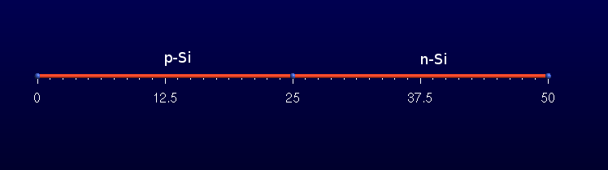

Modeling of the device with GMSH
^^^^^^^^^^^^^^^^^^^^^^^^^^^^^^^^

In this script, first the geometrical entities Points and Lines are defined 
( see :ref:`tutorial0` ). Then, two physical regions are defined, each associated 
to one of the two geometrical entities: Physical Line("p_side") and Physical Line("n_side").

::

  Physical Line("p_side")  = {1}
  Physical Line("n _side")= {2}

In this way, these physical regions are made available for **TiberCAD** , and will be 
associated to a **TiberCAD Region** (see in the following).

Then, two **Physical Points** are defined, **anode** and **cathode** , and associated to the 
first and to the last point of our 1D device.

::

  Physical Point("anode") = {1}
  Physical Point("cathode") = {3}

These points are needed to impose some boundary conditions and in this way 
they are made available for **TiberCAD** , and will be associated each to a 
boundary condition region (see in the following).

A *non-interactive* mode is also available in GMSH, without graphical user interface. 
For example, to mesh this first 1D tutorial in non-interactive mode, just type:

  |idea| gmsh diode.geo -1 -o diode.msh

where ``diode.geo`` is the geometrical description of the device with GMSH syntax;

some command line options are:

* -1 , -2, -3 to perform 1D, 2D or 3D mesh generation

* -o **mesh_file.msh** to specify the name of the mesh file to be generated
 

 

TiberCAD input file
^^^^^^^^^^^^^^^^^^^^^^^^

 

This is the summary of the Sections of this Tutorial :

*  :ref:`tut1step1` 
*  :ref:`tut1step2` 
*  :ref:`tut1step3` 
*  :ref:`tut1step4` 
*  :ref:`tut1step5` 
*  :ref:`tut1step6` 
 

..  index:: double:Si-Pn Diode;device
..  _tut1step1:

Device structure
^^^^^^^^^^^^^^^^  

Let's have a look to the input file; for further details you can 
refer to the reference manual.

::

  Device
    {
     meshfile = diode_1D.msh 
     material = Si

     Region n_side 
       {
        Doping
          {
           Nd = 1e18
           type = donor
          }
       }

     Region p_side 
       {
        Doping
          {
           Nd = 1e18
           type = acceptor
          }
       }
    }

First we define the device structure: it is composed by two Regions, 
both constituted of the material Silicon, respectively n and p doped with a concentration of 1e18 cm-3.

    With Region n_side

    and Region p_side

the physical regions previously defined in GMSH are associated to 
the respective **TiberCAD Region** .

..  index:: double:Si-Pn Diode;model
..  _tut1step2:

Simulation models
^^^^^^^^^^^^^^^^^^^^^  

Now, we have to define the **simulations** which we are going to execute 
in our calculations.

One **simulation** is a particular set of equations, boundary conditions, 
physical parameters, solver parameters, which describes a physical 
problem to be solved by TiberCAD.

A valid **TiberCAD simulation** must belong to one of the predefined 
**TiberCAD simulation models** .

TiberCAD, being a **multiphysics** software tool, includes several 
simulation models, each one describing a physical problem to be solved, 
e.g DriftDiffusion (to solve Poisson and DriftDiffusion equations) , 
EFASchroedinger (to solve Schroedinger equation in effective mass approximation) , 
Macrostrain (to calculate macroscopical strain) and others.

To create a **TiberCAD simulation** , we first have to declare the **TiberCAD 
model** class to which our simulation belongs::

  Module driftdiffusion
    { 
     name = dd

     plot = (Ec, Ev, Eg, ElField, ElPotential, eQFermi, hQFermi, eDensity, hDensity,
             NetRecombination, eCurrentDensity, hCurrentDensity, CurrentDensity,
             ContactCurrent, eMobility, hMobility, IonizedDonors, IonizedAcceptors)

	   
Here, we declare that the simulation to be created will belong to the 
model class **driftdiffusion** ( ``model driftdiffusion`` )

In the next Options block, we define the name of the TiberCAD simulation 
( ``name = dd`` ) and the TiberCAD regions to which it 
will be applied ( ``region = Regiona_Name``  if you don't specify anything, it means the whole device).

After we specify types of data we want in our Output file.

 

In this example, just one simulation for the *driftdiffusion model* is created. 

In general, several TiberCAD simulations belonging to the same **model** can be created; 
each of them must have a different **name** . This name must also be different 
from the **model name**. 

As we will see in the following, it is possible to specify 
physical and solver parameters for a single **TiberCAD simulation** , by referring to its **name** . 

Anyway, it is also possible to specify parameters common to all the **TiberCAD simulations** 
belonging to the same **model** , by referring to the name of the **TiberCAD model** 
instead (in this example driftdiffusion)::

  Physics
    {
     particle_density
      {
       statistics = boltzmann
      }

    # use a field dependent mobility model with the
    # gradient of the electrochem. potential as field
    # parameter
     mobility field_dependent
       {
        low_field_model = doping_dependent 
       }
    # use SRH and Auger recombination
    recombination (srh, auger) {}
  }

  Contact anode
  {
    type = ohmic
    voltage = $Vb[0.0]
  }

  Contact cathode
  {
    type = ohmic
    voltage = 0.0
  }
}

Thus, in this simulation we are going to calculate *Poisson* and *Drift-diffusion*  
( **model driftdiffusion** ) for all the device ( **regions = all** if not specified).

Next, some physical_model blocks follow.
The physical_model blocks are used in general to define the physical model 
to be used to describe a physical property or quantity associated to the present TiberCAD model.

Here, for example, we choose a Schottky-Read-Hall model ( model  =  srh) 
to describe recombination in our driftdiffusion calculations.

physical_model recombination

  Physics
    {
     recombination (srh, auger) {}
    }

Also, we choose a field dependent model to describe electron and hole mobility 
( ``mobility = field_dependent`` ), with the low field mobility determined by a 
doping-dependent model (Masetti model, see reference manual) 
( ``low_field_model = doping_dependent`` ).

physical_model electron_mobility
{
model = field_dependent
low_field_model = doping_dependent
}
 

Now, we have to specify the Boundary conditions for the PDE problem 
represented by the simulation dd : they are defined in Contact section.

Here, two boundary conditions are defined, corresponding to the two contacts 
of our pn diode, anode and cathode.

::

  Contact anode
    {
     type = ohmic
     voltage = $Vb[0.0]
    }

  Contact cathode
    {
     type = ohmic
     voltage = 0.0
    }

Here the **anode** and **cathode** Contacts are associated to the corresponding anode 
and cathode regions defined in GMSH as Boundary condition region s (which in 
the present case of 1D simulation are actually just a point), with 

* *Contact anode* 

and 

* *Contact cathode* .

 

Besides, the type of Boundary condition is assigned (in this case **ohmic** ) with 
its (initial) value, given by **voltage** .

|warn| The anode voltage is expressed by the notation **@Vb[0.0]**.
        This means that the anode voltage will be given the value of the variable **Vb** , 
        specified in the **sweep** block (see after). **[0.0]** means that the default voltage value is 0.0 V.

		
..  index:: double:Si-Pn Diode;solver
..  _tut1step3:

Solver parameters  
^^^^^^^^^^^^^^^^^^^^^

Definition of  Model-dependent Solver parameters ::

Module sweep
{
  variable = $Vb
  solve = dd

  start = 0.0
  stop = 1.2  
  steps = 60

  plot_data = true  # to write data for each step
}

Now, the parameters for the **solver** are defined. 

These values are tuned for the specific simulation and usually don't need to 
be changed; however you can refer to the manual for further details.

The **sweep** block allows us to perform the calculation of the IV characteristic 
of the diode: it defines the variable *Vb* , which will assume a range of values 
between 0 and 1.2 V. These values will be assigned in turn to the *anode* contact, 
in order to execute a series of complete dd simulations (simulation = dd) for each bias condition.

..  index:: double:Si-Pn Diode;physic
..  _tut1step4:

Physics parameters  
^^^^^^^^^^^^^^^^^^^^^^^^^^

Definition of  Model dependent physical parameters::

    Physics
      {
       particle_density
         {
          statistics = boltzmann
         }
       mobility field_dependent
         {
          low_field_model = doping_dependent 
         }
       recombination (srh, auger) {}
      }

In the Physics section usually some physical parameters are defined.
In this case we state that the Fermi-Dirac statistic will be applied (statistics =  FD).

..  index:: double:Si-Pn Diode;run
..  _tut1step5:

Run simulations  
^^^^^^^^^^^^^^^^^^^^^^

Finally, in Simulation section, we define the actual simulation to be performed, specified by::

  solve = sweep

this determines the execution of dd inside the ``sweep`` cycle;
this means that we are going to perform a calculation of **Poisson** and **drift-diffusion** 
for all the biases defined in the sweep section.

Results of the calculation will be in the format of xmgr data visualization program 
( ``output_format = grace`` ), suited to 1D case, since it consists of ascii text files with column data.

::

  Simulation
    {
     verbose = 2

     solve = sweep

     resultpath = diode1D_results
     output_format = grace
    }

Note that the output variable ContactCurrents is needed to get in output the IV characteristic.

Now we can run TiberCAD....

    ``tibercad diode.tib``

During the execution, the screen output shows some information about 
how the simulation is going:

First, about the creation of the Device regions; if there is an inconsistency 
between the mesh file and input file device description, here an error message 
is displayed and the execution terminated.

If all is ok, the calculation is started:

  We solve: ``sweep``

In this example only one simulation is performed, sweep, which is a set of 
drift-diffusion calculations.

First, the equilibrium solution is found, by solving Poisson equation:

  ``DriftDiffusion (name: driftdiffusion)
  Solving equilibrium
  ......
  iterations: 6, residual = 1.95054e-16
  Equilibrium done``

Then, current continuity equations are solved together with Poisson eq., 
for each step of the sweep.

The voltage and current found for each contact is displayed:

  ``Sweep value Vb = 0.05``

<<-------------------------------------------------------------------

  ``DriftDiffusion (name: driftdiffusion)
  .....
  iterations: 5, residual = 1.17131e-10

  contact name: contact voltage: contact current:
  cathode 0 6.31825e-05
  anode 0.05 -6.3187e-05``

The simulation ends correctly (hopefully...) with the Sweep value Vb = 1.2.

 
..  index:: double:Si-Pn Diode;output
..  _tut1step6:

Output  

Now, the output directory contain the simulation results, as defined 
in output_format and plot.

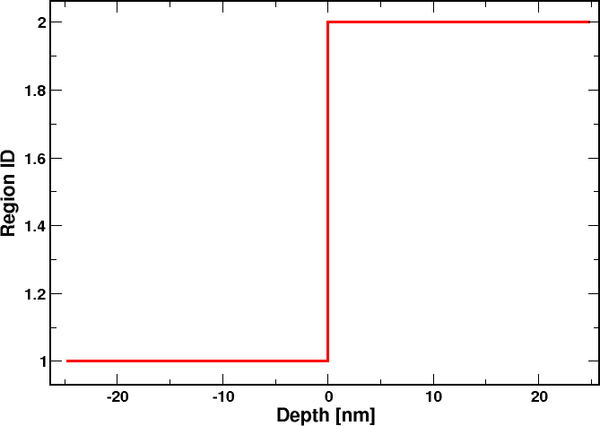

Thus, in ``driftdiffusion_materials.dat`` we have the information about 
the material regions of the device (not very interesting in 1D, but useful in 2 and 3D).

In ``driftdiffusion_nodal_Vb_0.000.dat`` and all the other files for each bias step, 
we have the output for the nodal quantities which have been calculated, e.g. conduction and valence bands, (quasi)fermi levels, electron and hole density and mobility.

Here is, for example, the band profile obtained at the last step of calculation, 
for V = 1.2V.

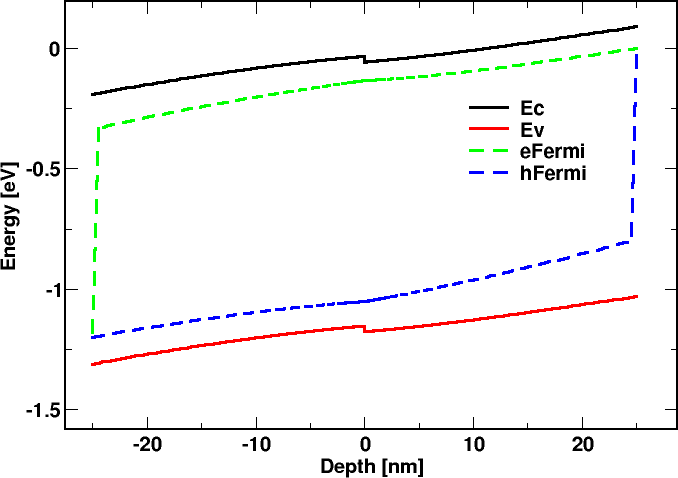

The IV characteristic of the diode is contained in the file sweep_driftdiffusion_Vb.dat, 
where the currents at both the contacts are reported.

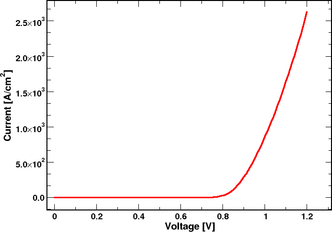

In the file driftdiffusion_elemental_Vb_0.200.dat etc., you can find the elemental 
quantities which have been calculated, in this case the electron, hole and 
total current density (Jn_x, Jp_x , J_x).

 

|  Attachment	        Size
|  
|  diode_1D.tib_	    1.79 KB
|  diode_1D.geo_	    239 bytes
|  diode_1D.msh_	    26.24 KB

----

n-MosFET 2D
------------------

This is the summary of the Sections of this Tutorial :

*  :ref:`tut4step1` 
*  :ref:`tut4step2` 
*  :ref:`tut4step3` 
*  :ref:`tut4step4` 
*  :ref:`tut4step5` 
*  :ref:`tut4step6` 

In this tutorial we will show an example of **2D** simulation 
of a **Si n-MOSFET** device.

We will calculate :

* :ref:`tut4step3<IV drain characteristic>`_ ,

* :ref:`tut4step6<Id/Vg transfer characteristic>`_ .

In order to execute correctly the example you should have 
the following files in the working directory:

mosfet.tib_  : input file for TiberCAD
mosfet.msh_  : mesh file produced by GMSH from the script mosfet.geo_ 

Here is the geometry of the Mosfet device as it is meshed by GMSH.

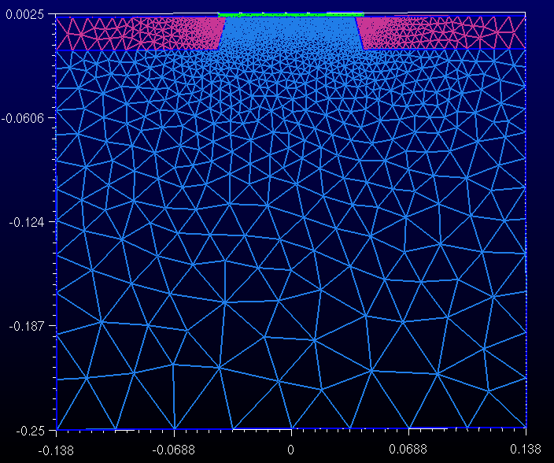
 
Let's give now a look to the input file; for further details 
you can refer to the program reference manual.

..  index:: double:n-MosFET 2D;device
.. _tut4step1:

Device structure
^^^^^^^^^^^^^^^^^^^

Description of  the  device physical regions::

  Device mosfet
    {
     meshfile = mosfet.msh  
     material = Si

    Region substrate 
      {
       Doping
         {
          Nd = 1e18
          type = acceptor
         }
      }
   
    Region contact
      {
       Doping
         {
          Nd = 5e19
          type = donor
         }
      }

    Region oxide
      {
       material = SiO2
      }
    }

First we define the device structure: it is composed by three 
**TiberCAD Regions: substrate** and **contact** , both made of *Silicon* , 
and *oxide* (SiO2).

The **substrate** region (which include channel) is doped p-type 
:math:`10^{18} cm^{-3}` ; contact region is composed by the two regions around 
source and drain, both heavily doped n-type 5x :math:`10^{19} cm^{-3}` ; 
finally, **oxide** is the gate dielectric.

..  index:: double:n-MosFET 2D;simulation
.. _tut4step2: 

Drift-diffusion simulation
^^^^^^^^^^^^^^^^^^^^^^^^^^^^^^^^^

Now, we define the **TiberCAD simulation models** which will be 
used in this example.
We are going to calculate Poisson and Drift-diffusion 
( model *driftdiffusion* ) for all the device ( ``regions = all`` in options). 

A field dependent model for **mobility** is applied.

::

    recombination srh {}

    mobility
    {
      type = field_dependent
      low_field_model = doping_dependent
    }

Then, we have to specify the the three **contacts** of our Mosfet.

We assume a gate width of 1 mm.

::

  Contact gate
    {
     type = schottky
     barrier_height = 3.0
     voltage = $Vg
     area_factor = 0.1
    }

  Contact source
    {
     voltage = 0.0
     area_factor = 0.1
    }
 
  Contact backcontact
    {
     voltage = 0.0
     area_factor = 0.1
    }

  Contact drain
    {
     voltage = $Vd
     area_factor = 0.1
    } 

The contacts (boundary regions for this model) have to be associated 
each to the corresponding region defined in the mesher program (here GMSH) 
as a Boundary region (which in the present case of 2D simulation is a line 
( ``Physical Line`` in GMSH)). 

This is made simply with ::

  Contact gate

and so on for the other contacts.

The **gate** contact is defined as a **schottky** contact, with a barrier value 
depending on the gate metal workfunction ( ``barrier_height`` ). 

The gate voltage is expressed by the notation ``@Vg[0.0]`` . This means 
that the gate voltage will be given the value of the variable *Vg* , 
specified in one of the sweep block (see after). **[0.0]** means that 
the default voltage value is 0.0 V.
Source and drain contacts are defined as ohmic; while source is fixed to 0 
( ``voltage = 0.0`` ), drain voltage is expressed, as for the gate, 
by the value of the sweep variable *Vd* ( ``voltage = @Vd[0.5]`` ).
 

..  index:: double:n-MosFET 2D;characteristic
.. _tut4step3:

Calculation of IV drain characteristic
^^^^^^^^^^^^^^^^^^^^^^^^^^^^^^^^^^^^^^^^

Definition of  Model-dependent Solver parameters::

  Module sweep
    {
     name = sweep_drain
     solve = driftdiffusion

     variable = $Vd
     start = 0.0 # 0.2
     stop = 1.0 
     steps = 5 # 4 
    }

  Module sweep
    {
     name = sweep_gate
     solve = driftdiffusion

     variable = $Vg
     start = -0.5
     stop = 1.5
     steps = 100 

     max_step = 0.1
     plot_data = true
    }

Every cycle is performed at maximum  step of 0.1 V

Definition of  model-independent parameters of the Simulation::

  Simulation
    {
     temperature = 300
     solve = (sweep_drain, sweep_gate)
     resultpath = output_transchar 
  
     output_format = vtk
    }

Now, the parameters for the solver are defined, for the driftdiffusion model.
 ``coupling = electrons`` specifies that only one type of carrier is considered. 

 ``ksp_type = bcgsl`` defines the solver type, 
 
 ``nonlinear_solver = tiber`` specifies the non-linear solver.

As a first step, we are going to calculate **Id/Vd drain current characteristic** .

We include the optional **Sweep** block, whose syntax is the following::

  Module Sweep
    {
     name = sweep_name1
       {
        .....................
       }
	}
  Module Sweep
    {
     name = sweep_name2
       {
        .....................
       }
    }
	
Here we define two nested **sweeps** : the external sweep ( ``sweep_gate`` ) calculates 
the drain current for a series of gate voltages, from -0.1 to 0.5 V; 
for each calculation, a sweep on drain voltages is performed ( ``simulation = sweep_drain`` ), 
defined by ``sweep_drain`` . In sweep_drain, driftdiffusion is calculated 
( ``simulation = driftdiffusion`` ) for a series of drain voltages from 0 to 2 V.

..  index:: double:n-MosFET 2D;physic
.. _tut4step4:

Physic
^^^^^^^^^^^^^^^^

In the **Physics** section usually some physical parameters are defined.
In this case we just state that we want to use the **unstrained** model for driftdiffusion 
(since no strain calculation is intended) and that we use Fermi-Dirac statistic 

  Physics
  {

    particle_density
    {
      statistics = fermidirac
    }

    recombination srh {}

    mobility
    {
      type = field_dependent
      low_field_model = doping_dependent
    }
  }

Finally, in **Simulation** section, we define the 2D ( ``dimension = 2`` ) simulation 
to be performed, specified by 

 ``solve = sweep_gate`` : this means that we are going to perform a calculation 
of **Poisson** and **drift-diffusion** 
with a double sweep on gate and drain voltage, to calculate **Id/Vd drain current characteristics** . 

Results of calculation will be in the format of **paraview** data visualization 
and post-processing program ( ``output_format = vtk`` )

In **plot** we define the output variables to be calculated.

::

  Simulation
    {
     temperature = 300
  
     solve = sweep_gate
     resultpath = output_outputchar  
  
     output_format = vtk
    }

Now we can run TiberCAD....

    ``tibercad mosfet.tib``
 
..  index:: double:n-MosFET 2D;output
..  _tut4step5:

Output
^^^^^^^^^^^^^^

After the execution, the output directory contain the simulation results, 
as defined in 

    output_format and plot.

TiberCAD s ports 3 packages for 2D and 3D data visualization and post-processing:

Free:

#. GMV, http://www-xdiv.lanl.gov/XCM/gmv/GMVHome.html

    ``output_format = gmv``

#. Paraview, http://www.paraview.org/New/index.html

    ``output_format = vtk`` 

Commercial:

#. Tecplot-ise, http://www.amtec.com/

    ``output_format = ise``

Let's see how to use Paraview to plot TiberCAD 2D results:

First, open the .vtk file from your directory: 

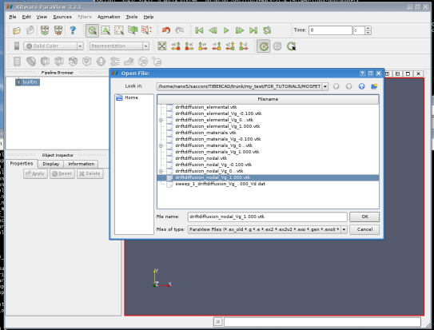

The name of the loaded files will be shown in the Pipeline browser.

To visualize the content of the file, you should click on the 
``Apply`` button in the **Properties** tab in **Object Inspector**

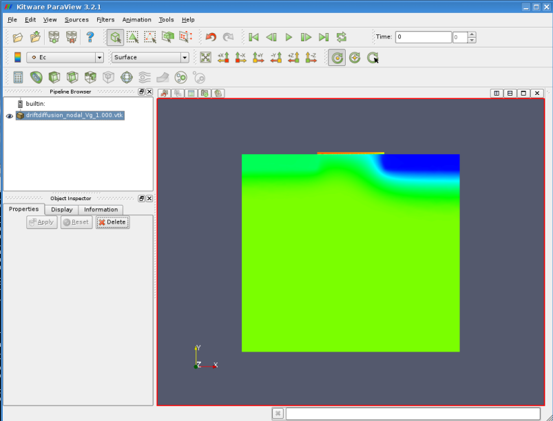

To select the output variable , go to **Display** and choose from the menu 
"Color by", e.g. electron _density. Also, in Display section Scale 
and legend bar can be setted.

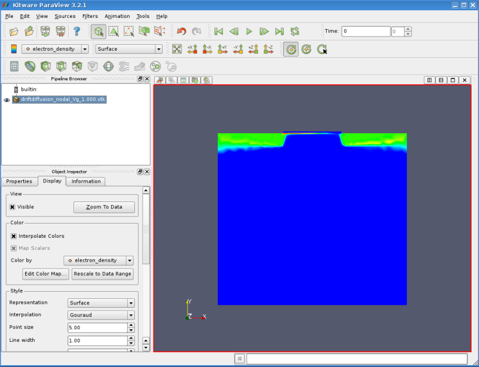

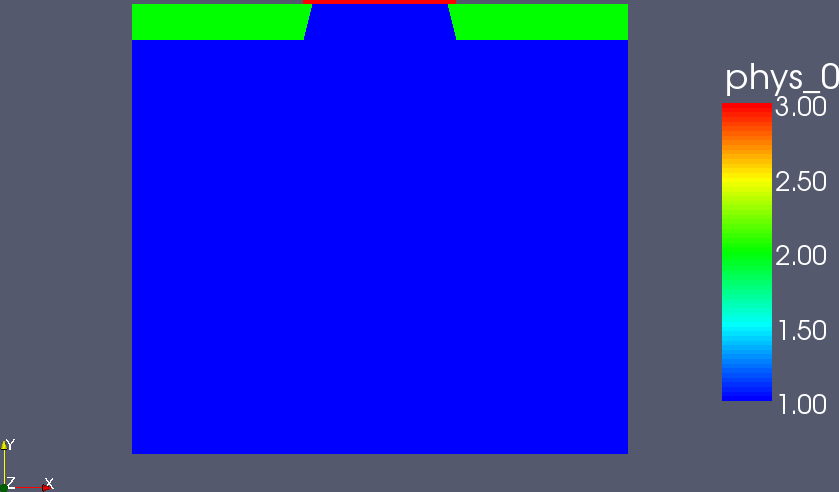

Thus, in ``driftdiffusion_materials.vtk`` we have the information about 
the material regions of the device: here, **1** indicates the substrate Region , 
**2** the contacts region and 3 the SiO2 gate dielectric.

In ``driftdiffusion_nodal.vtk`` and all the other files for each bias step, 
we have the output for the nodal quantities which have been calculated, 
e.g. conduction and valence bands, (quasi)fermi levels, electron and hole density and mobility.

For example, this is the electron density for a drain voltage = 2V and a gate bias Vg = 1V.
You can see the large increase of electron density in the channel, 
which is pinched off close to drain contact due to the high drain voltage.

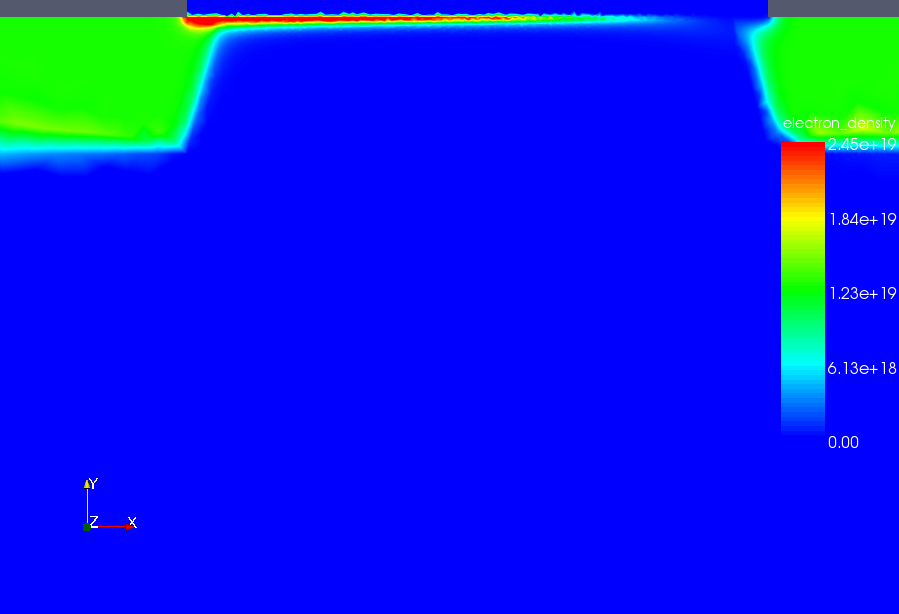
 
In ``sweep_2_driftdiffusion_Vg_0.000_Vd.dat`` and all the other files for each 
Vg bias step ( ``sweep_2_driftdiffusion_Vg_step_Vd.dat`` ) we have the IV drain 
characteristics for each Vg bias.

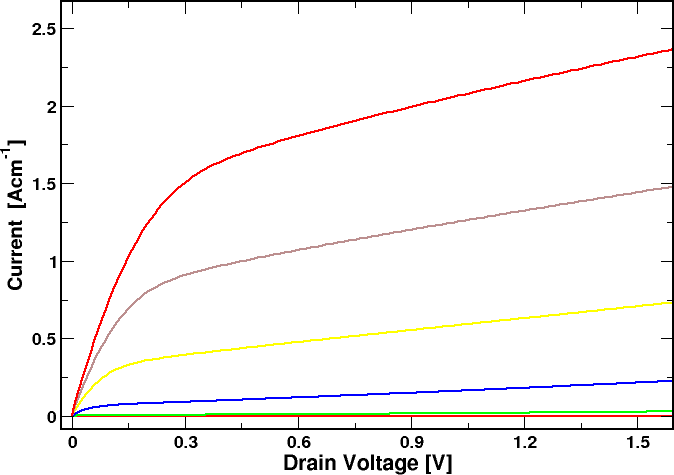

Here are the IV characteristics obtained for a gate voltage Vg between -0.1 and 0,5 V.

..  _tut4step6: 

Calculation of transfer characteristic
^^^^^^^^^^^^^^^^^^^^^^^^^^^^^^^^^^^^^^^^^^^^^

As a second step, we are going to calculate Id/Vg transfer characteristic.
(see input file mosfet_transchar.tib_ )
 

To do so, the two **sweeps** have to be defined in this way::

  Module sweep
    {
     name = sweep_drain
     solve = driftdiffusion

     variable = $Vd
     start = 0.0
     stop = 2.0 
     steps = 40
  
     plot_data = true
    }

  Module sweep
    {
     name = sweep_gate
     solve = sweep_drain

     variable = $Vg
     start = 0.0
     stop = 1.5
     steps = 6
    }

the first sweep ( ``sweep_drain`` ) calculates the drain current ( ``simulation = driftdiffusion`` ) 
for a series of drain voltages, from 0 to 1 V, while Vg is kept at its initial value Vg=0; 
at the end of this calculation we have polarized the mosfet at a drain voltage of 1 V. 

Then a sweep on gate voltages is performed, defined by ``sweep_gate`` . 
In ``sweep_gate`` , driftdiffusion is calculated ( ``simulation = driftdiffusion`` ) 
for a series of gate voltages from -1 to 0.5 V, by keeping the drain voltage at Vd = 1 V.

At the end, the Id/Vg transfer characteristic for Vd=1 V is obtained.

 

This time, in **Simulation** section, we define the 2D simulation to be performed 
by writing ``solve=(sweep_drain,sweep_gate)`` : this means that we are going to perform 
a calculation of **Poisson** and **drift-diffusion** 
with two sweeps in series, first a sweep on drain and than a sweep on gate voltage, 
to calculate **Id/Vg transfer characteristic** .

::

  Simulation
    {
     temperature = 300
     solve = (sweep_drain, sweep_gate)
     resultpath = output_transchar 
  
     output_format = vtk
    }

The rest of the input file remains unchanged.

 

Now we can run TiberCAD another time....

    ``tibercad mosfet.tib``

 

* Now, in the files ``sweep_1_driftdiffusion_Vd_step_Vg.dat`` (e.g. ``sweep_1_driftdiffusion_Vd_1.000_Vg.dat`` ), 
  we have the Id/Vg transfer characteristics for each *Vd_step* bias.
 

Here is the **Id/Vg transfer characteristic** for a drain voltage Vd = 1 V .

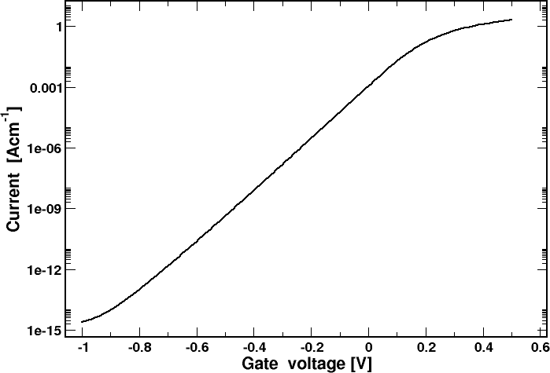
 

As before, in ``driftdiffusion_elemental.vtk`` and ``driftdiffusion_nodal.vtk`` , we have 
the output for respectively the nodal and the elemental quantities which have been calculated.

The **subthreshold S** parameter, given by

..  math::
    :nowrap:
	:label:
 
    \[
    S = log\frac{d(V_G)}{d(logI_D)}
    \]
 
in this case results to be **~80 mV/dec** .

 

|  Attachment	               Size
|
|  mosfet.msh_ 	               309.63 KB
|  mosfet.geo_ 	               1.67 KB
|  mosfet.tib_ 	               2.28 KB
|  mosfet_transchar.tib_ 	   2.14 KB

----

Bjt1 & Bjt2
------------------
 
This is the example of the first Bjt.

Device
^^^^^^^^^^^^^^^^

::

  Device bjt
    {
     material = Si
     meshfile = bjt.msh 

     Region coll_doped  # the buried doping
       {
        Doping 
		  {
           type = donor
           density = 1e19
          }
       }

     Region coll # the collector region
       {
        Doping 
		  {
           type = donor
           Nd = 5e15
          }
       }  

     Region b_reg # the base region
       {
        Doping 
		  {
           type = acceptor
           density = 1e17
          }
       }

     Region e_reg # the emitter region
       {
        Doping 
		  {
           type = donor
           density = 1e19
          }
       }
    }

Module
^^^^^^^^^^^^^

::

  Module driftdiffusion
    { 
              
     name = dd

     # we use a different quadrature rule to avoid density peaks
     # where the mesh is not so dense
     quadrature_rule = trapez

     plot = (Ec, Ev, ElPotential, ElField, eQFermi, hQFermi, eDensity, hDensity,
             eCurrentDensity, hCurrentDensity, CurrentDensity, ContactCurrents,
             NetRecombination, eMobility, hMobility)

     Solver linesearch
       {
       }

  Physic
^^^^^^^^^^^^^^

::

  Physics
  {

     # use Fermi-Dirac statistics
     statistics =  FD

           
     mobility doping_dependent {}

     recombination (srh, auger) {}
  }

Contacts
^^^^^^^^^^^^^^^^
  
::
  
  Contact base
    {
     type = ohmic
     voltage = $Vb
    }

  Contact collector
    {
     type = ohmic
     voltage = $Vc
    }
 
  Contact emitter
    {
     type = ohmic
     voltage = 0.0
    }
 

Sweep
^^^^^^^^^^^^^

::

  Module sweep
    {
     name = sweep_base
     variable = $Vb
     start = 0.5
     stop = 0.7  
     steps = 10

     # we calculate the output characteristics
     solve = sweep_coll

     # plot only for the last collector bias
     plot_data = true
    }

  Module sweep
    {
     name = sweep_coll
     variable = $Vc
     start = 0.0
     stop = 3
     steps = 60

     solve = dd
     #plot_data = true
    }

Simulation
^^^^^^^^^^^^^^

The temperature = 300 is the default ::

  Simulation
    {
     verbose = 3

     solve = sweep_base

     resultpath = output
     output_format = vtk
    }

----

Device
^^^^^^^^^^^^^^

This is the example of the second bjt ::

  Device bjt2
    {
     material = Si
     meshfile = bjt2.msh 

     Region coll_doped  # the buried doping
       {
        Doping donor { density = 1e19 }
       }

    Region coll # the collector region
      {
       Doping 
  	   {
          type = donor
          Nd = 5e15
         }
      }

    Region b_reg # the base region
      {
       Doping 
  	     {
          type = acceptor
          density = 1e17
         }
      }

    Region e_reg # the emitter region
      {
       Doping 
    	 {
          type = donor
          density = 1e19
         }
      }

    Region oxide
      {
       material = SiO2
      }
    }

Module
^^^^^^^^^^^^^^

::

  Module driftdiffusion
    { 
              
     name = dd

     quadrature_rule = trapez

     plot = (Ec, Ev, ElPotential, ElField, eQFermi, hQFermi, eDensity, hDensity,
             eCurrentDensity, hCurrentDensity, CurrentDensity, ContactCurrents,
             NetRecombination, eMobility, hMobility,
             IonizedDonors, IonizedAcceptors,
             IonizedElectronTraps)

  Solver linesearch
    {
    }

Physic
^^^^^^^^^^^^

We'll use the Fermi-Dirac statistic::

  Physics
    {

     statistics =  FD

     mobility doping_dependent {}

     recombination (srh, auger) {}

     trap eNeutral
       {
        regions = Si/SiO2
        Nt = 2e12
        Et = 0.5
        reference = cb
       }
    }   

  Contacts
^^^^^^^^^^^^^^^^^^^^^

::

  Contact base
    {
     type = ohmic
     voltage = $Vb
    }

  Contact collector
    {
     type = ohmic
     voltage = $Vc
    }
 
  Contact emitter
    {
     type = ohmic
     voltage = 0.0
    }
  

Sweep
^^^^^^^^^^^^^^^

We can calculate the output characteristics and plot only for the last collector bias::

  Module sweep
    {
     name = sweep_base
     variable = $Vb
     start = 0.5
     stop = 0.7  
     steps = 10

     solve = sweep_coll

     plot_data = true
    }

  Module sweep
    {
     name = sweep_coll
     variable = $Vc
     start = 0.0
     stop = 3
     steps = 60

     solve = dd
     plot_data = true
    }

Simulation
^^^^^^^^^^^^^^^

The temperature = 300  is the default ::

  Simulation
    {
     verbose = 3

     solve = sweep_base

     resultpath = output2
     output_format = vtk
    }

 
..  _bulk.tib: http://www.tibercad.org/files/bulk_2.tib
..  _bulk.geo: http://www.tibercad.org/files/bulk_0.geo
..  _bulk.msh: http://www.tibercad.org/files/bulk_0.msh

..  _diode_1D.tib: http://www.tibercad.org/files/diode_1D_5.tib
..  _diode_1D.geo: http://www.tibercad.org/files/diode_1D_1.geo
..  _diode_1D.msh: http://www.tibercad.org/files/diode_1D_3.msh

..  _mosfet.msh: http://www.tibercad.org/files/mosfet_0.msh
..  _mosfet.geo: http://www.tibercad.org/files/mosfet_0.geo
..  _mosfet.tib: http://www.tibercad.org/files/mosfet_2.tib
..  _mosfet_transchar.tib: http://www.tibercad.org/files/mosfet_transchar_2.tib

.. |more| image:: ../data/more.png
    :scale: 50%

.. |warn| image:: ../data/warn.png
    :scale: 50%

.. |idea| image:: ../data/idea.png
    :scale: 50%

.. rubric:: Footnotes
