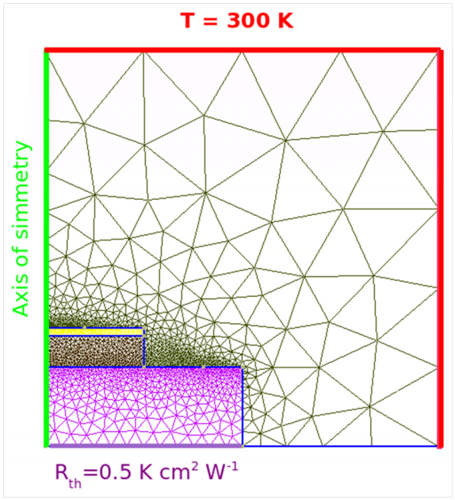

.. _Thermal:

Thermal
=================================================

Boundary conditions
-------------------

The Dirichlet boundary condition is set with ::

  Contact reservoir
    {
     type = heat_reservoir
     temperature = 300
    }
    
whereas the surface thermal resistance is applied with ::

  Contact dissipator
    {
     r_surf = 0.5
     type = surface_resistance
     temperature = 300
    }
    
The selfconsistent simulation solves the thermal and the drift diffusion simulations
(named **tt** and **dd** respectively) in a self consistent way.

::

  Module Selfconsistent
    {
     flavour = relaxation
     simulations = (dd,tt)
     abs_tolerance = 1e-5
     monitor = true
    }
    
The sweep section runs the selfconsistent simulation for each anode bias step ::

  Module sweep
    {
     simulation = selfconsistent
     variable = Vb
     start = 0.0
     stop = 1.0
     steps = 10
    }
  Simulation
    {
     temperature = 300
     solve = sweep
     symmetry = cylindrical
    }
    
The temperature map, the heat source and the thermoelectri power are shown below.

::

  Contact heat_reservoir
    {
     region = substrate  
     temperature = 300
    }
  
::

  Contact substrate
    {
     type = surface_resistance
     r_surf = 0. 05 
     temperature = 300
    }

Heat sources
------------

    
In this example we will see how to perform a thermal-driftdiffusion self-consistent sim 
ulation. We include the Seebeck and Peltier effects. The heat conduction through the
environment is modelled by adding an air region all around the diode. We assume that
far from the junction the system is in thermal equilibrium with a thermal bath at 300 K.

The heat dissipation through the substrate is taken into acount by introducing a thermal 
surface resistance. Furthermore, we rely on the cylindrical symmetry with respect to the
axis growth and consider only a 2D slice of the system. In this way we simulate a 3D
device by performing a 2D simulation (with much less computational time). The mesh
corresponding to the whole system (diode plus air region) is shown below. 

Region n-side corresponds to the n-doped region situated at the bottom of the device, while the region
p-side refers to the top p-doped region. Air is modelled with Region Air.

::

  Device
    {
     meshfile = tut_09.msh
     dimension = 2
     material = Si
     Region n_side 
       { 
        doping = 1e18 
        doping_type = donor 
       }
     Region p_side
       { 
        doping = 1e19 
        doping_type = acceptor
       }
     Region air
       {
       }
    }

The drift diffusion simulation is performed only over the device domain (excluding the
Air region). Therefore, in option subsection we have to indicate *physical_regions =
(n side,p side)* . The mobility models used for both electrons and holes are doping
dependent.

::

    electron_mobility doping_dependent{}
    
    hole_mobility doping_dependent{}
    
The connection with the thermal simulation is given by the keyword *thermal_simulaation
= tt* . The thermoelectric power model used can be included with *thermoelecric diffusivity model* 
(see the **Theory** section). Direct bias applied to the diode is obtained by using
the following boundary conditions ::

  Contact anode{@Vb[0.0]}

  Contact cathode{}

Unlike the drift diffusion case, the thermal simulation has to be performed over the
whole simulation domain (including the Air region). We can refer to all regions simply
by writing *physical_regions = all* . The connection with the drift diffusion simulation is
specified with

::

    HeatSource joule 
      {
       DD_simulation_name = dd
      }
    
    
::  

  HeatSource constant
    {
     region = qdot 
     H = 1e10
    }
  

