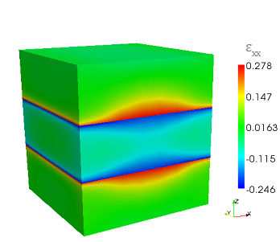

.. _Elasticity:

Elasticity
=================================================

Abstract
--------

Elasticity is a Finite Elements solver for mechanical equilibrium problems. 
It brings features typically developed for structural stability solvers into device modeling. 
The coupled treatment of the electro-mechanical problem within a unique framework results very useful to explore for multidisciplinary ideas. 

Mini theoretical intro
----------------------

Assuming a small displacement, Elasticity® elasticity computed the strain by solving the equation

.. math::
   :nowrap:
   :label:
   
   \[
   \frac{\partial}{\partial x_j}C_{ijlk}\frac{\partial u_l}{\partial x_k} = f_i
   \]

where C is the stiffness constant  and f is the total external body force. 
The latter may include several contribution such as the converse piezoelectric effect the thermal expansion and a lattice mismatch induced strain. 
The latter, described in the example below, occurs when an interface is created between two materials with different lattice constants. 
Let :math:`\epsilon^{LM}` be the lattice mismatch strain, then the effective body force reads as :  

.. math::
   :nowrap:
   :label:

    \[
    f_i = -\frac{\partial }{\partial x_j} C_{ijlk}\epsilon_{lk}^{LM}
    \]

Example
-------

In the following we will compute the strain induced by the lattice mismatch in a system comprising a layer of GaN between two contacts of :math:`Al_{x}Ga_{1-x}N` . 
Once the mesh is created with gmsh (distributed along TiberCAD®) we may start to build the input file. 
First, we have to insert the region section ::

  Device
    {
     dimension = 3 
     meshfile = mesh.msh
     mesh_units = 1e-9
     material = AlGaN
     x = 0.2
     x-growth-direction = (-1,0,1,0) 
     y-growth-direction = (-1,2,-1,0) 
     z-growth-direction = (0,0,0,1)
     Region Well  {material = GaN}
    }

All the options included in this section, such ad the material, axis growth and alloy concentration, apply for the whole structure.  
If we want to specify a region with different properties, we may use the keyword Region and refer to a region name, as specified in the mesh file. 

The second part of the input file is devoted to the module declaration ::

  Module elasticity 
    {
     Physics 
       {
        BodyForcelattice_mismatch 
          {
           x-growth-direction = (-1,0,1,0) 
           y-growth-direction = (-1,2,-1,0) 
           z-growth-direction = (0,0,0,1)
           reference_material = AlGaN
           x = 0.2 
          }
        Contact Base {type = clamp}
       }
    }

In physics we declare the physical models to be applied to our device. 
In our case, with BodyForce lattice mismatch we are adding a body force into the system, 
induced by the lattice mismatch with the reference lattice which in this case is :math:`Al_{0.2}Ga_{0.8}N` . 
In order to avoid a free standing device we may want to freeze a surface. With Boundary Clamp we fix, in this case, the region Base.

The third part is simply Simulation **{solve = elasticity}** where the default name *elasticity* is used. 
By default, files for 3D system are written in vtu which can be read from Paraview. 
Output data about strain are shown below.

.. _fig.elasticity01: 

   
   
.. _fig.elasticity02: 

.. figure:: ../data/elasticity02.png
   :align: center
   :scale: 50%

