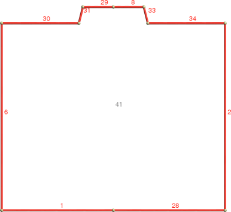
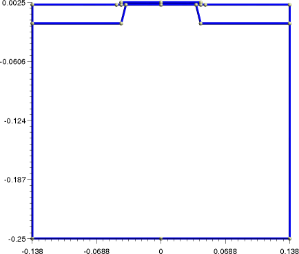
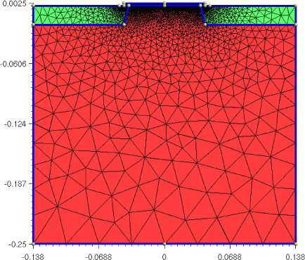

..  _installGetting:

############
Introduction
############

Installation instructions
===================================

In the following, ``installpath`` denotes the directory where tiberCAD 2.0.0 gets installed.
Version 2.5.0 of ``GMSH`` (http://www.geuz.org/gmsh) will be installed together with
tiberCAD.

Prerequisites
-------------------

Get the installer package for your OS/architecture from http://www.tiberlab.com or
by contacting support@tiberlab.com. Table :ref:`Installer packages<input_installerpacks>`  lists the packages available for download.
To run tiberCAD you will also need a license file that you will have to copy into the
installation directory of tiberCAD.

.. In the Windows version, some graphical features such as graphical convergence 
.. monitors are only available if an X Window server is installed and running.

Windows installation procedure
--------------------------------------

To install tiberCAD in Windows, please run the setup program ``tibercad-2.0.0-i686-mingw32_setup.exe`` .

During the installation you can choose the installation directory. 
After finishing installation, copy your license file ``tibercad.lic`` into the ``license`` subdirectory of the tiberCAD
installation directory (``installpath/license``), without changing the filename.

.. _input_installerpacks :

..  math::
    :nowrap:

    \begin{table}[!h]
    \center
    \begin{tabular}{l|c}
    \multicolumn{2}{c}{\textbf{Installer}} \\
    \hline
    \textbf{installer package name} & \textbf{Target architecture} \\
    \hline
    \hline
     &    \\
    \texttt{tiberCAD-2.0.0-i686-mingw32\_setup.exe} & Windows 32-bit     \\
    \texttt{tiberCAD-2.0.0-i686-linux\_installer.sh} & Linux 32-bit \\
    \texttt{tiberCAD-2.0.0-x86\_64-linux\_installer.sh} & Linux 64-bit \\
    \hline
    \end{tabular}
    \caption*{Installer Packages}
    \end{table}

Linux installation procedure
------------------------------------

To install tiberCAD under Linux, download and run the self-extracting installer
``tibercad-2.0.0-ARCH_installer.sh``, where ARCH corresponds to your hardware architecture,
and follow the installation instructions.

After installation, copy your license file ``tibercad.lic`` into the ``license`` subdirectory
of the tiberCAD installation path (``installpath/license``) without changing the filename. 
You can also provide the license file during installation.

tiberCAD is launched by means of a shell script, which is
installed together with the tiberCAD executable. It takes care of setting all necessary 
environment variables. 

If you have to call the executable directly, you have to
set the environment variable ``TIBERCADROOT`` to the tiberCAD installation directory (``installpath``).

Quick start guide
----------------------

In the ``examples`` subdirectory you can find several examples ready to run. More examples may be
available on http://www.tiberlab.com or http://www.tibercad.org.

tiberCAD has the following command line options:

  -v     print the version number and exit
  -b     run in batch mode, without asking for user input.

The ``-b`` option is useful only for the windows version, which attends a keystroke by the user before
exiting.

Windows
^^^^^^^^^^^^^^^^^^^^^

Open Windows Explorer and go to the tiberCAD installation directory. If you have
write permission in the installation directory, you can browse to an example directory
and start the simulation by double clicking the input file, e.g. ``bulk.tib`` in :ref:`tut0step1` . If
not, copy the whole directory to a location in your personal area and run the examples
from there.

If you cannot run tiberCAD by double clicking a tiberCAD input file (the files with extension ``.tib``), then the input
files may not be correctly associated with the tiberCAD executable. In this case,
try to establish the association by right-clicking the input file, choosing 

  ``open with... >> Choose Program... >> Browse...``,
browsing to the tiberCAD installation directory and choosing the tiberCAD executable, ``tibercad.exe``.

Linux
^^^^^^^^^^^^^^^^^^^^^^^^^^^^^^^^

After a correct installation of tiberCAD you should be able to run tiberCAD from the
command line using the command ``tibercad``. If not, you probably have to add the ``bin``
subdirectory of the tiberCAD installation path to your ``PATH`` environment variable or
start the tiberCAD executable using the absolute path (``installpath/bin/tibercad``).

Copy the directory of the example you want to run to your home directory
or any place you have write permissions for. Change to the example directory and
run tiberCAD by (assuming :ref:`tut0step1` )

  ``$ tibercad bulk.tib``

Bug reports / Feedback
-------------------------------------

Please send bug reports, feedback or suggestions to support@tibercad.org. When
submitting bug reports, please always include the full version number of tiberCAD you
are running. The full version number appears in the first line of output when running
the program:

::

  $ tibercad -v
  tiberCAD version 2.0.0 (x86_64-linux)

.. _GMSHTutorialGetting:

GMSH   Quick Tutorial
=================================================

To  use  tiberCAD,   as a first step you  need  to model the device and  generate  a suitable mesh  grid. This  can  be  done  by  using DEVISE module of ISE-TCAD 9.5 software package or GMSH program.

In the following we will see how to write a basic GMSH script in 1 and 2D; for any details please refer to GMSH manual  (http://geuz.org/gmsh/).

.. _GMSH_Ex1:

GMSH Example 1D 
-------------------------------------------

Step 1: Modeling the device
^^^^^^^^^^^^^^^^^^^^^^^^^^^^^^^^^^^^^^^^^^^^

Here we  will  refer  to  the  Example 0 *Bulk Silicon  in  1D* in the  Example directory. 
See :ref:`Input_Ex1` for the  description of the corresponding input file.

In a GMSH script, several variables can be defined and given a value in this way::

  L = 1;
  d = 0.01;

these are valid GMSH variables: ``L`` is just the length of the Si sample; ``d`` is the value of a *characteristic mesh length* (see below).

**GMSH modeling strategy: bottom-up  design**

In   gmsh  the idea  is  to   design  the  model  with a "bottom-up" strategy.
So,   first, points are  defined, then lines  connecting  points,  surface  connecting  lines,  and  so  on. No  superimposing  objects are  allowed.
This  means  that, once  defined  your  points,  you  may  connect them  with  lines but
different lines  must  not  have  parts  in  common (just  points);
the  same  works for  surfaces:  they  may  have only  lines  in  common,   but  no  intersections between  surfaces  are allowed.

.. warning::
             If  a  geometrical  model  with  not  null  intersections  between entities (points, lines,  surfaces, volumes) is  created, unpredictable results may  occur (gmsh  crashes  during  meshing, a  mesh is  created  which is  not  valid, etc.). 

**Definition of the geometrical entities Points**

::

  Point(1) = {0, 0, 0, d};
  Point(2) = {L, 0, 0, d};

In the definition of a geometrical point, the  first three expressions inside the braces on the right hand side give the three X, Y and Z coordinates of the point; the last expression ``d`` sets the *characteristic mesh length* at that point, that is the *size* of a mesh element, 
defined as the length of the segment for a line mesh element, the radius of the circumscribed circle for a triangle mesh element and the radius of the circumscribed sphere for a tetrahedron mesh element.

Thus, the smaller is the value of ``d``, the greater is the mesh density close to that point. The size of the mesh elements will then be computed in GMSH by linearly interpolating these characteristic lengths in the whole mesh.

.. warning::
             In a 1D simulation it is  assumed that the geometrical model is  restricted to the ``x`` axis. 
             Any other geometrical orientation  could  give unpredictable results.

**Definition of a geometrical entity Line**

::  

  Line(1) = {1,2};

The two expressions inside the braces on the right hand side  give the identification numbers of the start and end points of the line.

**Definition of the physical entity Physical Line ``bulk`` and of two physical entities Physical Point** 

Convenient *Physical Names*  are  to  be  assigned to  the  Physical entities. *Physical Names* consist of  strings  enclosed between  quotation marks.
The  syntax is the  following:

::
  
  Physical Line("bulk") = {1}
  ............
  Physical Point("Anode") = {1};
  Physical Point("Cathode") = {2};

The expression(s) inside the braces on the right hand side  give the identification numbers of all the geometrical lines that need to be grouped inside the *Physical Line*  or *Physical Point* .
In this way, in general, *physical regions* are created which associate together geometrical regions, and then the related mesh elements, which share some common physical properties. It's only these physical regions which can be referred to outside GMSH. In tiberCAD, this is done by associating one or more physical regions to a tiberCAD region through the keywords *Region* and  *mesh_regions* (see :ref:`Input File<InputFileGetting>`).

.. warning::
             In general, in a n-Dimension (``nD``) simulation, ``(n-1)D`` physical regions
             (points in 1D, lines in 2D, surfaces in 3D) are used by tiberCAD to impose the required 
             boundary conditions. Each  ``(n-1)D``  physical region defined in this way in GMSH will be associated                          in tiberCAD to a boundary condition (Contact) region. 
             Thus, in this case, Physical points *Anode* and *Cathode* will be associated respectively to two *Contacts* 
             (see :ref:`Input_Ex1`).

            

 

Step 2: Meshing the device
^^^^^^^^^^^^^^^^^^^^^^^^^^^^^^^^^^^^^^^^^^^^

The ``.geo`` script file with the geometrical description can be run in GMSH, to display the modelled device and to mesh it through the GMSH graphical interface.
To  generate  the  mesh,  select  ``Mesh`` in  the main menu  of  GMSH  and  click  on  ``1D``, ``2D`` or ``3D`` depending  on  the  dimension of  your  simulation.
This  will  create  a  file  .msh  in  your  working  directory.

Alternatively, a ``non-interactive`` mode is also available in GMSH, without graphical user interface. For example, to mesh this 1D tutorial in non-interactive mode, just type in the command line ::

  gmsh bulk.geo  -1 -o bulk.msh 

where ``bulk.geo``  is the geometrical description of the device with GMSH syntax;
``-1`` means 1D mesh generation;

some command line options are::

  -1, -2, -3 

to perform 1D, 2D or 3D mesh generation, respectively.

::

  -o  mesh_file.msh 

to specify the name of the mesh file to be generated

In this way, a ``.msh`` has been generated and is ready to be read in tiberCAD. 

.. _GMSH_Ex2:

GMSH Example 2D
-------------------------------------------

In this  second  example  we  will  refer  to  the  Example 4 that you can 
find in the Example directory  (*mosfet.geo*). See :ref:`Input_Ex2` for  a  description of  the  Input file.

Modeling the device
^^^^^^^^^^^^^^^^^^^^^^^^^^^^^^^^^^^^^^^^^^^^

Again, as a first step, we have to model the device. 

Geometrical *Points* and *Lines* are  defined to design the device  structure; the  fourth parameter in *Point* assignement is  the   **characteristic length** associated to that point: this  is  an  essential feature to control the  mesh density and refine it where  necessary (usually in the channel region).   

.. warning::
             In a 2D simulation it is  assumed that the geometrical model is  restricted to  the  
             ``xy-plane (z = 0)``. Any  other geometrical orientation  could  give impredictable results

 
::
  
  Point(1) = {0, -h, 0, lsub};
  Point(2) = {0, 0, 0, lc};
  Point(3) = {xmax,-h,0.0,lsub};
  Point(4) = {-xmax,-h,0.0,lsub};
  Point(5) = {xmax,0,0.0,lh};
  Point(6) = {-xmax,0,0.0,lh};
  ..........................
  Line(1) = {4,1};
  Line(2) = {3,13};
  Line(6) = {4,14};
  Line(7) = {10,9};
  Line(8) = {12,2};
  Line(9) = {8,7};
  Line(10) = {11,8};
  Line(11) = {9,12};
  Line(13) = {7,6};
  ..........................

**Definition of a surface**

First a *line loop* is composed, listing all the  lines constituting the  boundary of the surface; then this  line  loop is  assigned to a  *Plane Surface* object (this  procedure can be alternatively performed through the  graphical interface).                          

::

  Line Loop(40) = {28,2,-34,33,8,29,-31,-30,-6,1};
  Plane Surface(41) = {40};
  ..........................

The obtained geometrical  surface is shown n Fig. :ref:`Surface<geomsurf>`

..  _geomsurf :

    Surface

**Definition of  the Physical Surfaces**

Each of the  *Physical Surfaces* is composed by one or more geometrical *Plane Surface*. For example, *Physical surface* **contact** comprises in one   single physical region the two separated contact geometrical regions, while *Physical surface* **oxide** corresponds to the  oxide  region. 
The  *Physical surfaces* are the 2D Physical regions of  the  mesh and will  be  assigned to the related tiberCAD regions through the keyword *Region* and *mesh_regions*. (See :ref:`Input_Ex2`) ::

  Physical Surface("substrate") = {41}; // n-Si
  Physical Surface("contact") = {44,47}; // n+-Si
  Physical Surface("oxide") = {46}; // SiO2

                                               
**Definition of the Phisical Lines**

In this 2D simulation, 1D physical regions are used to carry information about boundary condition regions. In  other words, each *Phisical Line* corresponds to a boundary condition (a contact in the case of a driftdiffusion calculation). Thus *Physical Line* **source** refers to the source contact, *Physical Line* **gate**  to the gate contact, *Physical Line*  **drain**  to the drain contact.
The names of these *Phisical Lines*  will be  assigned to tiberCAD *Contacts*.

::

  Physical Line("source") = {13}; // source
  Physical Line("gate") = {39,38}; // gate
  Physical Line("drain") = {19}; // drain

The final geometrical model  is shown in Fig. :ref:`Geometrical model<geomodel>`

..  _geomodel :

    Geometrical model 

Meshing the device
^^^^^^^^^^^^^^^^^^^^^^^^^^^^^^^^^^^^^^^^^^^^

The ``.geo`` script file with the geometrical description can be run in GMSH, to display the modelled device and to mesh it through the GMSH graphical interface.
Alternatively, a textual mode is also available in GMSH, without graphical user interface. For example, to mesh this 2D tutorial in non-interactive mode, just type:

::

  gmsh mosfet.geo  -2 -o mosfet.msh 

The final meshed model  is shown in Fig. :ref:`2D meshing<mesh>`

..  _mesh :

    Meshed model 

.. _InputFileGetting:

Input for tiberCAD
=================================================

Input for tiberCAD is composed by an input file e.g. ``input.tib`` and a mesh file generated 
by a mesher software: as for now, mesh files from ``GMSH`` (\*.msh)
and from Synopsys TCAD (\*.grd) are supported.
Be sure that the material files are in the correct directory.

To run the program, type: 

  ``tibercad`` *input_file_name*

Description of Input file structure
-------------------------------------------

A valid input file for tiberCAD is a text file with the structure described in the following.
In the whole input file, everything following a "#" is considered as a comment and is
ignored; blank lines can be present anywhere and are ignored, too.
An input file is composed by several blocks :

A block is enclosed between curly braces ("{", "}") and may include one or more blocks.
Each block has a header made of one or two keywords.
Each block may contain zero or any number of parameter assignments of the
form ``tagname = tagvalue``, where

  * ``tagname`` is a string

  * ``tagvalue`` is a single numerical or string item or a list of items in parentheses
    and separated by commas. e.g. ``(cathode, anode)``

Format is free for the parameter assignments, provided that they are separated by
spaces. Everything which follows a "#" is considered as a comment and is ignored.

For example::

  electron_mobility field_dependent
  {
    region = buffer
    # type = doping_dependent
    low_field_model = constant
  }

Here and in the whole input file a string item can include a combination of characters,
special characters and numbers, except spaces; if a space is found, the string item is
assumed to be terminated.

The input file is composed by the following main classes of blocks:

    ``Device``, ``Module``, ``Simulation``

which will be described in the following.

Device section
-------------------

::

  Device hemt
  {
    meshfile = hemt.msh

    Region buffer
    {
      ...
      Doping
      {
        ...
      }
    }

    Region barrier
    {
      ...
    }
    ...
  }

The ``Device`` section includes the geometrical description of the device to be simulated.
An optional device name can be associated to the device object after the ``Device`` keyword.
In the ``Device`` section, two types of blocks can be present: ``Region`` and 
``Cluster`` blocks. Outside of these blocks, general options common to all the device can
be defined. The most important one is the specification of the mesh file, which is mandatory.

 ``meshfile`` : string
     name of the mesh file, including file name extension
     (``*.grd`` for Synopsys devise, ``*.msh`` for ``GMSH`` mesh files)

 ``mesh_units`` : double
     units used in the meshfile in meters, default is ``1e-6`` corresponding to micrometers

.. warning::
             For a *1D* simulation the geometrical model (mesh) has to be drawn on the *x axis*.
             For a *2D* simulation the geometrical model (mesh) has to be drawn in the *xy-plane (z=0)*. 
             Any other orientation will produce wrong results.

The ``Region`` blocks contain the description of the device in continuous media approach.
The ``Cluster`` blocks define logical groups of regions, which may have different materials or
different physical properties. In this way it is possible to easily refer to sets of regions
by using the cluster name.

Region block
^^^^^^^^^^^^

``Region`` blocks are started with the keyword ``Region`` , followed by the
name of the tiberCAD region. The name of the tiberCAD region 
can coincide with the name of a mesh region, as defined during the modeling of the
device. In this case, if the keyword ``mesh_regions`` is not used, the tiberCAD region will
be associated to the mesh region identified by the given name.
Otherwise, the tiberCAD region will be associated with the mesh regions
specified using the keyword ``mesh_regions``.
For example, in  the  following, the tiberCAD ``Region``  *QuantumWell* will comprise the  two  mesh regions *well1* and *well2*, defined during  the  geometrical modeling  of  the  device  

::

  Region QuantumWell
  {
    mesh_regions = (well1, well2)

    Doping
    {
      density  = 1e17
      type = donor
      level  = 0.025
    }
  }

In  the following, instead, the  ``Region``  *well1* takes  its  name  from the mesh  region *well1*  it  refers to

::

  Region well1
  {
    
    Doping
    {
      density  = 1e17
      type = donor
      level  = 0.025
    }
  }

 
The available keywords inside a ``Region`` block are the following:

  ``material`` : string
             name of the material associated to the region, e.g ``Si`` or ``AlGaAs``

  ``x`` : double, 0 < ``x`` < 1
          alloy concentration, expressed as the molar fraction of the first component of the alloy.
          To create e.g. an alloy :math:`\mathrm{Al}_{0.2}\mathrm{Ga}_{0.8}\mathrm{As}`,
          we specify ``AlGaAs`` for the keyword ``material``, and ``0.2`` for ``x``

  ``mesh_regions`` : string, list
          a list of region names as specified in the meshing program.

  ``[x,y,z]-growth-direction``  : 3-/4-tuple
          Bravais vectors with Miller indices for wurtzite (4-tuple) or zincblende (3-tuple) crystal
          along the x, y and z directions.

.. ``structure`` : string
..          crystal structure (wz = wurtzite, zb = zincblend)

.. tip:: A common material, crystal structure and growth directions can be defined for all
          device regions by defining them outside of the ``Region`` blocks.

The optional subblock ``Doping`` as in the example above contains the keywords:

  ``type`` : string
         The dopant type. Can be ``donor`` or ``acceptor``.

  ``density`` : double 
         The doping concentration in cm\ :sup:`-3`.

  ``level`` : double
         The energy level of the dopant given as the distance from the conduction band edge (for donors)
         or from the valence band edge (for acceptors) in eV.

  ``g`` : integer
         Level multiplicity. Defaults to 2 for donors and 4 for acceptors.

Cluster block
^^^^^^^^^^^^^

The definition of cluster blocks must be preceded by the keyword ``Cluster`` , followed by the
name of the Cluster. For example

::

  Cluster Quantum
  {
    regions = (well, barrier1, barrier2)
  }

groups the regions ``well``, ``barrier1`` and ``barrier2`` in a logical unit with name ``Quantum``.
The  ``regions`` option is mandatory and contains the list of mesh or tiberCAD regions to be grouped
together.

Regions and clusters represent the macroscopical description of the device or structure 
to be be simulated in tiberCAD. In the rest of the input file, the regions
associated to the Modules will be indicated by means of tiberCAD region names and cluster names.

Atomistic structure
^^^^^^^^^^^^^^^^^^^

The definition of an atomistic structure can be done using the keyword ``Atomistic``. 

::
   
  Atomistic qw
  {
    regions = (all)
    reference_region = barrier1
  }

The atomistic generator produces an atomistic model over all the specified regions. Currently the structure
can only be a pseudomorphic structure. The reference region is used to define the crystal lattice for the 
whole structure. More details about the atomistic generator can be found in the module Empirical Tight Binding (ETB).

Modules
------------

::

  Module driftdiffusion
  {
    name = dd
    #regions = all

    plot = (Ec, Ev, Eg, eQFermi, hQFermi,
            eDensity, hDensity, eMobility, hMobility,
            Polarization, ElPotential, ElField,
            eCurrentDensity, hCurrentDensity,
            CurrentDensity, ContactCurrents,
            eConductivity, hConductivity)

    Solver
    {
      max_iterations = 15
      relative_tolerance = 1e-12
      step_tolerance
    }

    Physics
    {
      strain_simulation = strain

      polarization (piezo, pyro) {}
      
      mobility
      {
        type = field_dependent
        low_field_model = doping_dependent
      }
    }

    Contact cathode
    {
      voltage = $Vd
    }

    Contact anode
    {
      voltage = 0.0
    }
  }

One or more module-blocks may be present: each module-block must be preceded by
the keyword ``Module``, followed by the (single-word) module name. This must be the
name of one of the tiberCAD modules.
Here are the Modules implemented until now:

 ``driftdiffusion`` : 
       Poisson-driftdiffusion transport of electrons and holes

 ``thermal`` : 
       Heat balance simulation

 ``elasticity`` : 
       Calculation of elastic deformations in heterostructures

 ``efaschroedinger`` : 
       Envelop Function Approximation (EFA) solution of single particle Schroedinger equation for electrons and holes 

 ``opticskp`` : 
       Optical properties (spontaneous emission  spectrum)

 ``DSC`` : 
       Simulation of a DSC solar cell

 ``sweep`` : 
       Parameterized execution of a module simulation (e.g. for the calculation
       of output current characteristics)

 ``selfconsistent`` : 
       coupled calculations of different simulation modules

Each module-block usually contains a list of general options, such as  ``plot``  and others
specific to each module. Then, two main blocks define the ``Physics`` and the ``Solver``
models and parameters for this module.

  **Solver** contains the solver parameters; depending on the Module, it can contain a
  LinearSolver definition subblock.

  **Physics** usually contains the definition of the *physical models* used in the simulation.

Examples of *physical models* are, for the **driftdiffusion**  module, **recombination**, **electron mobility**, **trap**, **polarization** 
and so on. A particular model is the **Boundary** model, which has an alias **Contact**
for driftdiffusion module, as  we will  see in  the  following.
The declaration of these models obey to the following syntax:

    *model_keyword* type_specifier
    
        <block>

where *model_keyword* is the name of the physical model to be declared (e.g. the *trap*
model), **type_specifier** is the name of a particular one among the available descriptions 
for that model and the  following block contains the options for the model. For example, for a *trap* model of **type** *acceptor* ::

  trap acceptor
    {
     region = buffer
     Nt = 7e16
     Et = 0.5
     reference = cb
    }

An alternative multiple declaration is possible if no options, other than default, are
declared:

    *model_keyword* (type specifier1, type specifier2,...)

  ``recombination (srh, direct, auger) { }``

In this example, several recombination models are defined (srh, auger, direct) each one
with default parameters.
For a detailed description of the models, please refer to the reference guide.

Two special modules are  the ``sweep`` and the ``selfconsistent`` modules

Module sweep
^^^^^^^^^^^^^^^^^^^^^^^^

::

  Module sweep
  {
    name = sweep_drain
    solve = driftdiffusion
    variable = $Vd
    start = 0.0
    stop = 2.0
    steps = 20
    plot_data = true
  }

Each ``sweep`` Module defines a set of calculations applied to a **boundary** region (e.g. a
set of bias values to be assigned to a drain contact of a MOSFET for the calculation of
an output drain IV characteristic), in this Guide referred to as ``sweep`` calculation.

The following keywords are defined for this feature:

  ``variable`` 
     name of the variable to which the ``sweep`` is applied: 

Writing e.g. ``variable = $Vg`` means that a ``sweep`` on the variable ``$Vg`` will be performed.
(see  :ref:`Variable`).

Further options controlling a ``sweep`` are:

  ``name``
     A user defined name. This is important if several ``sweeps`` are defined.

  ``solve``  
     names of the simulations (modules) to be solved at each ``sweep`` step.
     The names of other ``sweeps`` may be provided to realize nested ``sweeps``.

  ``start, stop, steps`` 
     The ``sweep`` goes from ``start`` to ``stop`` in ``steps`` steps.

  ``min_step``
     The minimum allowed step size.

  ``max_step``
     The maximum allowed step size.

  ``plot_data``  
     If set to true, output data will be written after
     each step of the ``sweep``, otherwise this will be done only for the final sweep value.
     The default is ``false`` to limit output data.
     The amount of written data can be controlled using the ``max_step`` option

Once a ``sweep`` calculation has been defined, it is treated as an ordinary simulation
and may therefore be used just like any other simulation by adding it to a ``solve`` statement (see below).

Module selfconsistent
^^^^^^^^^^^^^^^^^^^^^^^^^^^^^^^^^^^^

In this Module it is possible to define a self-consistent calculation based on two different
simulation modules (e.g. ``driftdiffusion`` and ``thermal``).

::

  Module selfconsistent
  {
    name = sc_all
    solve = (tb, dens_el, dens_hl, dd)
    max_iterations = 5
    absolute_tolerance = 1e-3
    relative_tolerance = 1e-6
  }

In ``solve`` the list of simulations to be performed self-consistently is specified.

See  also :ref:`Selfcons`.   

Simulation section
--------------------------

::

  Simulation
  {
      temperature = 300
      verbose = 3
      solve = (strain, dd, sweep_g)
      logfile = output_Nt5e16_Al0.215_SiN/hemt.log
     
      resultpath = output_Nt5e16_Al0.215_SiN
      output_format = vtk
  }

In this block one can specify several general parameters  such as the temperature and the settings for the actual
calculation to be run,that is  the process-flow of the simulation.

  ``searchpath`` : 
     path for material files, default is  the system-defined material directory.

  ``temperature`` : 
     temperature of the system [K]

  ``solve`` : 
     list of simulations to be executed, in the order of execution

     ``solve = (strain,driftdiffusion, quantum_electrons, quantum_holes)``

  ``resultpath`` : 
     path for output directory

  ``output_format`` : 
     format of the output data: ``grace`` for ascii data column type
     ``vtk`` for VTK based output.

Output description
-------------------------

At the end of the execution, the program will write the results of the simulation in the
directory specified by  ``resultpath``, with the format specified by ``output_format``. 
The output variables for each Module are specified in the list *plot*.

tiberCAD output is divided in two classes: **mesh-based** and **mesh-independent**
quantities.

The  available  formats are 

  * ``vtk`` for 2D and 3D  output data

  * ``grace`` for 1D output  data

Output results from 2D or 3D simulations may  be  visualized with  the open source visualization and post-processing  tool **paraview**: http://www.paraview.org

Output results from 1D simulations are  ascii  data  files which  can  be visualized e.g.  with the  open source plotting tools: 

**xmgrace** : http://plasma-gate.weizmann.ac.il/Grace
(for Linux)

**AptPlot** :
http://www.aptplot.com/aptplot/
(in java,  for  Win and  Linux)

Mesh-based quantities
^^^^^^^^^^^^

The ``mesh-based`` quantities are all the quantities associated with the nodes of the mesh,
such as Fermi level, electron and hole density, conduction and valence band, etc., together
with all the quantities associated with the elements of the mesh, such as current density.

The output values for these quantities are reported in the files *simname_msh.ext*,
where *simname* is the  Module used for the calculations and *ext* is the extension
of the chosen file format, e.g. **vtu** for paraview output.

  ``strain_msh.vtu``

In the case a ``sweep`` calculation is performed and the **plot_data** keyword is set to
*true*, the output files are of the kind *simname_sweepvariable_stepvalue_msh.ext*, where *sweepvariable* is the variable with respect to which the sweep is performed (e.g. gate voltage) and *stepvalue* is the value of this variable at that step; e.g the result at the
step ``Vb = 1.1`` will be found in the file:

  ``dd_Vb_1.1_msh.vtu``

Mesh-independent quantities
^^^^^^^^^^^^^^^^

The ``mesh-independent`` quantities are the quantities which are not associated to the
mesh, for example current at the contacts of a diode or quantized energy levels in a
quantum well. 

These mesh-independent quantities are displayed in separated files,
with the format ``simname.ext``, e.g ``quantum_electrons.dat`` , where ``simname`` is the name of
the Module associated to the results and ``ext`` is the filename extension (usually ``dat``). If a sweep is performed, the output file
gets the format ``sweep_name_simname.ext``,   
where ``sweep_name`` is the name of the ``sweep``
performed, for example

  ``sweep_drain_driftdiffusion.dat``
The mesh independent results for every sweep step are stored in this file.

Material database
----------------------------------

..  _material_list :

..  math::
    :nowrap:
    :label:

     \begin{table}[!ht]
     %\center
     \begin{minipage}[t]{8cm}
     \begin{tabular}{l|c|l}
     \multicolumn{3}{c}{\textbf{Material list}} \\
     \hline
     \textbf{Name}  & \textbf{Crystal structure} & \textbf{Type}  \\
     \hline
     \hline
     \texttt{Air} & - & - \\
     \texttt{AlAs} & zb & binary \\
     \texttt{AlAsP} & zb & ternary \\ 
     \texttt{AlAsSb} & zb & ternary  \\
     \texttt{AlGaAs} & zb & ternary  \\
     \texttt{AlGaN} & wz & ternary  \\
     \texttt{AlGaP} & zb & ternary  \\
     \texttt{AlGaSb} & zb & ternary  \\
     \texttt{AlInAs} & zb & ternary  \\
     \texttt{AlInN} & wz & ternary  \\
     \texttt{AlInP} & zb & ternary  \\
     \texttt{AlInSb} & zb & ternary  \\
     \texttt{AlN} & wz & binary \\
     \texttt{AlP} & zb & binary \\
     \texttt{AlPSb} & zb & ternary  \\
     \texttt{AlSb} & zb & binary \\
     \texttt{GaAs} & zb & binary \\
     \texttt{GaAsP} & zb & ternary  \\
     \texttt{GaAsSb} & zb & ternary  \\
     \texttt{GaInP} & zb & ternary  \\
     \texttt{GaInSb} & zb & ternary  
     \end{tabular}
     \end{minipage}
     \hspace{0.5cm}
     \begin{minipage}[t]{8cm}
     \begin{tabular}{l|c|l}
     \multicolumn{3}{c}{\textbf{Material list}} \\
     \hline
     \textbf{Name}  & \textbf{Crystal structure} & \textbf{Type}  \\
     \hline
     \hline
     \texttt{GaN} & wz & binary \\
     \texttt{GaP} & zb & binary \\
     \texttt{GaPSb} & zb & ternary \\ 
     \texttt{GaSb} & zb & binary \\
     \texttt{Ge} & zb & simple \\
     \texttt{InAs} & zb & binary \\
     \texttt{InAsP} & zb & ternary  \\
     \texttt{InAsSb} & zb & ternary  \\
     \texttt{InGaAs} & zb & ternary  \\
     \texttt{InGaN} & zb & ternary  \\
     \texttt{InN} & wz & binary \\
     \texttt{InP} & zb & binary \\
     \texttt{InPSb} & zb & ternary  \\
     \texttt{InSb} & zb & binary \\
     \texttt{Pentacene} & - & molecular \\
     \texttt{Si} & zb & simple \\
     \texttt{SiN} & zb & binary  \\
     \texttt{SiO2} & zb & binary \\
     \texttt{TiO2mes} & - & mesoporous \\    
     \texttt{ZnO} & zb & binary \\
     \texttt{ZrO2} & zb & binary 
     \end{tabular}
     \end{minipage}
     \caption{List of Materials}
     \label{table:material_list}
     \end{table}

    
    

|

The  parameters  of  the  most  important semiconductor materials are  collected  in  the  *material database*.
See :ref:`List of materials<material_list>` for  a  complete list of  the  materials defined in  tiberCAD. 
*zb* stands  for  *zincblende* crystal  structure, *wz* for  *wurtzite*. 
Materials  can be  simple elements, like Si and  Ge, binary  compounds, such  as GaAs or  GaN,  and ternary alloys, like  AlGaAs.
For  the  simple and binary  compounds the lattice, strain  and  band properties are included in  each material file. The ternary alloy material  file instead contains  the name of  the  two parent  materials,  from  which the  parameters  of  the  alloy  material are  calculated,  depending  on  the  components concentration, according to a  quadratic  law, e.g. for the energy gap *Eg* 

.. math::
   :label: Vegard_law

    E_g(A_xB_{1-x}) & = xE_g(A)+ (1-x)E_g(B)- x(1-x)C  

where  the  *bowing* parameter *C* accounts  for  the  deviation from a linear interpolation (virtual-crystal approximation) between the two binary compounds *A* and *B* and *x* is the concentration of the binary *A*. Values of *C* for one or  more  parameters are reported in the  alloy  material  file. 
User-defined  materials can  be  freely  added, provided  that  the  correct syntax for  the parameters entry is  followed.

Input files Examples
----------------------------------

.. _Input_Ex1:

1D Bulk Silicon
^^^^^^^^^^^^

This is the Example 0 in  the  Example directory.
This simple example calculates the IV characteristic of a piece of slightly doped bulk silicon
The mesh  file ``bulk.msh`` has  been  generated by GMSH,  based on the  script bulk.geo,  described in 
:ref:`GMSH_Ex1`. ::

  # Description of the device physical regions
  Device
  {
   meshfile = bulk.msh

   Region bulk 
    {
     material = Si

     Doping
     {
      density = 1e16
      type = donor
     }
    }

  }

Here  the  geometrical and physical structure of the device  to  be  simulated  is  described.
Note that the name of  the  only  ``Region`` of  this  ``Device`` is **bulk**,  that  is  the  name of the Physical Line in  
:ref:`GMSH_Ex1`. ::

  # Definition of Simulation Models 

  Module driftdiffusion
  { 
              
   # name = driftdiffusion  # this is the default name

   #regions = all # 'all' is the default

   # what we want to plot
   plot = (Ec, Ev, eQFermi, hQFermi, ContactCurrent)

   Contact anode { voltage = $Vb }
   Contact cathode { }

  }

Here the block for  **Module**  ``driftdiffusion`` is  defined.

Note  that the names of  the  two ``Contact`` boundary  regions, **anode** and **cathode**, are the  names of the two *Physical Point* objects created in :ref:`GMSH_Ex1`. ::

  # we want to sweep over the anode voltage
  Module sweep
  {
   solve = driftdiffusion
   variable = $Vb
   start = 0.0
   stop = 1
   steps = 10
   # for each step we want to plot the solution variables
   # specified in the driftdiffusion module
   plot_data = true
  }

In  this  example, we  calculate Poisson and  transport equations for a  set  of  bias  values,  as  described  by  **Sweep** block. ::

  Simulation
  {
   # this increases the amount of information
   # written to the screen
   verbose = 2

   solve = sweep

   resultpath = output
   output_format = grace
  }

Finally, the **Simulation**  block defines  the  simulations  to  be  executed and  their  order.
In this  case this  amounts to just the  **sweep**  block calculation.

.. _Input_Ex2:

2D Mosfet 
^^^^^^^^^^^^

This is the Example 4 in  the  Example directory (see  also :ref:`DD_Ex2`)
This  example calculates the IV characteristics of a silicon Mosfet. 
The mesh  file ``mosfet.msh`` has  been  generated by GMSH,  based on the  script *mosfet.geo*,  described in 
:ref:`GMSH_Ex2`. ::

  Device mosfet
  {

   meshfile = mosfet.msh

   material = Si

   Region substrate
   {
     Doping
     {
      density = 1e18
      type = acceptor
     }
   }

   Region contact
   {
     Doping
     {
      density = 5e19
      type = donor
     }
   }

   Region oxide
   {
    material = SiO2
   }

  }

Note that the  ``Regions`` **substrate**, **contact**, **oxide** correspond to the *Physical surfaces* defined in the geo script of GMASH (see  :ref:`GMSH_Ex2`). ::

  Module driftdiffusion
  {

  # we  solve  for electrons only
  #coupling = electrons

  plot = (Ec, Ev, eQFermi, eDensity, eCurrentDensity, eMobility,
          hQFermi, hDensity, hCurrentDensity, hMobility,
          NetRecombination, ElField, ElPotential, ContactCurrents)

  Solver
  {
    type = linesearch

    linear_solver
    {
      method = pconly
      preconditioner = lu
    }
  }

   Physics
   {

    particle_density
    {
      # use Fermi-Dirac statistics
      statistics = fermidirac
    }

    recombination srh {}

    mobility
    {
      type = field_dependent
      low_field_model = doping_dependent
    }
   }

   Contact gate
   {
    type = schottky
    barrier_height = 3.0

    voltage = $Vg

    # assume a gate width of 1 mm = 0.1 cm
    area_factor = 0.1
   }

   Contact source
   {
    voltage = 0.0
    area_factor = 0.1
   }

   Contact backcontact
   {
    voltage = 0.0
    area_factor = 0.1
   }

   Contact drain
   {
    voltage = $Vd
    area_factor = 0.1
   }
  }
             

Note  that the names of  the   ``Contact`` boundary  regions,  are the  names of the  *Physical Line* objects created in :ref:`GMSH_Ex2`. ::

Example of Input file: 2D HEMT
^^^^^^^^^^^^

Here is an example of the input file template::

  Device hemt1
    {
     meshfile = hemt.msh
     mesh_units = 1e-6

     material = GaN
     y-growth-direction = (0,0,0,1)
     z-growth-direction = (1,0,-1,0)
     x-growth-direction = (-1,2,-1,0)

     Region barrier
     { 
       material = AlGaN
       x = 0.14
     }
     Region barrier_doped
     {
       mesh_regions = (barrier_dop_s, barrier_dop_d)
       material = AlGaN
       x = 0.14
       Doping 
       {
         Nd  = 1e21
         type = donor
         doping_level = 0.026
        }
      }

    Region buffer { }
    
     Region buffer_doped
     {
       mesh_regions = (buffer_dop_s, buffer_dop_d)
       Doping 
	{
          Nd  = 1e21
          type = donor
          doping_level = 0.026
         }
      }
     Region cap
     {
       Doping 
       {
         Nd  = 5e18
         type = donor
         doping_level = 0.026
        }
      }
     Region cap_doped
     {
       mesh_regions = (cap_dop_s, cap_dop_d)
       Doping 
      {
        Nd  = 1e21
        type = donor
        doping_level = 0.026
       }
     }
     Region passivation
     {
       mesh_regions = (passiv1, passiv2, passiv3, passiv4)
       material = SiN
     }
     Cluster semiconductor
     {
       regions = -passivation
     }
    }
    Module driftdiffusion
    {
      name = dd
      regions = all
      coupling = electrons
      save_state = true
      #load_state = output_Nt7e16_out/dd_Vd_50.tsv
      statistics = FermiDirac
      strain_simulation = macrostrain
      plot = (Ec, Ev, Eg, eQFermi, hQFermi, eDensity, hDensity, Polarization,
              eCurrentDensity, hCurrentDensity,CurrentDensity, ContactCurrents,
              ElPotential, ElField, eMobility, hMobility, eConductivity, hConductivity,)

      NonlinearSolver linesearch
      {
        # type = ls
        relative_tolerance = 1e-15
        step_tolerance = 5e-3
        max_iterations = 15
        LinearSolver petsc
        {
          ksp_type = pconly
          preconditioner = lu
        }
      }
      Physics
      {
        recombination (srh, direct, auger) { }
        electron_mobility field_dependent
        {
          region = buffer
          low_field_model = constant
         }
        electron_mobility doping_dependent
        {
          region = (barrier, barrier_doped, cap, cap_doped, buffer_doped)
        }
        trap fixed_charge
        { 
          region = GaN/SiN
          Nt = 2.74e13
        }
        trap acceptor
        {
          region = buffer
          Nt = 7e16
          Et = 0.5
          reference = cb
         }
        polarization (piezo, pyro) { }
      }
	   
     Contact drain
     {
       voltage = @Vd
     }
     Contact source
     {
       voltage = 0.0
     }
     Contact gate
     {
       regions = (gate1, gate2)
       type = schottky
       work_function = 1.5272
       voltage = @Vg
     }
   }
   
 
	
   Module elasticity 
   {

     name = strain
     regions =  -passivation # all the device except Region "passivation"

     plot = (Strain, StrainCell,Stress,Displacement )
     lin_rel_tol = 1e-6 

     Physics 
     {
       body_force lattice_mismatch 
       {
         reference_material = GaN

         structure = wz
         y-growth-direction = (0,0,0,1)
         z-growth-direction = (1,0,-1,0)
         x-growth-direction = (-1,2,-1,0)
          
       }
       
     }

     Contact substrate  
     {type = clamp}

    }

    Module sweep
    {
     name = sweep_g
     variable = Vg
     solve = sweep_d
     start = -1
     stop = 1.0
     steps = 2
     max_step = 0.25
     min_step = 1e-4
     #plot_data = true
    }
	
    Module sweep
    {
     name = sweep_d
     variable = Vd
     solve = driftdiffusion
     start = 0.0
     stop = 50.0
     steps = 200
     min_step = 1e-4
     plot_data = true
    }
	
    Module selfconsistent
    {
     name = relaxation
     solve = (macrostrain, driftdiffusion)
     absolute_tolerance = 1e-3
     relative_tolerance = 1e-5
    }
	
    Simulation
    {
      temperature = 300
      verbose = 3
      solve = (strain, dd, sweep_g)
      logfile = output_Nt5e16_Al0.215_SiN/hemt.log
      # these parameters can be defined in modules, too
      resultpath = output_Nt5e16_Al0.215_SiN
      output_format = vtk
     }
	
	

	
..   </marker>

.. rubric:: Footnotes

