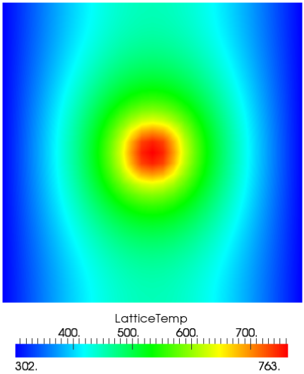
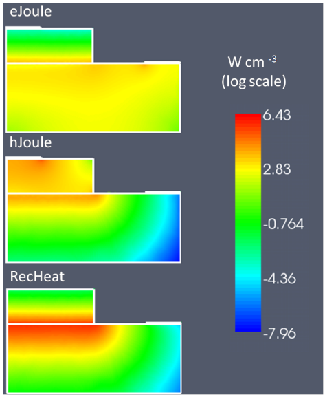
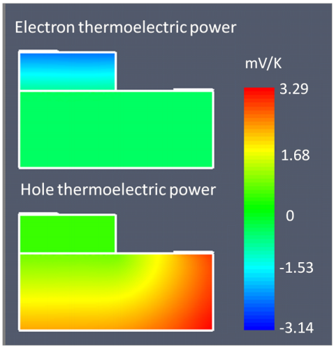

.. _Thermal:

Thermal
=================================================

Details about irreversible thermodynamics can be found in [Wachutka]_ .

The heat flux, within the diffusive approach, is given by the Fourier's law, i.e.

..  math::
    :nowrap:
    :label:
   
    \begin{equation}
    J_i = - \kappa_{ij} \frac{\partial}{\partial x_j} T
    \end{equation}
   
where :math:`\kappa` is thermal conductivity second-rank tensor (which is assumed temperature in 
dependent). The power balance is ensured by the continuity equation for the thermal

..  math::
    :nowrap:
    :label:
    
    \begin{equation}
    \frac{\partial}{\partial x_i} J_i = H
    \end{equation}
    

Boundary conditions
-------------------

The boundaries of the thermal simulation domain are set to ideally thermal insulator
by default. Dirichlet boundary conditions can be imposed with the keyword boundary 
*heat_researvoir* .

::

  Contact reservoir
    {
     temperature = 300
    }
    
A surface boundary resistance can be added with the keyword *surface_resistance* .

::

  Contact surface_resistance
    {
     r_surf = 0.01
     temperature = 300
    }
    
Heat sources
------------

The constant value heat source can be included with *heat_source constant* . 

Example::

  HeatSource constant{ H=1e6 }

The heat source must be in :math:`W/cm^3` . Heat generated by the Joule's effect is in 
cluded with *heat_source joule* . The name of the drift-diffusion simulation is given by 
*dd_simulation* . 

Example::

  HeatSource joule{ dd_simulation = dd }
  
    

    