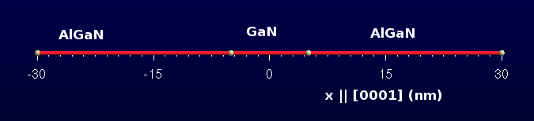
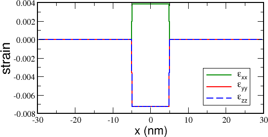
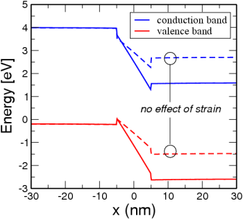
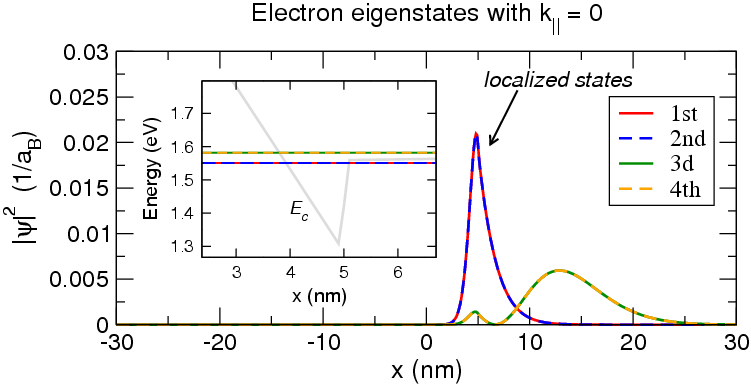
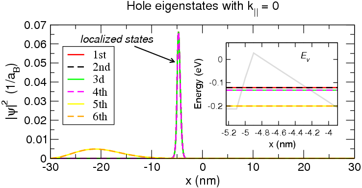
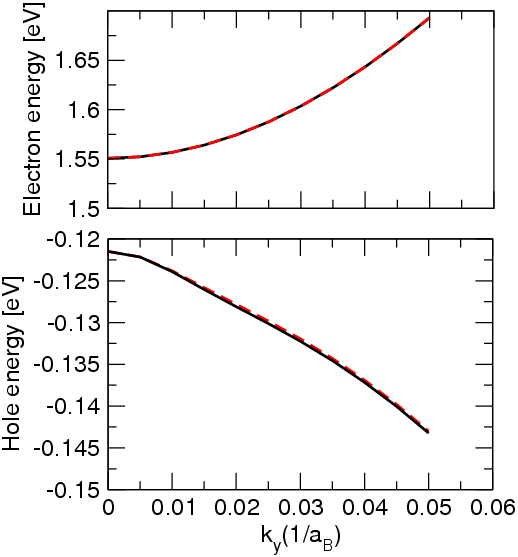
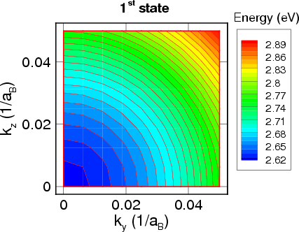
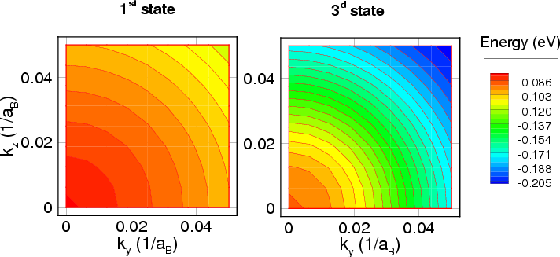

.. _EFA:

Envelope Function Approximation
=================================================

.. _tutorial6:

Quantized states in a GaN/AlGaN quantum well
--------------------------------------------------

We consider a GaN quantum well embedded into a :math:`Al_{0.3}Ga_{0.7}N` barrier. 
The structure is grown on a :math:`Al_{0.3}Ga_{0.7}N` substrate.

 

The structure geometry file is quantum_well.geo_ .

::

  Point(1) = {-30, 0, 0, 1};
  Point(2) = {-5, 0, 0, 0.1};
  Point(3) = {5, 0, 0, 0.1};
  Point(4) = {30, 0, 0, 1};
  Line (1) = {1, 2};
  Line (2) = {2, 3};
  Line (3) = {3, 4};
  Physical Line  (&quot;well&quot;) = {2};
  Physical Line  (&quot;buffer1&quot;) = {1};
  Physical Line  (&quot;buffer2&quot;) = {3};
 

There are three physical regions (the well and two barriers, defined by means 
of Physical Lines 1, 2 and 3) and two physical points, at the simulation domain boundary, 
which will be associated to the boundary conditions (see :ref:`Tutorial0` and :ref:`Tutorial1` ). 

We'll study the following properties:

* Strain

* Band profile

* Quantized states of electrons and holes
 

The Device section of the input file reads::

  Device
    {
     Region well
       {
        material = GaN
        structure = wz
        y-growth-direction = (1,0,-1,0)
        z-growth-direction = (-1,2,-1,0)
        x-growth-direction = (0,0,0,1)
        doping = 1e18
        doping_type = acceptor
        doping_level = 0.025
       }
     Region  buffer1
       {
        material = AlGaN
        x = 0.3
        structure = wz
        y-growth-direction = (1,0,-1,0)
        z-growth-direction = (-1,2,-1,0)
        x-growth-direction = (0,0,0,1)
        doping = 5e16 
        doping_type = acceptor
        doping_level = 0.025
       }
     Region  buffer2
       {
        material = AlGaN
        x = 0.3
        structure = wz
        y-growth-direction = (1,0,-1,0)
        z-growth-direction = (-1,2,-1,0)
        x-growth-direction = (0,0,0,1)
        doping = 5e16
        doping_type = acceptor
        doping_level = 0.025
       }
    }
 

Calculation of strain
^^^^^^^^^^^^^^^^^^^^^^^^^^^^^ 

The strain is calculated over all the structure. Since the structure is grown 
over a substrate, we define an appropriate boundary condition. 
The substrate boundary condition is associated with Physical Point **1** . 
The  Models section reads::

  model macrostrain
    {
     options
       {
        simulation_name = str
        physical_regions = all
       }
     BC_Regions
       {
        BC_Region  substrate
          {
           type = substrate
           material = AlGaN
           x = 0.3
           structure = wz
           y-growth-direction = (1,0,-1,0)
           z-growth-direction = (-1,2,-1,0)
           x-growth-direction = (0,0,0,1)
          }
       }
    }
 

The  Solver section defines that the structure has a substrate::

  macrostrain
    {
     substrate = substrate
    }
    
In the output section we specify the variable name **strain** .

The results look as follows:

 

 

The well is strained, but the barriers are not, because the substrate 
material and the barrier material coincide.

 

Calculation of the band profile
^^^^^^^^^^^^^^^^^^^^^^^^^^^^^^^^^^^^^

The band profile calculation needs the Poisson equation to be solved. 
Therefore, we have to define a drift-diffusion model and solve it 
without any voltage applied. The  Models section reads::

  model driftdiffusion
    { 
     options
       { 
        simulation_name = dd
        physical_regions = all
       }
    }

This section does not contain any boundary conditions. It means that 
we rely on the *default* boundary condition, that require zero gradient 
of electric potential near the boundary. This boundary condition, 
known as the *flat band boundary condition* , is usually applied if the 
simulation domain represents a small part of a real heterostructure. 

It assumes that the free charge accumulated somewhere outside of the 
simulation domain screens the electric field.

The  Solver section reads::

  driftdiffusion
    {
     coupling = poisson
     nonlin_max_it = 70
     nonlin_rel_tol = 1e-10
     nonlin_abs_tol = 1e-10
     nonlin_step_tol = 1e-9
     ls_max_step = 4
     discretization = fem
     integration_order = 2
     ksp_type = bcgs
    }

The most important parameter is coupling = poisson that defines that 
no transport equation is solved. The rest of the parameters define properties 
of the numerical solver. The important thing is to define a physical model 
in the model  Physics, that reads as follows::

  driftdiffusion
    {
     strain_simulation = str
    }
    
Here we impose that the drift diffusion model takes into account both 
the deformation potential effect and the piezoelectric effect. 
The latter is very important for wurtzite materials. 
In order to plot the band diagram we ask for two variables to be written out, namely Ec, Ev. 
The band diagram calculated with and without taking into account the effect of strain is shown:

 

 

Quantized states of electrons and holes
^^^^^^^^^^^^^^^^^^^^^^^^^^^^^^^^^^^^^^^^^^^^^^^^^^^^^^

We are going to study quantized states of electrons and holes in the quantum well. 
Since the structure is 1D, the eigenstate is characterized by the energy level number *n* 
and the :math:`k_{||}` vector that is perpendicular to the growth direction. 
First, we define two simulations that solve Schrödinger for a single **k** -vector, 
for electrones and holes. In order to simplify the tutorial we solve the Schrödinger equation 
over all the structure. 

The  Models section reads::

  model efaschroedinger
    {
     options
       {
        simulation_name = quantum_el
        physical_regions = all
       }
    }
  model efaschroedinger
    {
     options
       {
        simulation_name = quantum_hl
        physical_regions = all
       }
    }
    
The Solver section reads as follows::

  quantum_el
    {
     Dirichlet_bc_everywhere = true
     particle = el
     number_of_eigenstates = 10
     poisson_model_name = dd
     strain_model_name = macrostrain
     solution_method = general
     solver = krylovshur
    }
  quantum_hl
    {
     Dirichlet_bc_everywhere = true
     particle = hl
     number_of_eigenstates = 15
     poisson_model_name = dd
     strain_model_name = macrostrain
     solver = krylovshur
     solution_method = general
    }

Here we defined two different option sets for electrons and holes. 
We specified that

* Dirichlet boundary condition is imposed at the simulation domain boundary

* Electric potential and strain is applied

The  Physics section defines the 8x8 :math:`k \cdot p` model for electrons and holes::

  quantum_el
    {
     particle = el
     model = kp
     kp_model = 8x8
    }
  quantum_hl
    {
     particle = hl
     model = kp
     kp_model = 8x8
    }
    
We choose to plot the following variables: EigenEnergy, EnergyLevels, EigenFunctions.

The results (levels and :math:`|\Psi|^2` ) for electrons and holes are shown:

 

 
Now we would like to study the dispersion of the two first electron and hole states. 
In this tutorial we show how to define different k-spaces and calculate the particle dispersion over them.

First, we would like to calculate the dispersion along a line in k-space. 
We define two simulations belonging to the model **quantumdispersion** : 
 ``dispersion1D_el`` and ``dispersion1D_hl`` .

::

  model quantumdispersion
    {
     options
       {
        simulation_name = dispersion1D_el
        physical_regions = all
       }
    }
  model quantumdispersion
    {
     options
       {
        simulation_name = dispersion1D_hl
        physical_regions = all
       }
    }

We have to connect the ``quantumdispersion`` simulations to the related quantum 
( **efaschroedinger** ) ones.
Thus, in  Solver section::

  dispersion1D_el
    {
     quantum_simulation = quantum_el
     wedge = half
     k_space_dimension = 1
     k1 = (0, 0.1, 0)
     number_of_nodes = (10)
     min_eigenvalue_number = 0
     max_eigenvalue_number = 1
    }
    
  dispersion1D_hl
    {
     quantum_simulation = quantum_hl
     wedge = half
     k_space_dimension = 1
     k1 = (0, 0.1, 0)
     number_of_nodes = (10)
     min_eigenvalue_number = 0
     max_eigenvalue_number = 1
    }
 

    
|  Attachment            Size
  
* quantum_well.geo_     352 bytes
* tutorial6.tib_        4.53 KB

..  _quantum_well.geo: http://www.tibercad.org/files/quantum_well_0.geo
..  _tutorial6.tib:    http://www.tibercad.org/files/tutorial6_2.tib

.. |more| image:: ../data/more.png
    :scale: 50%

.. |warn| image:: ../data/warn.png
    :scale: 50%

.. |idea| image:: ../data/idea.png
    :scale: 50%

.. rubric:: Footnotes
