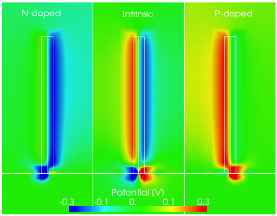

..   <marker>

.. _ElasticityExamples:

Elasticity
=================================================

Piezolectric nanogenerator
----------------------------

In this example we will show how to perform electro-mechanical simulation of a piezoelectric 
nanogenerators [Wang]_ . The simulation domain consists of
a Zinc oxide nanowire (length = 200 nm, diameter = 50 nm) growth on a ZnO substrate
and surroinded by air. The performance of such a device can be obtained by computed
the piezopotential produced when the nanowire is subjected to a shear force.

With the block device we specify the materials and properties associated with the
physical regions. In particular, we have the *Nanowire, Substrate* and *Air* .

::

  Device
    {
     dimension = 3 
     meshfile = mesh.msh
     mesh_units = 1e-9
     material = AlGaN
     x = 0.2
     x-growth-direction = (-1,0,1,0) 
     y-growth-direction = (-1,2,-1,0) 
     z-growth-direction = (0,0,0,1)
     Region Nanowire 
       {
        doping_type = donors
        doping_level = 0.035
       }
     Region Substrate 
       {
        doping_type = donors
        doping_level = 0.035
       }
     Region Air 
       {
        material = Air
       }
    }

In this example we use a isotropic stiffness constant and, therefore, a Young modulus
and Poisson's ration must be defined. The base of the substrate is clamped whereas a
shear force is applied on the top of the nanowire.
    
::

  Module elasticity 
    {
     Physics 
       {
        Stiffness isotropic
          {
           Young = 129 Poisson = 0.349
          }
        Contact Base
          {
           type = clamp
          }
        Contact Top
          {
           type = surface_force force = (0.0, 0.0625,0.0)
          }
       }
    }

The driftdifiusion module computes the piezopotential due to the applied force. The
piezopolarization uses the strain computed by the elasticity module. The base of the
substrate is grounded.

::

  Module driftdiffusion
    {
     Physics
       {
        strain_simulation = elasticity
        Contact Base
          {
           Voltage = 0.0
          }
        Polarization piezo
          {
          }
       }
    }
    
In the simulations block we specify the simulations to be solved. The default simulation
name is the name of the module itself.

::

  Simulations
    {
     solve (elasticity,driftdiffusion)
    }
    
Consistently with results published in [Gao]_ the free carriers
tend to screen the output potential. The potential profile is shown below.

    
..   </marker>