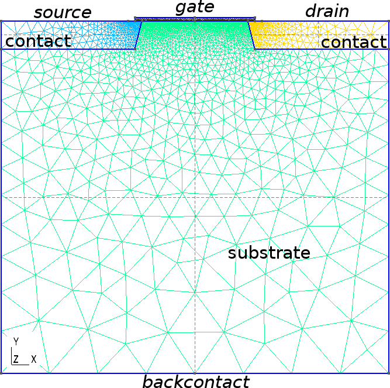
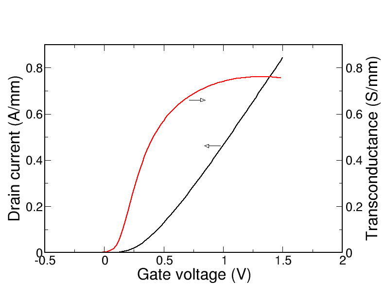

..   <marker>

.. _DriftDiffusionGetting:

Drift Diffusion
=================================================

Introduction
-------------

The module Drift-Diffusion simulates electron and hole transport based on the drift-diffusion
approximation.

The system of equations that is solved is given by

.. math::
   :label: dd_eq_ddsystem
   
   -\nabla(\varepsilon\nabla\varphi - \mathbf{P}) & =  -e(n - p - N_d^+ + N_a^-) \\
   -\nabla(\mu_n n ( \nabla\phi_n + P_n \nabla T)  ) & =  R \\
   -\nabla(\mu_p p (\nabla\phi_p + P_p \nabla T) ) & =  -R, 

where :math:`P` is the electric polarization due to e.g. piezoelectric effects and :math:`R` is the net 
recombination rate, i.e. recombination rate minus generation rate. :math:`P_n` and :math:`P_p` are the electron
and hole thermoelectric powers, respectively. The models for the mobilities and the net
recombination rates can be specified in the ``Physics`` section.
Recombination and trap models can be specified both for bulk and interface device regions.

Example: Bulk silicon in 1D
----------------------------

This very simple example presents the basic setup of a Drift-Diffusion simulation
by simulating the current in a piece of bulk silicon.

The following files should be in your working directory:

  bulk.tib_  :            tiberCAD input file 

  bulk.msh_ :             mesh file

The mesh file can be obtained from the following ``GMSH`` script (bulk.geo_):

::

   L = 1;
   d = 0.01;

   Point(1) = {0, 0, 0, d};
   Point(2) = {L, 0, 0, d};

   Line(1) = {1, 2};

   Physical Line("bulk") = {1};
   Physical Point("anode") = {1};
   Physical Point("cathode") = {2};

The simulated device is a homogeneous piece of bulk silicon with a length of :math:`1\, \mu\rm m`.
At the two ends we define the contacts (``anode`` and ``cathode``).

The tiberCAD input file (bulk.tib_) is shown in the following listing:

::

  Device
  {
    meshfile = bulk.msh

    Region bulk 
    {
      material = Si

      Doping
      {
        Nd = 1e16
        type = donor
      }
    }
  }

  Module driftdiffusion
  { 
    plot = (Ec, Ev, eQFermi, hQFermi, ContactCurrent)

    Contact anode { voltage = $Vb }
    Contact cathode { }
  }

  Module sweep
  {
    solve = driftdiffusion
    variable = $Vb
    start = 0.0
    stop = 1
    steps = 10
    plot_data = true
  }

  Simulation
  {
    verbose = 2

    solve = sweep

    resultpath = output
    output_format = grace
  }

In the ``Device`` block we provide the name of the mesh file (``bulk.msh``), assuming default mesh units
of micrometers (``mesh_units = 1e-6``).
The model has a single region ``bulk`` with material silicon (``material = Si``), which is slightly n-doped.

Next we specify the simulation model. Here we only solve the Drift-Diffusion model (``Module = driftdiffusion``).
We do not specify any physical models for recombination or mobility in this example, but we have to define the electrical contacts
using the ``Contact`` keyword.
At the anode we apply a variable voltage by providing a variable name (``$Vb``).
We also specify which quantities to plot.

In this simulation we want to calculate the IV characteristic of a piece of bulk Si.
For this porpose we define a sweep on the anode voltage (``Module sweep``).
In the sweep block we have to specify the sweep variable, which in our case is ``$Vb``.
The ``plot_data = true`` option will make the sweep plot all results after each sweep step.

Finally, in the ``Simulation`` block we define the output directory and format (in this case ``grace`` for 1D ASCII files),
and we specify that we want to solve the sweep.

The generated Output files are:

* ``driftdiffusion_msh.dat``      : mesh-dependent quantities (conduction and valence band edges and quasi Fermi levels)

* ``driftdiffusion_Vb_<step>_msh.dat``: mesh-dependent quantities for each sweep step 
 
* ``sweep_driftdiffusion.dat``   : integrated current at the two contacts for each sweep step

..  _bulk.geo: http://www.tiberlab.com/images/stories/products/device_sim/tibercad/manuals/resources/bulk_0.geo
..  _bulk.msh: http://www.tiberlab.com/images/stories/products/device_sim/tibercad/manuals/resources/bulk_0.msh
..  _bulk.tib: http://www.tiberlab.com/images/stories/products/device_sim/tibercad/manuals/resources/bulk_2.tib

Example: Mosfet
---------------

In this second example we show a 2D simulation of a silicon Mosfet device.
The ``GMSH`` model obtained from the script mosfet.geo_ is shown in Fig. :ref:`GMSH model of the Mosfet <fig_dd_mosfet>`.
 
.. _fig_dd_mosfet:

    ``GMSH`` model of the Mosfet showing the mesh and the region labels

The model consists of a p-doped Si substrate (``substrate``), two highly n-doped access regions (``contact``),
a thin gate oxide (``oxide``) and source, gate, drain and back-side contacts.

We want to simulate a set of output characteristics and a transcharacteristic for this Mosfet, using two distinct input files
outputchar.tib_ and transchar.tib_.
In these two files we define only the ``Module sweep`` and ``Simulation`` blocks.
The device and model definitions are put into a third file mosfet.tib_, which is included in the other two files using the syntax

::

   @include mosfet.tib

The device definition found in mosfet.tib_ is shown in the following listing:

::

  Device mosfet
  {
    meshfile = mosfet.msh
  
    material = Si

    Region substrate 
    {
      Doping
      {
        density = 1e18
        type = acceptor
      }
    }
   
    Region contact
    {
      Doping
      {
        density = 5e19
        type = donor
      }
    }

    Region oxide
    {
      material = SiO2
    }
  }

The material is defined globally in the ``Device`` section.
For the oxide it has to be overridden in the correspondent ``Region`` block.

The followng shows the module definition for the Drift-Diffusion simulation:

::

  Module driftdiffusion
  { 
    #coupling = electrons

    plot = (Ec, Ev, eQFermi, eDensity, eCurrentDensity, eMobility,
            hQFermi, hDensity, hCurrentDensity, hMobility,
            NetRecombination, ElField, ElPotential, ContactCurrents)

    Solver
    {
      type = linesearch

      linear_solver
      {
        method = pconly
        preconditioner = lu
      }
    }

    Physics
    {
      particle_density
      {
        statistics = fermidirac
      }

      recombination srh {}

      mobility
      {
        type = field_dependent
        low_field_model = doping_dependent
      }
    }

    Contact gate
    {
      type = schottky
      barrier_height = 3.0

      voltage = $Vg

      area_factor = 0.1
    }

    Contact source
    {
      voltage = 0.0
      area_factor = 0.1
    }
 
    Contact backcontact
    {
      voltage = 0.0
      area_factor = 0.1
    }

    Contact drain
    {
      voltage = $Vd
      area_factor = 0.1
    }
  }

The commented option ``coupling = electrons`` shows how a unipolar simulation can be set up.
This example however we simulate in bipolar mode.
The ``Solver`` defines options for the nonlinear solver (the shown options are the default ones).
In this case, a linesearch approach is used to refine the nonlinear Newton steps.
The linear solver for each Newton step (defined in the ``linear_solver`` block) uses a complete LU factorisation as preconditioner (``preconditioner = lu``).
In this case, the linear solver method can be chosen to be the application of the preconditioner only (``method = pconly``), instead of using an iterative
approach.

The ``Physics`` block contains the definition of a few physical models to be used.
For the particle density we use Fermi-Dirac statistics, which is the default.
We also use Shockley-Read-Hall recombination and a field-dependent mobility model in the simulation.

The contacts are defined in the ``Contact`` blocks.
For the gate we specify ``schottky`` as type (the default is ohmic contact), providing a suitable barrier height.
The ``area_factor = 0.1`` indicates that we assume a transistor with 1 mm gate width.

Next, we create a file transchar.tib_ containing the definitions for the simulation of the transcharacteristic, as given in the following listing:

::

  @include mosfet.tib

  Module sweep
  {
    name = sweep_drain
    solve = driftdiffusion

    variable = $Vd
    start = 0.0
    stop = 1.0 
    steps = 5 
  }

  Module sweep
  {
    name = sweep_gate
    solve = driftdiffusion

    variable = $Vg
    start = -0.5
    stop = 1.5
    steps = 100 

    max_step = 0.1
  
    plot_data = true
  }

  Simulation
  {
    solve = (sweep_drain, sweep_gate)
    resultpath = output_transchar 
    output_format = vtk
  }

On the first row we include the device definition from mosfet.tib_.
Then we define two sweeps ``sweep_drain`` and ``sweep_gate``.
The first one will ramp the drain to 1.0 V in 5 steps, without plotting the results.
The second one will then perform a sweep on the gate voltage from -0.5 V to 1.5 V,
plotting the results after each step and produciong the transfer characteristic.
The option ``max_step = 0.1`` limits the maximum voltage step to 0.1 V.
This is useful, since the solver has first to reach the initial gate voltage of -0.5 V, starting from 0 V.
Using this option it will do this in steps of 0.1 V.
In the ``Simulation`` block we simply have to specify the two sweeps in the correct order.

Running the simulation with ``tibercad transchar.tib`` will produce in particular a set of files ``*.vtu`` for each 
step of the sweep ``sweep_gate``, and the file ``sweep_gate_driftdiffusion.dat`` containing the voltage-current
characteristics for each contact, shown in Fig. :ref:`fig_dd_mosfet_transchar`.

 
.. _fig_dd_mosfet_transchar:

    Mosfet transcharacteristic

..  _mosfet.geo: http://www.tiberlab.com/images/stories/products/device_sim/tibercad/manuals/resources/mosfet.geo
..  _outputchar.tib: http://www.tiberlab.com/images/stories/products/device_sim/tibercad/manuals/resources/outputchar.tib
..  _transchar.tib: http://www.tiberlab.com/images/stories/products/device_sim/tibercad/manuals/resources/transchar.tib
..  _mosfet.tib: http://www.tiberlab.com/images/stories/products/device_sim/tibercad/manuals/resources/mosfet.tib

.. rubric:: Footnotes

..   </marker>

