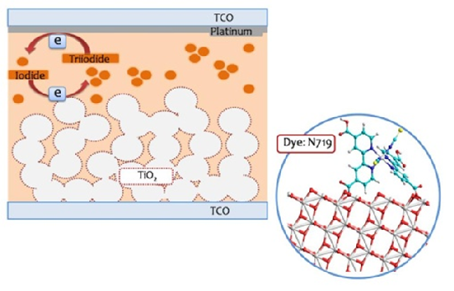
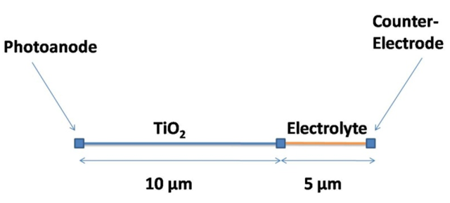
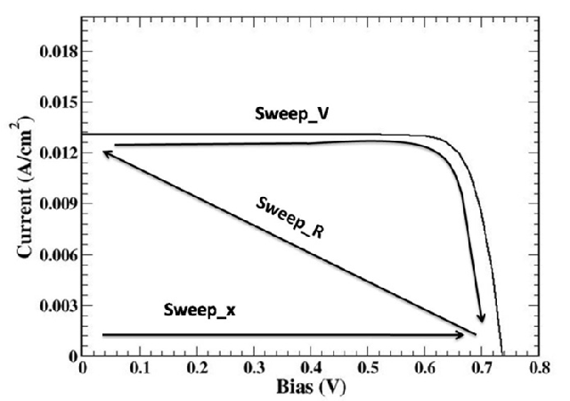
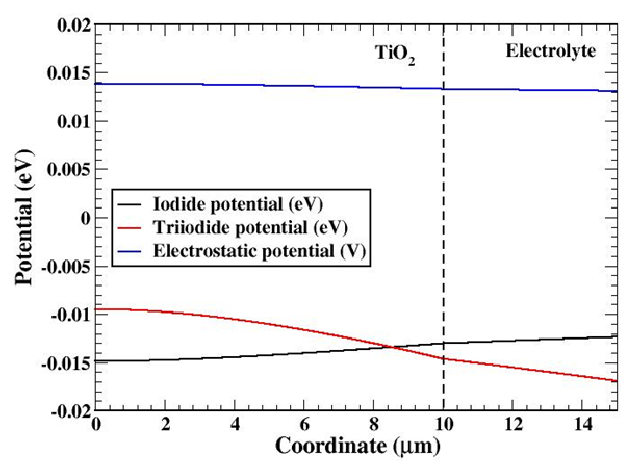
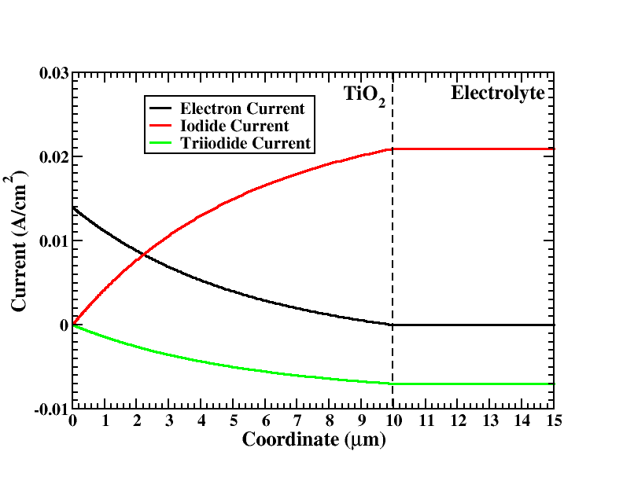
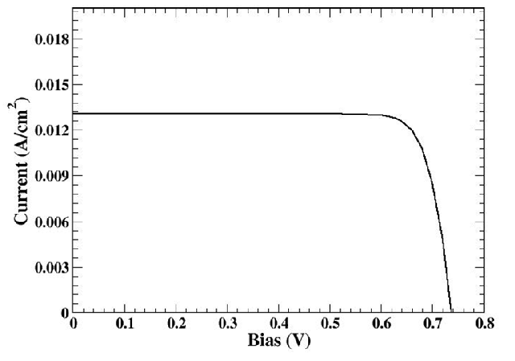

..  _DscGetting:

Dye Solar Cell
====================

Introduction
---------------

The basic structure of a DSC is the following:

#.  A photoanode made of a semiconductor mesoporous medium |TiO2| plunged into a liquid electrolyte.
#.  A region of liquid electrolyte only in contact with a counter-electrode covered by a thin platinum layer.

The surface of the semiconductor is covered by a mono-layer of dye molecules which make the oxide photoactive. 
The mesoporous material is obtained by sintering together nanoparticles of TiO2 of 15-20 nm in diameter. 
The diameter of the nanoparticles is fundamental to obtain the right porosity of the material, 
in fact in order to have a high light harvesting from the dye molecules is necessary to have a large effective area 
that can be obtained only with a porous material, moreover the porosity of the semiconductor allows the electrolyte 
to be in contact with the dye molecules.

 
    Scheme of a DSC (in the inset: a typical Dye molecule).

The functioning of the device is the following: when a photon is absorbed by a dye, it excites an electron which is transferred into the conduction band of the porous material. The charge transfer is extremely fast, in the order of tens of fs. Then, the electron percolates inside the porous material until it reaches the anode contact: a transparent conductive oxide (TCO). The ionized dye is regenerated by the electrolyte via a redox process where iodide is oxidized and triiodide is formed. This regeneration has two important consequences: on the one hand the dye is now ready to absorb another photon and on the other hand the equilibrium of the redox pair concentration in the electrolyte is broken. In particular, the concentration of triiodide is increased at the expense of iodide concentration. A concentration gradient is formed that moves triiodide ions towards the counter-electrode and iodide ions towards the mesoporous material. Finally, the triiodide ions reach the platinum where they are reduced and transformed back in iodide ions. The cycle of charge carriers is completed and a current has been established inside the cell exploiting the energy of the photon absorbed.

Two important facts must be noted: 

#.  In the cell there is no permanent chemical transformation;
#.  The split of the electron-hole pair created by the photon occurs directly at the dye level, 

the electron percolates inside the |TiO2| while the hole is handled by the electrolyte. 

This means that charge carriers in DSCs are majority carriers and the recombination is suppressed. 
That is the reason why DSCs allow reasonable efficiencies despite they are made of very poor quality materials.

Theory
-------------

For a brief list of literature to understand Dye Solar cells (DSC) see [Kalyanasundaram]_ . 
For a review of the model see [Gagliardi]_ .

The model consists in a set of drift-diffusion equations for the propagation of ions
and electrons coupled with Poisson equation:

.. math::
   :nowrap:
   :label:

   \begin{eqnarray}
    \nabla \cdot (\mu_{e}n_{e}\nabla\phi_{e}) & = & (G - R) \\
    \nabla \cdot (\mu_{I^{-}}n_{I^{-}}\nabla\phi_{I^{-}}) & = & -\frac{3}{2}(G - R) \\
    \nabla \cdot (\mu_{I^{-}_{3}}n_{I^{-}_{3}}\nabla\phi_{I^{-}_{3}}) & = & \frac{1}{2}(G - R) \\
    \nabla \cdot (\mu_{c}n_{c}\nabla\phi_{c}) & = & 0,
   \label{eq1}
   \end{eqnarray}

where :math:`\mu_{\alpha}` refers to carrier mobilities, :math:`n_{\alpha}` to charge concentrations and :math:`\phi_{\alpha}` to 
electrochemical potentials. **R** is the recombination term and **G** the generation term due to illumination. 
In order to take into account the trap density we use a density dependent
mobility developed from multi-trapping model:

.. math::
   :nowrap:
   :label:

   \begin{equation}\label{difftraps}
    \mu_{e}(n_{e}) = \mu_{0} \left ( \frac{n_{e}}{N_{t}} \right )^{\frac{1 - a}{a}}
   \end{equation}

|

where :math:`a` is the trap exponent, :math:`N_t` the trap density and :math:`\mu_0` a constant. The energy trap
density is assumed to form an exponential tail below the conduction band of the semiconductor:

.. math::
   :nowrap:
   :label:
   
   \begin{equation}\label{denstrap}
    g_{T}(E) = \frac{a N_t}{kT} e^{\frac{-a E}{kT}}.
   \end{equation}

|

The Poisson equation to handle the internal potential drop:

.. math::
   :nowrap:
   :label:
   
   \begin{equation}\label{poisson}
    -\varepsilon\triangle \varphi =  q[n_{c} + N_{D}^{+} - n_{I^{-}} - n_{I_{3}^{-}} - (n_{e} - \bar{n}_{e})],
   \end{equation}

|

where N+ D is the amount of ionized dyes and it is equal to:

.. math::
   :nowrap:
   :label:
   
   \begin{equation}\label{dyeion}
    N_{D}^{+} = \frac{G}{k_{3}}
   \end{equation}

|

with **G** the generation term and :math:`k_{3}` the rate constant of dye regeneration. The dielectric
constant, :math:`\varepsilon` , of the mesoporous material is a mix the two dielectric functions of the semiconductor and the electrolyte. 
We use the Maxwell-Garnet model where the dielectric
function of the mixed medium becomes:

.. math::
   :nowrap:
   :label:
   
   \begin{equation}\label{diel}
    \varepsilon = \varepsilon_{s}\frac{\varepsilon_{e} + 2\varepsilon_{s} + 2\epsilon_{p}\varepsilon_{e} - 2\varepsilon_{s}\epsilon_{p}}
    {\varepsilon_{e} + 2\varepsilon_{s} -\epsilon_{p}\varepsilon_{e} +\varepsilon_{s}\epsilon_{p}}
   \end{equation}

|

where :math:`\varepsilon_{s}` and :math:`\varepsilon_{e}` are the dielectric constants of the semiconductor and the electrolyte,
respectively, and :math:`\epsilon_{p}` is the porosity of the medium. The recombination term depends
largely on the loss mechanisms at the electrolyte/oxide interface which follows the reaction chain:

.. math::
   :nowrap:
   :label:
   
   \begin{eqnarray}
   I^{-} & \rightleftharpoons & I + e \\
   2I & \rightleftharpoons & I_{2} \\
   I_{2} + I^{-} & \rightleftharpoons & I^{-}_{3}.
   \label{reaction_loss}
   \end{eqnarray}

|

From the chemical path we can get a formula for the interface recombination (considering
that the first chemical reaction is the slow process):

.. math::
   :nowrap:
   :label:
   
   \begin{equation}\label{ricombinazione}
    R = k_{e} \left [  \left ( \frac{n_{e}}{\bar{n}_{e}} \right )^{\beta}\bar{n}_{e}\sqrt{\frac{n_{I^{-}_{3}}}{n_{I^{-}}}}
    - \bar{n}_{e}\sqrt{\frac{\bar{n}_{I^{-}_{3}}}{\bar{n}^{3}_{I^{-}}}} n_{I^{-}}\right
    ],
   \end{equation}

|

where the electron rate :math:`k_{e}` is the recombination rate constant.

For the boundary conditions of the model we assume at the photoanode:

*  :math:`\phi_{e} = V`: electrochemical potential of electrons set with the voltage applied;
*  :math:`\nabla\phi_{I^{-}} = 0`: no iodide current at the photoanode;
*  :math:`\nabla\phi_{I_{3}^{-}} = 0`: no triiodide current at the photoande;
*  :math:`\nabla\phi_{c} = 0`: no cationic current;
*  :math:`\nabla\varphi = 0`: no charged layer at the photoanode;

at the cathode:

*  :math:`\nabla\phi_{e} = 0`: no electronic current at the cathode;
*  :math:`-q\mu_{I^{-}}n_{I^{-}} \nabla\phi_{I^{-}} = \frac{3}{2}\left ( \frac{ - E_{red}(\mathbf{r_{c}})}{R_{L}} \right )`: split of the current between the ionic species;

*  :math:`-q\mu_{I^{-}_{3}} n_{I^{-}_{3}}\nabla\phi_{I^{-}_{3}} =  -\frac{1}{2}\left ( \frac{ - E_{red}(\mathbf{r}_{c})}{R_{L}} \right )`: split of the current between the ionic species;
*  :math:`\nabla\phi_{c} = 0`: no cationic current;

integral boundary conditions for conservation of ionic species:

*  :math:`\int_{\Omega} \left [ \frac{1}{3}n_{I^{-}}(\mathbf{r}) + n_{I^{-}_{3}}(\mathbf{r}) \right ] d\mathbf{r} = \left (\frac{1}{3}\bar{n}_{I^{-}} + \bar{n}_{I^{-}_{3}} \right )\Omega`: conservation of iodine ions within the cell;

*  :math:`\int_{\Omega} n_{c}(\mathbf{r}) d\mathbf{r}  =  \bar{n}_{c}\Omega`: conservation of cation within the cell;

where :math:`\Omega` is the volume of the cell, :math:`n_{\alpha}` the density
of charged species and the index :math:`\alpha` stands for cation (c),
iodide (I:math:`^{-}`), triiodide (I:math:`^{-}_{3}`) and electrons (e).
R:math:`_{L}` is the external load. The bias applied is equal to:

.. math::
   :nowrap:
   :label:
   
   \begin{equation}\label{pot1}
    V = \phi_{e} - E_{red}/q.
   \end{equation}

Ered is the redox potential. The redox potential can be evaluated using a Nernst approximation:

.. math::
   :nowrap:
   :label:
   
   \begin{equation}\label{redox11}
    E_{red} = E^{0}_{Pt} - \frac{kT}{2} ln \left ( \frac{n_{I^{-}_{3}}/n_{St}}{ (n_{I^{-}}/n_{St})^{3} } \right ).
   \end{equation}

Module DSC
----------------------

The DSC module is tagged as ``dssc``. In this part of the input file are set the name of the
simulation and the list of plotted variables:

::

  Module dssc 
    {
     name = dssc
     plot = (Potential, Density, Current, ContactCurrents)
     Solver linesearch
       {
        max_iterations = 300
        step_tolerance = 1e-4
        linear_solver
          {
           preconditioner = lu
          }
       }
     Physics
       {
        ...
       }
     Contact anode
       {
        ...
       }
     Contact cathode
       {
        ...
       }
    }

This section contains information about the ``Contacts``, parameters for the ``Solver`` and
the ``Physics`` sections.

Contacts
^^^^^^^^^^^^^^^^^^^^^

Information for the contacts is inserted in the ``Module`` section, in the subsections ``Contacts``. 
The two contacts are the photoanode and the cathode. The photoanode must be
the boundary of a region where :math:`\bf TiO_2` is present, on the contrary the cathode must be
the boundary of a region where the *electrolyte* is present.

::

  Contact anode
    {
     type = ohmic
     bias = $V[0.0]
    }
  Contact cathode
    {
     type = Pt
     load = $R[1e8]
    }

The anode is an ohmic contact, it contains only the sweep of the bias applied for the
electrochemical potential of the electrons. The cathode must contain the initial external
resistance (``load = R``). 

If a simulation of the cell under illumination is made the initial
value of ``load`` must be set to a high value, in the range of :math:`10^{6}-10^{8}\Omega cm^{2}`

in order to have
no current during the light intensity sweep. In case a simulation under dark conditions
is performed, where an external bias only is applied, ``load = 1.0``.

Physics
^^^^^^^^^^^^^^^^

For the generation:

|  ``generation = dssc_generation``

The ``Physics`` section must contain at least the setting of the generation module. The
set of parameters that can be defined for the entire device are enlisted in table :ref:`Physical parameters<dsc_parameters>`.

.. _dsc_parameters:

.. math::
   :nowrap:
   :label:
   
   \begin{table}[!ht]
   \center
   \begin{tabular}{l|p{8cm}|l}
   \multicolumn{3}{c}{\textbf{Parameters}} \\
   \hline
    & \textbf{Poisson equation} & \\
   \hline
   \texttt{porosity} & Porosity of porous material &  \\
   \texttt{perm\_oxide} & Relative perm. of the TiO$_2$ &  \\
   \texttt{perm\_electrolyte} & Relative perm. of the electrolyte & \\
   \texttt{k\_dye} & Oxidized Dye regeneration rate constant & s$^{-1}$ \\
   \texttt{trap\_exp} & Trap exponential tail $a$& \\
   \texttt{trap\_DOS} & Trap effective density of states $N_t$& \\
   \hline
    & \textbf{Drift Diffusion equation} & \\
   \hline
   \texttt{ne} & Dark electron density & cm$^{-3}$ \\
   \texttt{nI} & Dark iodide density & mol/l \\
   \texttt{nI3} & Dark electron density & mol/l \\
   \texttt{mu\_e} & Electron mobility & cm$^{2}$/Vs \\
   \texttt{D\_I} & Iodide diffusion constant & cm$^{2}$/s \\
   \texttt{D\_I3} & Triiodide diffusion constant & cm$^{2}$/s \\
   \texttt{D\_C} & Cation diffusion constant & cm$^{2}$/s \\
   \hline
    & \textbf{Recombination term} & \\
   \hline
   \texttt{k\_e} & Recombination constant rate & s$^{-1}$ \\
   \texttt{rec\_non\_linearity} & Non-linearity exponent in the electron density recombination &  \\
   \end{tabular}
   \caption{Physical parameters that can be set for the model divided
   in subsets relative to different processes in the cell.}
   \label{table:dsc_parameters}
   \end{table}

Generation module
^^^^^^^^^^^^^^^^^^^^^^^^^

The generation term is related to the flux of photons which reaches the active :math:`TiO_2`
regions and the dye present in the cell. We assume a simple Beer-Lambert exponential
decay for charge generation of the form:

.. math::
   :nowrap:
   :label:

where :math:`\alpha` is the absorption coefficient (in :math:`\mu m^{-1}`
) of the chosen Dye, :math:`\Phi(\lambda)` the intensity of
the light power at wavelength :math:`\lambda` of the light source spectrum.
The part of the input file for the generation module:

:: 

  Module dssc_generation
    {
     regions = TiO2
     plot = (Distance, Generation)
     light_direction = (1, 0, 0)
     light_intensity = $x
     dye = N719
     
     Contact anode
       {
       }
    }

In the generation module must be specified:

* ``regions`` : the regions where we want that there is generation (where the Dye is present);
* ``plot if we want`` : to plot the generation;
* ``light_direction`` : the vector which fixes the direction from where the light comes;
* ``light_intensity`` : the light intensity;
* ``dye`` : the dye used in the cell;
* ``illumination_spectrum`` : the source spectrum, by default a 1.5 AM solar spectrum;

The light intensity is defined in a sweep. It can be set to reach 1 that means one Sun,
or a larger or smaller illumination intensity (0.1, 2.0, etc.).
There is another flag called ``illumination_spectrum`` that can be used if it is wanted
to change the spectrum profile :math:`\Phi` with another illumination source (for example if it is
assumed that the cell is under light concentration). The file used by default for F is the
standard 1.5 AM sun spectrum contained in the material database in the file **Sun1p5am** .

The last part of the generation is the definition of the Contact. This Contact tells to
the code which is the boundary region of the grid from where the light penetrates into
the device. The information given by the boundary and the light direction vector defines
the coming of light and direction of rays.

Device
----------------------

Device section for a DSC simulation:

::

  # Description of the device physical regions Device
  { 
   meshfile = <name_of_the_mesh>
   Region TiO2
     {
      material = TiO2mes
      porosity = 0.5
     }
   Region electrolyte
     {
      material = TiO2mes
      TiO2 = false
     }
  }

The Device section must contain the name of the mesh file ``meshfile = <name_of_the_mesh>`` .
For every region of the device it is specified the material file from the database (the
 ``TiO2mes`` contains standard parameters for both :math:`TiO_2` and electrolyte, so it can be used
for both regions). For every region must be specified if it contains ``TiO_2``, or electrolyte
or both. This can be done setting two flags called ``TiO2`` and electrolyte. 

If set *true* the material is present in the region, if set *false* it is not present. 
By default they are assumed both true (porous region). In the second region of the example showed here
there is electrolyte only and ``TiO2 = false`` is explicitly specified. In case both materials
are present (porous region) a porosity must be specified (in the range between 0, :math:`TiO_2`
only, and 1, electrolyte only). If one material is not present the porosity is automatically
set to 0 or 1.

Sweep
-----------------

Three sweeps are needed for the plot of the entire I-V under illumination. The first sweep
is needed to make the transition from dark condition to full open-circuit condition under
illumination. The high value of the load **R** maintains the current to zero. Then a second
sweep is used to pass from open circuit condition to short circuit condition lowering the
external load from a high external load to a small one (``R = 1``). 
Finally, the voltage sweep compute the I-V characteristics under illumination. In case of dark simulation
(application of an external bias without illumination) the first and second sweep are not
needed. The external load for the cathode can be set directly to **R** = 1.

::

  Module sweep 
    {
     name = sweep_gen
     solve = (dssc_generation, dssc)
     variable = $x
     values = (0, 1e-9, 1e-8, 1e-7, 1e-6,
     1e-5, 1e-4, 1e-3, 1e-2, 0.1, 1)
     plot_data = true
    }
  Module sweep 
    {
     name = sweep_R
     solve = dssc
     variable = $R
     values = ( 1000, 100, 10, 1 )
     plot_data = true
    }
  Module sweep 
    {
     name = sweep_V
     solve = dssc
     variable = $V
     values = (0, 0.1, 0.2, 0.3, 0.4, 0.5, 0.6, 0.62, 0.64, 
     0.66, 0.68, 0.7, 0.72, 0.74, 0.76, 0.78, 0.8)
     plot_data = true
    }
    
The intensity of illumination can be changed sweeping the value of **x** different to 1 (1 = 1 Sun of power).

.. _dsc_nodal:

.. math::
   :nowrap:
   :label:
   
   \begin{table}[!ht]
   \center
   \begin{tabular}{l|p{8cm}|l}
   \multicolumn{3}{c}{\textbf{Nodal quantities}} \\
   \hline
    & \texttt{Potential} & \\
   \hline
   \texttt{eQFermi} & Electron electrochemical potential & eV ($-e\phi_n$)\\
   \texttt{IQFermi} & Iodide electrochemical potential & eV ($-e\phi_{I^{-}}$)\\
   \texttt{I3QFermi} & Triiodide electrochemical potential & eV ($-e\phi_{I^{-}_{3}}$)\\
   \texttt{CQFermi} & Cation electrochemical potential & eV ($-e\phi_C$)\\
   \texttt{ElPotential} & Electrostatic potential & eV \\
   \texttt{Eredox} & Electrolyte electrochemical potential & eV ($-e\phi_{Red}$) \\
   \hline
    & \texttt{Density} & \\
   \hline
   \texttt{eDensity} & Electron density & cm$^{-3}$ \\
   \texttt{IDensity} & Iodide density & cm$^{-3}$ \\
   \texttt{I3Density} & Triiodide density & cm$^{-3}$ \\
   \texttt{CDensity} & Cation density & cm$^{-3}$ \\
   \texttt{Generation} & The net electron generation rate & cm$^{-3}$s$^{-1}$ \\
   \texttt{NetRecombination} & The net recombination rate & cm$^{-3}$s$^{-1}$ \\
   \end{tabular}
   \caption{Nodal quantities. The flags \texttt{Potential} and
   \texttt{Density} allow to plot all the electrochemical potentials and all the densities, including generation and recombination.}
   \label{table:dsc_nodal}
   \end{table}

.. _dsc_elemental:

.. math::
   :nowrap:
   :label:
   
   \begin{table}[!ht]
   \center
   \begin{tabular}{l|p{5cm}|l}
   \multicolumn{3}{c}{\textbf{Elemental quantities}} \\
   \hline
    & \texttt{Current} & \\
   \hline
   \texttt{ElField} & Electric Field & Vcm$^{-1}$ \\
   \texttt{CurrentDensity} & Total current density & Acm$^{-2}$ \\
   \texttt{eCurrentDensity} & Electron current density & Acm$^{-2}$ \\
   \texttt{ICurrentDensity} & Iodide current density & Acm$^{-2}$ \\
   \texttt{I3CurrentDensity} & Triiodide current density & Acm$^{-2}$ \\
   \texttt{CCurrentDensity} & Cation current density & Acm$^{-2}$ \\
   \end{tabular}
   \caption{Elemental quantities. The flag \texttt{Current} allows to plot all of them in the x, y and z components.}
   \label{table:dsc_elemental}
   \end{table}
   
.. _dsc_scalar:
   
.. math::
   :nowrap:
   :label:
   
   \begin{table}[!ht]
   \center
   \begin{minipage}{8cm}
   \center
   \begin{tabular}{l|l|l}
   \multicolumn{3}{c}{\textbf{Scalar quantities}} \\
   \hline
   \texttt{ContactCurrents} & Contact currents & *\footnote{depends on dimension and symmetry}\\
   \end{tabular}
   \end{minipage}
   \caption{Scalar quantities.} \label{table:dsc_scalar}
   \end{table}
   
..   </marker>

Output
------------------

The output that want to be plotted are enlisted in section Module dssc. See tables :ref:`Nodal quantities<dsc_nodal>`,
:ref:`Elemental quantities<dsc_elemental>` and :ref:`Scalar quantities<dsc_scalar>`.

..   rubric:: Footnotes

.. |more| image:: ../data/more.png
    :scale: 50%

.. |warn| image:: ../data/warn.png
    :scale: 50%

.. |idea| image:: ../data/idea.png
    :scale: 50%

Example
---------

In this Tutorial we will show how to model and simulate a **Dye Sensitized Solar Cell** (DSC).

To run this tutorial the following files should be present in the working directory:

  ``dsc.tib``: 
    input file (physical parameters of the device)

  ``dsc.msh`` : 
    mesh generated by GMSH from the script (geometry of the device)

  ``dsc.geo`` : 
    script for GMSH

Device structure
------------------------

In this tutorial we will see a simple 1D model, made of two physical regions:

#.  TiO2 region, which is the mesoporous medium where the light absorption and recombination takes place
#.  Electrolyte region

Two boundary condition points represent the photoanode (left) and the counter-electrode (right).

 
    The scheme of the 1D device.

Definition of dsc.tib::

  # Description of  the  device physical regions
  Device
  {
   meshfile = bulk.msh

   Region TiO2 
   {
    material = TiO2mes
    porosity = 0.5
   }

   Region electrolyte 
   {
    material = TiO2mes
    TiO2 = false
   }
  }

..  note:: 
          for both region (TiO2 and electrolyte) the same material for the database is used (TiO2mes), the parameter porosity 
          defines which porosity has the material. The flag TiO2 = false defines instead that in the electrolyte region only 
          the electrolyte is present and there is no semiconductor. By default the dssc module assumes that a certain region 
          contains both the semiconductor and the electrolyte.

::

  # Definition of  Simulation Models  and associated Boundary Conditions 
  Module dssc
  { 
              
   name = dssc
   plot = (Potential, Density, Current, ContactCurrents)

   Solver linesearch
   {
    max_iterations = 300
    step_tolerance = 1e-4
    linear_solver
    {
     preconditioner = lu
    }
   }

   Physics 
   {
    generation = dssc_generation
   }

   Contact anode
   {
    type = ohmic
    bias = $V[0.0]
   }

   Contact cathode
   {
    type = Pt
    load = $R[1e8]
   }

  }

The module ``dssc`` contains the name of the simulation (and the list of output plotted), 
the subsections for the solver, the physics and the contacts. 

The physics subsection must contain at least one flag for the generation module. 
The non linear exponent in the electron density recombination is assumed to 1 (linear case), 
but can be a changed to a different value for non-linear recombination. 

The contact modules must be two: ``photoanode`` and ``counter-electrode``. 
The two contacts are type = ``ohmic`` (photoanode) and ``Pt`` (counter-electrode). 

The external bias is applied at the photoanode (bias), while the counter-electrode is closed over an external resistance (load). 
In case it is wanted to simulate a cell under illumination the load must be set to a high value (open-circuit condition) 
and then switched to a load = 1 value (short-circuit condition). 

For a simulation in dark condition, load can be set to ``load = 1`` immediately. 
The contact modules can include the flag ``region = (region_1, region_2)`` in case that contact (cathode or anode) 
is the composition of different mesh regions.

::

  Module dssc_generation
  {
   regions = TiO2
   light_direction = (1, 0, 0)
   light_intensity = $x
   dye = N719
  
   Contact anode
   {
   }
  }

The Module dssc_generation defines the photogeneration within the device. 
The generation model must define which is the region(s) where photogeneration occurs (regions), 
the intensity of light (*light_intensity*), the direction of the light rays (*light_direction*), 
the kind of Dye used in the cell (dye) and the boundary region where light has the maximum intensity (in our example ``anode``). 

Another flag ``illumination_spectrum = <material>`` can be set if we want to change the solar spectrum 
for generation (for example in case the light source we want to simulate is not the conventional sun spectrum). 

By default the flag is set to ``illumination_spectrum = Sun1p5am`` conventional sun spectrum 1.5 AM.

::

  Module sweep
  {
   name = sweep_gen
   solve = (dssc_generation, dssc)
   variable = $x
   values = (0, 1e-12, 1e-11, 1e-10, 1e-9, 1e-8, 1e-7, 1e-6, 1e-5, 1e-4, 1e-3, 1e-2, 0.1, 1)
   plot_data = true
  }

  Module sweep
  {
   name = sweep_R
   solve = dssc
   variable = $R
   values = ( 1000, 100, 10, 1 )
   plot_data = true
  }

  Module sweep
  {
   name = sweep_V
   solve = dssc
   variable = $V
   values = (0, 0.1, 0.2, 0.3, 0.4, 0.5, 0.6, 0.62, 0.64, 0.66, 0.68, 0.7, 0.72, 0.74, 0.76, 0.78, 0.8)
   plot_data = true
  }

The three sweeps needed to solve the cell: the first sweep is needed to push the device to open circuit condition 
under illumination, the second sweep switches the state of the cell from open circuit condition 
(high external load) to short circuit condition (load = 1), then the final sweep for the bias. 

In figure the three sweeps of the code are shown

    Various type of sweep

::
    
  # Definition of  model-indipendent parameters of the Simulation
  Simulation
  {
   searchpath = ../../materials
   solve = (sweep_gen, sweep_R, sweep_V)
   resultpath = output
   output_format = grace
  }

The output of the calculation is set in the module dssc section. 
We can chose to plot the internal potential profiles (flag ``Potential``) which includes electrostatic potential, 
all the densities (flag ``Density``) which includes electron, iodide, triiodide, cation densities and recombination 
and generation profiles, all the currents (flag ``Current``) which include the x, y and z components of the currents 
(electronic, iodide, triiodide and cation, total current) and the electric field. Finally the flag (``ContactCurrents``) 
allows the plot of the current flowing through the contacts.

..  note:: 
          In a DSC the current is fundamentally diffusion driven, the electric field and the consequent drift current is rather small.

 
    Potential profiles for the ionic species and the electrostatic potential (short-circuit condition).

 
    Current contributions within the cell (short-circuit condition).

 
    I-V characteristic of the device.

..  |TiO2| replace:: :math:`TiO_2`

..  rubric::  Footnotes

