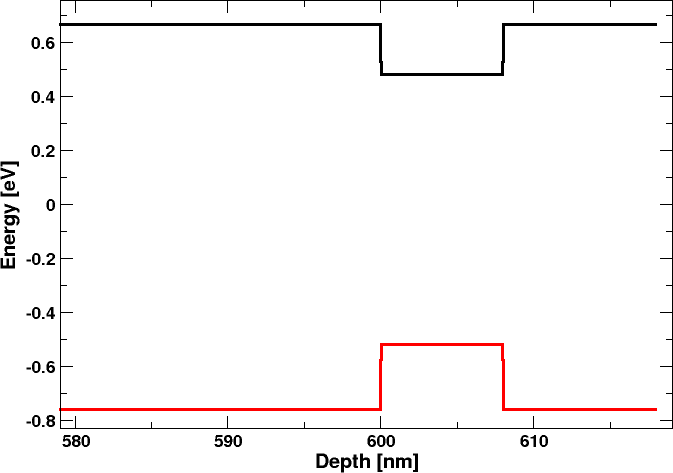
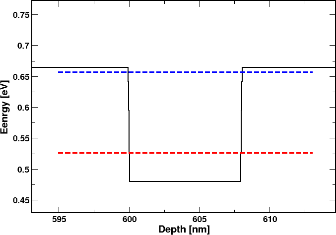
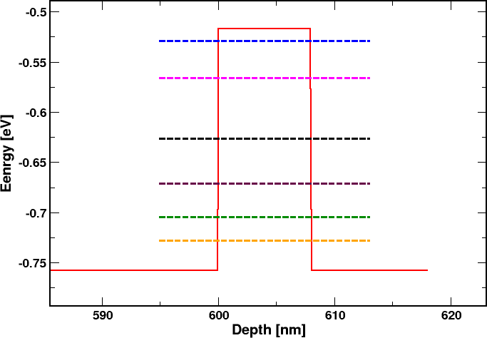
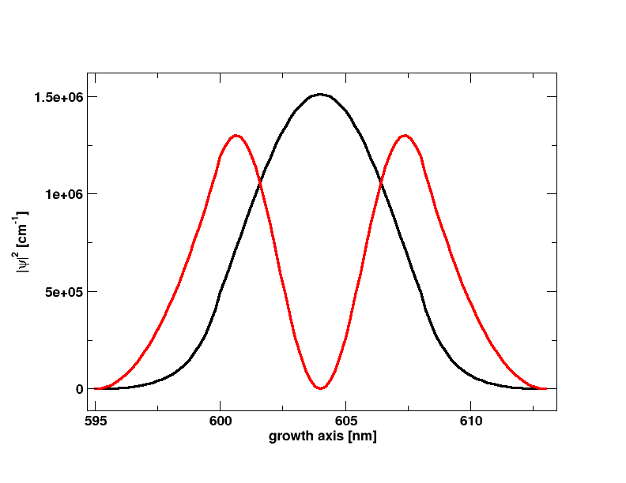
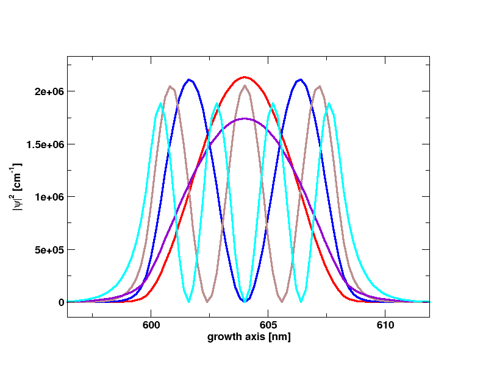

..   <marker>

.. _EFAReferenceGuide:

Quantum  EFA  calculations
=================================

In  tiberCAD,  it  is  possible  to  perform quantum  calculations in  the  framework  of  Envelope Function Approximation (EFA):  eigenstates, eigenfunctions and  quantum  density of  a  given system and    dispersion  of  quantum  states  can  be  obtained  by means  of the module:

* **Module**  ``efaschroedinger``

The  optical properties  are  calculated by  the  module 

* **Module**  ``opticskp``

Module efaschroedinger
-----------------------
 

The  ``efaschroedinger``  simulation tool of tiberCAD  is developed
in order to solve a single-particle    :math:`Schr\ddot{o}dinger`  equation for electrons and holes in a semiconductor crystal. 
This problem is an eigenvalue problem that is treated as a generalized
complex eigenvalue problem

..  math::
    :nowrap:
    :label:

	
    \begin{equation}
	 H\psi  = E S \psi,
    \end{equation}

where H and S are the Hamiltonian and S-matrix, respectively.
The EFA calculations are performed by the **Module** ``efaschroedinger``.

A typical example is the following::

  Module efaschroedinger
  {
    particle = el
    poisson_model_name = dd
    strain_model_name = strain # 
    name = quantum_el
    regions = quantum
    plot = (EigenFunctions, EigenEnergy, EnergyLevels, QuantumDensity)
    
    Solver
    {
      number_of_eigenstates = 10 # 30 
     }
    Physics
    {
      model = single_band 
     }
   }

In  this  example, Schroedinger  equation is  solved for  electrons with a  single band model.
We  calculate  10 eigenstates  by  specifying in  Solver  section::

  number_of_eigenstates = 10  

The  electron quantum density is  calculated too if  the  keyword QuantumDensity is  present in the plot list::

  plot = (ProbabilityDensity, EigenEnergy, QuantumDensity)  

A similar  definition is  needed  for  the  calculation of hole  quantum  states, by  defining:: 

  particle = hl

For  holes, one  can  choose  a  6 bands ``kp``  model in  this  way::

  Physics
  {
   
    model = kp   #  k.p  for  valence  band
    kp_model = 6x6
   }

Calculation of quantum dispersion
^^^^^^^^^^^^^^^^^^^^^^^

Within  the **Module**  ``efaschroedinger``  it is possible to calculate the dependence of quantum eigenstates on ``k``-vector. Such dependence gives the *quantum state dispersion*. 
To  calculate the  quantum dispersion we  need  to  define the  block *Dispersion*

::

  Dispersion 
  {
    k-path = G-K-M
    number_of_nodes = 10
    k_max = 0.1  
  }

The dispersion is calculated for each of  the quantum states previously  defined in  the  simulation.

Output
^^^^^^^^^^^^^^^^^^^^^^^

The available output variables, to be specified in the plot option, are the following:

  ``EigenEnergy``: 
    Eigen energy in eV

  ``ProbabilityDensity``: 
    square module :math:`|\psi({\bf r})|^2` of the eigenstate wavefunction 

  ``k-space_dispersion`` :
    output of  the quantum dispersion

  ``QuantumDensity``:   
    if  present, quantum  density is  calculated 

  ``Occupation``: 
    probability to find the state occupied. It is calculated assuming Fermi
    distribution and mean electrochemical potential and temperature.

Module opticskp
----------------------

By defining the **Module** ``opticskp`` , calculation of optical properties is enabled; in particular, the optical ``kp`` matrix elements are calculated from the quantum models specified in the **Module**.

The optical spectrum from spontaneous emission is calculated in the following way:

..  math::
    :nowrap:
    :label:

    \begin{equation}
         P(\hbar \omega) = \sum_{i,j} \frac{1}{2\pi^2}  \frac{\omega^2_{ij} e^2 }{m^2 c^3}  
         |{\bf M_{i,j} e}|^2 f_i(E_i)(1 - f_j(E_j)) 
         \frac{\Gamma/2} {(\hbar \omega_{ij} - \hbar \omega)^2 + (\Gamma/2)^2} d\Omega,
    \end{equation}

where :math:`f_i` and :math:`f_j` are the Fermi distributions and :math:`M_{i,j}` is the optical matrix element between the states  :math:`i` and :math:`j`.

::

  Module opticskp
  {
    name = optics
    regions = quantum
    plot = (optical_spectrum_k_0 )
    initial_state_model = quantum_el
    final_state_model = quantum_hl
    initial_eigenstates = (0, 9)
    final_eigenstates = (0, 15)
    polarization = (0, 0, 1)
    Emin = 2.8
    Emax = 3.6
    dE = 0.001
  }

Here, ``initial_state_model`` and ``final_state_model`` are, respectively, the quantum simulations 
( ``efaschroedinger`` module) associated respectively to the initial state of optical
transition (e.g. electron), and to the final state of optical transition (e.g. hole). 

``initial_eigenstates`` and ``final_eigenstates`` refer to the range of eigenstates to be taken in
account for optical calculations.
By  default, all  the eigenstates calculated in  the electron  and  hole quantum simulations are taken in  account  for the  optical calculations.

By specifying a range of energy values in this way::

  Emin = 3.0
  Emax = 5.0
  dE = 0.001

the emission optical spectrum for **k=0** is calculated.

Integrated spectrum
^^^^^^^^^^^^^^^^^^^^^^^

For  1D and  2D  calculations,  it  is  possible  to  perform  an  integration  of  the  optical  spectrum  in  *k-space*, by specifying *optical_spectrum* in  the  ``plot``  statement ::

  plot = (optical_spectrum)

In  this  case,  one  has  to  define a  **k-integration**  block inside  **Module** ``opticskp``, in this  way ::

  k-integration
  {
   
     k_max = 0.05     
     number_of_elements = (5,5)
     quadrature_type = gaussian 
     quadrature_order = third 

     refine_k_space = false 
     refine_fraction = 0.5
     relative_accuracy = 0.001 

  }

To  run  an  opticskp  sumulation,  one  needs  to  define it in the  solve  statement,  in  this  way::

   Simulation
   { 
      solve = (strain, dd,optics) 
   }

where  *optics*  is  the  name  of  the  defined ``opticskp``  simulation.

Output
^^^^^^^^^^^^^^^^^^^^^^^

The output variables for optics calculations are:

 ``optical_spectrum_k_0`` : 
    optical emission spectrum for *k=0*.

 ``optical_spectrum`` : 
    optical emission spectrum integrated in  k-space.

Example
-----------------------

In this 1D example we will see how to calculate quantum properties of a GaAs/InGaAs **quantum  well**.
:math:`Schr\ddot{o}dinger` equation is solved with a single-band effective mass model for conduction band and with a 6-band **k.p** model for valence band. Eigenvalues and eigenfunctions are calculated to get energy levels and wavefunctions in the quantum well.
Here is  the  device  definition ::

  Device
  {
   
   meshfile = InGaAs_1D.msh 

   # mesh is drawn in nm
    mesh_units = 1e-9

    Region buffer
    {
      
     material = GaAs

    }

    Region barrier_1
    {
     mesh_regions = (barrier1_cl, barrier1_q)
     
     material =  GaAs
     
    }

    Region QWell
    {
    
     material = InGaAs 
     x = 0.40 

    }

    Region barrier_2
    {
     mesh_regions = (barrier2_q, barrier2_cl)
    
     material = GaAs
    
    }

The InGaAs  well  region (**QWell**) and  the  two  barrier  regions are  collected  in  the  *Cluster*  **Quantum_1**.  Quantum calculation  will  be  restricted  to  this  *Cluster* ::

  Cluster Quantum_1
    {
      regions = (barrier1_q, QWell, barrier2_q)
    } 

First, a strain calculation for the GaAs/InGaAs/GaAs heterostructure, with GaAs as a reference substrate, is performed. ::

  Module elasticity 
   {

    name = strain
     regions = all

     plot = (Strain)

    Physics 
    {
      body_force lattice_mismatch 
      {
        reference_material = GaAs
        structure = zb    
      }
       
    }

    Contact cathode 
    {type = clamp}

    }

 

Simulation is performed at equilibrium, so that   we   solve *driftdiffusion* with the option  ::

  coupling = poisson

which  means that only Poisson  equation will  be  solved. ::

  Module driftdiffusion
  { 
   ............
   coupling = poisson
   
   Physics
    {

      strain_simulation = strain

      polarization (piezo, pyro) {}

      recombination srh {}

      recombination direct {}

    }

Finally, we define the model *efaschroedinger*, for quantum effective mass calculations.
We are going to study quantized states of electrons and holes in the quantum well. 
Since the structure is 1D, each eigenstate is characterized by the energy level number *n* and the *k vector* that is perpendicular to the growth direction. In this example, we define two simulations that solve :math:`Schr\ddot{o}dinger` equation for a single *k-vector* (*k = 0*), one for electrons and one for holes. For electrons ::

  Module efaschroedinger

  {
 
   name = quantum_electrons
   regions = Quantum_1 

   plot = (ProbabilityDensity, EigenEnergy)

    
   particle = el
   poisson_simulation = driftdiffusion  #  potential from driftdiffusion 
   strain_simulation = strain 
 

   number_of_eigenstates = 6

   Physics
   {
    model = single_band    
   }

  
  }

Note  that we must  define *poisson* and  *strain*  simulation from  which potential and  strain data have  to  be taken ::

  poisson_simulation = driftdiffusion  #  potential from driftdiffusion 
  strain_simulation = strain 

Electron eigenstates  will  be  obtained from a  single  band model, so we define ::

  Physics
   {
    model = single_band    
   }  

In  a  similar  way,  for  holes ::

  Module efaschroedinger

  {
 
   name = quantum_holes
   regions = Quantum_1 

   plot = (ProbabilityDensity, EigenEnergy)

  
   particle = hl
   poisson_simulation = driftdiffusion  #  potential from driftdiffusion 
   strain_simulation  = strain  
   number_of_eigenstates = 12

   Physics
   {
    model = kp   #  k.p  for  valence  band
    kp_model = 6x6
   }

  
  }

where, in  this  case,  we  use a  6x6 :math:`{\bf k \cdot p}`  model to  calculate  hole  eigenstates ::

  Physics
   {
    model = kp   #  k.p  for  valence  band
    kp_model = 6x6
   }

Finally, in  the  block  *Simulation*,  we  state  the *solve*  order. ::

  solve =  (strain, driftdiffusion, quantum_electrons,quantum_holes ) 

.. warning::  We need to  compute strain and driftdiffusion modules first, to  get  the  correct  parameters  for  :math:`{\bf k \cdot p}`  quantum calculations

Thus, the  block  *Simulation* reads  :: 

  Simulation
  {
   dimension = 1
   temperature = 300
   solve =  (strain, driftdiffusion, quantum_electrons,quantum_holes )
   resultpath =  output  
   output_format = grace
  }

 

Output of  simulation is  shown in the following.

First we look at the output of driftdiffusion calculation.
In Fig. :ref:`Conduction and valence bands<bands>` we have the conduction and valence band profiles in equilibrium condition (contained in the output file *driftdiffusion_msh.dat*); the Fermi level is in correspondance of the zero of energy.

..  _bands :

    Conduction and valence bands

..  _cblevels :

    Conduction band levels

..  _vblevels :

    Valence band levels

Then in Fig. :ref:`Conduction band levels<cblevels>` we  show
the conduction band profile and the the quantized levels for electrons (from the file *quantum_electrons_msh.dat*) in the InGaAs quantum well; for this 8 nm-wide quantum well only the first two energy levels are confined. 

The first 12 quantized levels for the holes (from the file *quantum_holes_msh.dat*) in the InGaAs quantum well are shown in Fig. :ref:`Valence band levels<vblevels>` (there are 6 couples of degenerated energy levels). 

Fig. :ref:`CB wavefunctions<cbwave>` show the wavefunctions (square module) for the energy states in the conduction band: only the first two states are confined in the conduction band and are shown here.

 
Finally, in Fig. :ref:`VB wavefunctions<vbwave>`
there are the wavefunctions for the first 10 confined energy states in the valence band. The first of each couple of degenerated states is shown.
States from the heavy hole and the light hole bands are visible. 

..  _cbwave :

    CB wavefunctions   

..  _vbwave :

    VB wavefunctions   

.. rubric:: Footnotes

..   </marker>
