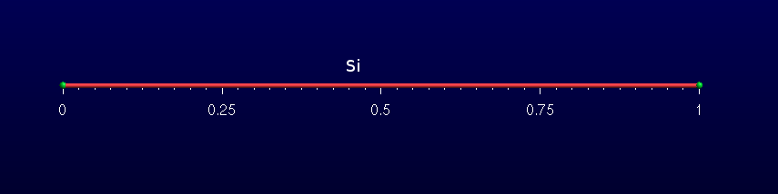

Drift-diffusion simulation of electrons and holes
=================================================

Introduction
-------------------------

The semi-classical transport simulation of electrons and holes is based on the drift-diffusion
approximation (see [Selberherr]_ ).

Beside the electric potential the electro-chemical potentials are used as variables such
that the system of PDEs to be solved reads as follows

.. math::
   :label: dd_eq_ddsystem
   
   
   -\nabla(\varepsilon\nabla\varphi - \mathbf{P}) & =  -e(n - p - N_d^+ + N_a^-) \\
   -\nabla(\mu_n n ( \nabla\phi_n + P_n \nabla T)  ) & =  R \\
   -\nabla(\mu_p p (\nabla\phi_p + P_p \nabla T) ) & =  -R 
   
   
:math:`P` is the electric polarization due to e.g. piezoelectric effects and :math:`R` is the net 
recombination rate, i.e. recombination rate minus generation rate. :math:`P_n` and :math:`P_p` are the electron
and hole thermoelectric powers, respectively. The models for the mobilities and the net
recombination rates can be specified in the ``Physics`` section as described in the
following.

..   <marker>

.. _DriftDiffusionTheory:

..  THEORY PART

..  index:: double:DriftDiffusion;Solution

Solution/Plot variables
-----------------------

The solution variables available for plotting and for interaction with other models are
given in :ref:`Table Plotting variables<dd_solutions>` .

Module options
---------------------

The following options influence the behaviour of the Drift-Diffusion module:

  ``coupling`` : string
     defines which equations to solve. 
     The default is ``full``, meaning that
     the full system consisting of the Poisson, electron continuity and hole continuity
     equations is solved. Other possible values are ``poisson`` (for equilibrium calculations),
     ``electrons`` or ``holes``. For the last two cases local equilibrium is assumed such that
     :math:`\phi_n  =  \phi_p` .
 
  ``enforce_local_charge_neutrality`` : bool 
     If set to true, local charge neutrality will
     be enforced by setting the charge density to zero. This may be useful for solving
     the Poisson equation involving only dielectrics.

  ``guess_el_qfermi`` : double 
     If this option is set, then before resolving the system the
     given number will be set as a guess for the electron electro-chemical potential.

  ``guess_hl_qfermi`` : double 
     If this option is set, then before resolving the system the
     given number will be set as a guess for the hole electro-chemical potential.

  ``default_boundary_condition = string`` 
     With this option the user can control the default 
     boundary condition for the electric field on all external boundaries without explicit boundary model. 
     Possible values are zero field (default), or zero displacement.
     The two differ only in presence of electric polarization fields.

  ``quadrature_rule = string`` 
     This option allows to chose between trapezoidal and Gauss
     type numeric integration rules. The default rule is gauss, but in some cases trapez
     may prevent density peaks near badly resolved material interfaces.

  ``save_state = boolean`` 
     If set to *true* the current solution will be written to a compressed 
     file after each solve. The file name follows the same rules as the result files,
     having file extension ``.tsv`` .

  ``load_state = file`` 
     Reload a formerly saved solution. filename can be a filename (to
     reside in the current working directory), a relative or an absolute path to a file.
     The file needs to have been created with ``save_state = true`` .

  ``solve_after_load = boolean`` 
     If set to true, the system will be solved after having
     reloaded a saved state. Otherwise it will not be solved, which is the default behaviour.

.. warning::  
                 Currently the reload of saved solutions *only works correctly when using the identical mesh*. 
                 Otherwise there will be undefined behaviour or failure. 

Solver section
--------------------

The ``Solver`` section of the Drift-Diffusion module refers to a nonlinear solver .

Physics section
--------------------

The Physics block contains generic options for the bulk physical model and the definition
of submodels. The generic options are:

  ``model = string`` 
     Specify the semiconductor model to be used. Possible values are default
     and simple. The former uses ``k.p`` to calculate the (strain corrected) band parameters.

  ``thermal_simulation = string`` 
     If you are doing coupled electrothermal simulations,
     you have to specify the name of the thermal simulation providing the lattice temperature.

  ``strain_simulation = string`` 
     If you are doing simulations on strained systems, you
     can specify the name of a strain simulation. The band parameters will then be
     calculated taking local strain corrections into account.

  ``relax_polarization = double`` 
     With this option one can specify a relaxation factor
     for the electric polarization field. This can be useful if the amount of total electric
     polarization has to be treated as fitting parameter.

For the simple semiconductor model one has to provide conduction and valence band
edges and the effective density of states masses (or the effective density of states itself)
in the ``Region`` sections. The corresponding keywords are given in table 4.2 .
In the following we describe the submodels. All submodels can be restricted to a
subset of simulation regions.

Recombination/generation models
^^^^^^^^^^^^^^^^^^^^^^^^^^^^^^^^^^^^^^^^^^

This section describes the currently available generation/recombination models. Note
that all recombination models can be applied also to surfaces/interfaces.
Recombination models are controlled by means of recombination submodel blocks
inside the Physics section. Different recombination models having the same (or no)
options can be enabled in a single statement writing::

  recombination (model1, model2, ...) {}

Shockley-Read-Hall (SRH) recombination
""""""""""""""""""""""""""""""""""""""""""""""""""""""

The SRH recombination model can be enabled by defining a recombination submodel
of type ``srh`` .

SRH recombination is defined as follows:

.. math::
    :label: dd_eq_recsrh
    
    
    R_{SRH} = \frac{np - n_i^2}{(n + n_i e^{E^*/k_BT})\tau_p +
    (p + n_i e^{-E^*/k_BT})\tau_n}
    

:math:`E^* = E_{trap} - (E_c + E_v)/2` is the trap level with respect to the midband energy. 

:math:`n_i` is the intrinsic carrier density, :math:`\tau_n` and :math:`\tau_p` are the recombination times. 

The parameters are taken from the material database. The recombination times are dependent on temperature and
doping density, e.g.

.. math::
   :label: dd_eq_001
    
    
    \tau_n & =  \tau_n^0 \left(\frac{T}{T_0}\right)^{\alpha_n} e^{\beta(T/T0 - 1)} \\
    \tau_n^0 & =  \tau_{min,n} + \frac{\tau_{max,n} - \tau_{min,n}}{1 + (N/N_{ref})^\gamma}
    
    
where :math:`T_0` is the reference temperature (300 K). Table 4.3 shows the corresponding parameters 
for the material data files. The parameters for holes and electrons have to be
specified in an array, e.g. :math:`\tau_min = (1e-5, 3e-6)`

    

The recombination times and trap level can be overridden from the input file by using
the keywords of Table 4.4.

The SRH recombination model can be applied also to surfaces and interfaces. In this
case, you can provide the recombination velocities using the keywords ``rec_velocity_n``
and ``rec_velocity_p`` instead of ``tau_n`` and ``tau_p`` .

Direct (radiative) recombination
"""""""""""""""""""""""""""""""""""""""""""

The direct recombination model can be enabled in the input file by by defining a
``recombination`` submodel of type ``direct`` .

Direct recombination is modeled as follows:

.. math::
   :label: dd_eq_recdirect

    
    R_{direct} = C(np - n_i^2)
    

The material data file and the input file use the same keyword ``C`` for the parameter C. The
database value can be overridden from the input file as described for SRH recombination.

Auger recombination
"""""""""""""""""""""""""""""""

The Auger recombination model can be enabled in the input file by defining a recombination
submodel of type ``auger`` .

Auger recombination is modeled by the following equation

.. math::
   :label: dd_eq_recauger
    
    
    R_{auger} = (C_nn + C_pp)(np - n_i^2)
    

with temperature dependent parameters

.. math::
   :label: dd_eq_002

    C_{\{n,p\}} = \left(A + B\frac{T}{T_0} + C\left(\frac{T}{T_0}\right)^2\right)\left(1 + H e^{-\{n,p\}/N_0}\right)

 
The parameters A;B;C;H and :math:`N_0` are taken exclusively from the database. They are
different for :math:`C_n` and :math:`C_p` and have to be specified as arrays with keywords ``A``, ``B``, ``C``, ``H``, ``N0``,
e.g. ``A = (1e-31, 1e-32)``. The calculated values for :math:`C_n` and :math:`C_p` can be overridden from
the input file by specifying values for the keywords ``C_n`` and ``C_p`` .

Optical generation
""""""""""""""""""""""""""""""

A very simple model for photoelectric generation of electron-hole pairs is implemented
in tiberCAD. It is enabled by specifying a ``generation`` submodel of type optical The
model imposes a constant generation rate which has to be provided by the keyword ``G`` in
units of :math:`(\mathrm{cm}\cdot\mathrm{s})^{-1}` . 

.. note:: 
            Usually the simulation should define a sweep on the value
            of G from 0 to the desired generation.

Thermoelectric power models
^^^^^^^^^^^^^^^^^^^^^^^^^^^^^^^^^^^^^^^^

The thermoelectric power models are the same for electrons and holes. 

The keyword is  ``thermoelectric_power`` , i.e ::

  thermoelectric_power [type]
  {
  }
    
The model keyword can be ``constant`` (i.e. the thermoelectric powers are read from the
database) or ``diffusivity_model`` where the thermoelectric powers are computed by

.. math::
   :label: dd_eq_thermopower

    P_n & = - \frac{k_b}{q}\left( \frac{5}{2} + \frac{e \phi_n + E_c - e \varphi}{k_b T} \right) \\
    P_p & = \frac{k_b}{q}\left( \frac{5}{2} - \frac{e \phi_p + E_v - e \varphi}{k_b T} \right)

The default is :math:`P_n = P_p = 0`

Mobility models
^^^^^^^^^^^^^^^^^^^^^^^^^^^^^^^

The models to be used for electrons and holes can be defined in a single submodel
block or independently using two blocks. The corresponding keywords are ``mobility`` or
 ``electron_mobility`` and ``hole_mobility`` , i.e.

::

  mobility [type]
  {
  }
    
  electron_mobility [type]
  {
  }
    
  hole_mobility [type]
  {
  }
    
When using the first approach, both carriers will use the same model, and parameters 
provided in the input file will also be used by both carriers. When mixing the
different definitions, the blocks ``electron_mobility`` and ``hole_mobility`` will override
the common ``mobility`` block.

The default model is the constant mobility model. The parameters for the different
mobility models are needed for both electrons and holes. In the material files they are
specified with a common keyword in arrays, e.g.

..  math::
    :label: Mobility Table

    \begin{tabular}{l|c}
    \multicolumn{2}{c}{\textbf{Mobility Table}} \\
    \hline
    \textbf{mobility} & \textbf{constants}  \\
    \hline
    \hline
     & \texttt{electrons holes }  \\
    \hline
     &  \\
    \texttt{mu\_max} & (1400.0 , 250.0)  \\
    \texttt{exponent } & (1.0    , 2.1)  \\
    \hline
    \end{tabular}

Constant mobility model
"""""""""""""""""""""""""

The constant mobility model (identifier ``constant`` ) assumes a mobility which depends
only on temperature by means of the following formula:

.. math::
   :label: dd_eq_muconst

    \mu_{const} = \mu_0 (T/T_0)^{-\gamma}

In the material data file :math:`\mu_0` and :math:`\gamma`  
have to be specified with the keywords ``mu_max`` and ``exponent``. 
:math:`\mu_0` can be overridden from the ``physical_model`` section using the keyword
``mu`` or from the Region sections using the keywords ``mu_e`` and ``mu_h`` .

Doping dependent mobility model
""""""""""""""""""""""""""""""""

The doping dependent mobility model (identifier ``doping_dependent`` ) implements two
models for mobility depending on the total doping density and the temperature. The
model that is used depends on the value of the ``mobility_formula`` parameter.

**Model by Masetti et al. [4]**

The model by Masetti et al. is identified by ``mobility_formula`` = 1. It uses the following
formula:

.. math::
   :label: dd_eq_dopdep1
    

    \mu = \mu_{min,1} \cdot \mathrm{e}^{-P_c/N} + \frac{\mu_{const} - \mu_{min,2}}{1 + (N/C_r)^\alpha} - \frac{\mu_1}{1 + (C_s/N)^\beta}

where N is the total doping density and :math:`\mu_{const}` the mobility obtained from the constant
mobility model. The parameters are specified in the material file as given in Table 4.5.

**Model by Arora [5]**

The model by Arora is identified by ``mobility_formula`` = 2. It reads:

.. math::
   :label: dd_eq_dopdep2

      \mu = \mu_{min} +  \frac{\mu_d}{1+(N/N_0)^{A^*}} 
      
    
with

.. math::
   :label: dd_eq_004

    \mu_{min} = A_{min}(T/T_0)^{\alpha_m}, & \quad \mu_d = A_d(T/T_0)^{\alpha_d} \nonumber \\
    N_0 = A_N(T/T_0)^{\alpha_N}, & \quad A^* = A_a(T/T_0)^{\alpha_a} \nonumber 

The parameters are given in table 4.6 at the end of the Chapter.

Field dependent mobility model
"""""""""""""""""""""""""""""""

The field dependent mobility model describes the degradation of mobility at high driving
fields. It is identified by the identifier ``field_dependent``. The electric field component
in direction of the current flow or the gradient of the electro-chemical potential can be
chosen as driving force:

  ``driving_force = efield | grad_fermi | field_parameter``

The default driving force is the gradient of the corresponding electro-chemical potential :math:`\nabla\phi` .
``field_parameter`` uses a field parameter given by :math:`\sqrt{E\cdot\nabla\phi}`  as driving force.

The model is based on the Caughey-Thomas model, refined by Canali [6]:

.. math::
   :label: dd_eq_fielddepmodel

    \mu = \frac{\mu_{lowfield}}{\left(1 + \left(\frac{\mu_{lowfield} |\mathbf{E}|}{v_{sat}}\right)^\beta \right)^{1/\beta}}

with

.. math::
   :label: dd_eq_005

    \beta = \beta_0(T/T_0)^b 

:math:`|E|` is the modulus of the driving field, :math:`\mu_{lowfield}` is the low-field mobility. For the latter
one can specify the model to be used using the parameter ``lowfield_model`` . As default
the doping dependent model is used.
There are two models for vsat, identified with ``Vsat_Formula = 1`` and 2. 

Formula 1 reads

.. math::
   :label: dd_eq_fielddepvel1

    v_{sat} = v_{sat,0} (T/T_0)^{-\gamma}

Formula 2 reads

.. math::
   :label: dd_eq_fielddepvel2

    v_{sat} = \max(A_{vsat} - B_{vsat} (T/T_0), v_{min})
    

The parameters for the field dependent mobility model are summarized in Table 4.7.

Polarization models
^^^^^^^^^^^^^^^^^^^^^^^^^^^^

For simulations involving materials with nonzero electric polarization (such as nitrides)
it is important to include the effect of polarization. This is done by specifying the models
for spontaneous (pyro-) and piezoelectric polarization using the keywords polarization
with the types ``pyro`` and ``piezo`` ::

  polarization pyro {}
  polarization piezo {}

As for all models, if they do not have individual options, they can be specified together
by writing ``polarization (pyro, piezo) {}`` .

Spontaneous (pyro-)polarization
"""""""""""""""""""""""""""""""

The spontaneous polarization model imposes a constant electric polarization ``P`` along
the symmetry-braking direction of the crystal. Crystals with wurtzite structure like Nitrides
have strong piezoelectric fields along the c-direction. 
The value of the polarization usually is taken from the database, but it can be overridden from the input file by specifying
the option ``Pz``, meaning the value of the spontaneous polarization along c-direction ([0001]). 
Alternatively, one can specify explicitly a polarization vector using the option
``P = (Px, Py, Pz)`` . This is useful to impose an arbitrary constant polarization field.

Piezopolarization
""""""""""""""""""

The piezoelectric polarization is strain induced and given by

.. math::
   :label: dd_eq_piezo

    P^{pz} = e_{ikl}\varepsilon_{kl}

where :math:`\varepsilon_{kl}` is the strain tensor. The piezoelectric moduli :math:`e_{ikl}` are stored in the database.
The strain is obtained from the simulation specified in the ``Physics`` section, but it can
be overridden by providing a name for the strain simulation inside the polarization block
using the ``strain_simulation`` option.

particle density
^^^^^^^^^^^^^^^^^^^^^^^^^^

Details for the calculation of the electron and hole densities can be given in the particle_density
submodel. Its options are:

  ``particle = string`` : 
     The particle this model is describing. Can be ``electron`` or ``hole`` .

  ``statistics = string`` :
     The statistics. Can be ``fermidirac`` (default) or ``boltzmann`` .

  ``quantum_density = string`` :
     The name of a quantum density simulation. 
     This will use the quantum mechanical particle density in the regions it was calculated.

If a quantum density is used, then it is useful to define also an embracing region
where the model gradually switches from a fully classical to a fully quantum density.
The options for the embracing are specified in a block with keyword ``embracing`` . It
accepts the following options:

  ``embracing_length = double`` :
     When the domain of the quantum simulation is smaller
     than the domain of the full simulation, the boundary conditions for the Schroedinger
     equation will disturb the transfer from classical to quantum density. By defining an
     embracing region of a certain extension (specified in meters), a gradual transition
     from classical to quantum density will be done instead of an abrupt one, using as
     effective density :math:`\rho = x\cdot\rho_{\mathrm{quantum}} + (1-x)\cdot\rho_{\mathrm{classical}}` . 
     The default is no embracing region at all (zero extension).

  ``cutoff = double`` :
     If an embracing region is used, a part of this region near the boundary
     of the quantum region can be cut off so that only the classical density is considered
     in that part. ``cutoff`` is specified as a percentage of the embracing length and should
     therefore be between 0.0 and 1.0.

  ``plot_embracing_region = bool`` :
     Whereas the automatic creation of the embracing region 
     in 1D is a very simple task, it is a more difficult one in higher dimensions. 
     By setting this flag to true, the embracing region and the mixing coefficient x will be
     plotted for a visual control of the quality of the embracing region. 
     The default is ``false`` .

.. _DD_trapmodels:

Trap models
^^^^^^^^^^^^^^^^^^^^^^^^

Currently single level traps are implemented in TiberCAD. Traps can be normally neutral
or normally charged electron or hole traps, or a fixed charge. Common options for all
models are

  ``type`` : string
     The type of traps. One of ``eNeutral``, ``hNeutral``,
     ``donor``, ``acceptor`` or ``fixed_charge``.
     (Only necessary if not provided as second keyword). 

  ``Nt`` : double
     The trap density in |cm3| (or |cm2| for surface traps).

  ``Et`` : double
     The trap level in eV with respect to the reference energy.

  ``reference`` : string
     The reference energy. The default is ``m`` for midgap.
     Possible values are ``cb``, ``vb`` or ``m`` 

For ``reference = m`` for example, the trap energy is given as :math:`E_{trap} = E_{midgap} + Et` . 
In the other cases it is :math:`E_{trap} = E_c - Et` or :math:`E_{trap} = E_v + Et` .

``eNeutral`` The trapped electron density is given by

.. math::
   :label: dd_eq_eneutral
    

    n_t = \frac{N_t}{1 + \exp(\frac{E_{trap} - E_{F,n}}{k_BT})}

``hNeutral`` The trapped hole density is given by

.. math::
   :label: dd_eq_hneutral
    
    p_t = \frac{N_t}{1 + \exp(-\frac{E_{trap} - E_{F,p}}{k_BT})}

``donor`` The density of ionized traps is given by

.. math::
    :label: dd_eq_donor

    N^+_t = N_t - \frac{N_t}{1 + \exp(\frac{E_{trap} - E_{F,n}}{k_BT})}

``acceptor`` The density of ionized traps is given by

.. math::
    :label: dd_eq_acceptor

    N^-t = N_t - \frac{N_t}{1 + \exp(-\frac{E_{trap} - E_{F,p}}{k_BT})}

If traps are specified, the total charge density in the Poisson equation is modified to
include the charged trap densities:

.. math::
   :label: dd_eq_totchargedensity

   
   \rho = e\left(p - n + N^+_D - N^-_A - \sum n_t + \sum p_t + \sum N^+_t - \sum N^-_t \right)
   

Additionally, each trap induces a SRH recombination term of the form

.. math::
   :label: dd_eq_trapsrh

   
   R_t = N_t \frac{v_{th}^n\sigma^nv_{th}^p\sigma^p(np -n_i^2)}{v_{th}^n\sigma^n(n+n_1) + v_{th}^p\sigma^p(p+p1)}
   

where :math:`\sigma^{n,p}` are the capture cross sections, :math:`v_{th}^{n,p}` the thermal velocities and (for Boltzmann statistics)

.. math::
   :label: dd_eq_n1p1

   
   n_1 = n_{i,\mathrm{eff}}\exp(E_{trap}/k_BT),\quad p_1 = n_{i,\mathrm{eff}}\exp(-E_{trap}/k_BT)
   

Boundary conditions
^^^^^^^^^^^^^^^^^^^^^^^^^^^

Boundary conditions are implemented for ohmic contacts, Schottky contacts, free surfaces
and interfaces. Contacts are boundary models that allow a nonzero normal electrical
current. The applied voltage is specified with the option ``voltage`` . 

A variable can be assigned to this, using the $-syntax. On ohmic or schottky contacts one can define surface
recombination velocities for electrons and holes using the options ``rec_velocity_e`` and 
``rec_velocity_h`` . This will impose Robin type boundary conditions for the continuity
equations of the form

.. math::
   :label: dd_eq_006

    
    -\nabla[\mu_n n (\nabla\phi_n + P_n \nabla T) ]  & =  v_n(n - n_0) \\
    -\nabla[\mu_p p (\nabla\phi_p + P_p \nabla T) ]  & =  -v_p(p - p0)  \\
    

The options ``zero_field`` , ``zero_grad_fermi_e`` and ``zero_grad_fermi_h`` can be used,
which when set to ``true`` will impose zero normal electric field and zero normal gradient
of the electron and hole electro-chemical potential, respectively. The latter are special
cases of surface recombination velocities ( :math:`v_{rec} = 0` ).

Contacts are defined by blocks with keyword Contact, for example::

  Contact anode 
  {
    type = ohmic
    [regions = (anode1, anode2)]
    voltage = $Vd
  }
    
An area factor can be specified for contacts using the keyword ``area_factor`` . The
contact current will be multiplied by this factor.

For interfaces and surfaces, the same syntax can be used (optionally one can use
the keywords ``Interface`` or ``Boundary`` ), however they do usually not need to be defined
explicitly.

Ohmic contact
""""""""""""""

The ohmic contact (identifier ohmic) has no further parameters.

Schottky contact
""""""""""""""""""

A Schottky contact (identifier ``schottky`` ) has the additional parameter ``barrier`` , which
signifies the energy difference between the semiconductor band edge and the fermi energy
in the metal. As default, the barrier is taken with respect to the conduction band. By
specifying ``band = v`` the barrier can be imposed with respect to the valence band (p-
type contact). Alternatively, the metal work function can be defined using the keyword
``work_function`` or the keyword ``metal_fermilevel``. The latter is just the work function with
inverted sign.

.. note:: 
            The  value given in  ``work_function`` or ``metal_fermilevel`` has to be
            aligned with the band energies given in the material files,
            *not* with that resulting from simulation.

The ``fixed_barrier`` controls the
behaviour of the barrier height for strained materials. If it is set to true, the barrier will
be independent of strain (default behaviour). If it is set to ``false`` , the given barrier is
used as barrier for the unstrained case and will depend on strain during simulation. If
the metal work function is specified, the barrier will be strain dependent as default.
Thermionic emission is by default switched on, but can be disabled by specifying
``thermionic_emission = false`` .

.. warning::  
                 If a Schottky contact is touching different materials, one should specify the work
                 function instead of the barrier.

Interface/surface model
"""""""""""""""""""""""

The free surface or interface model (identifier interface) can include surface charges
due to traps and surface recombination. Their definition can be found in section :ref:`DD_trapmodels`.

Each trap model will induce automatically a SRH recombination model as in the bulk
case.

Schroedinger/Poisson/Drift-Diffusion calculations
-----------------------------------------------------

TIBERCAD is able to do selfconsistent Schroedinger-Poisson or Schroedinger-Drift-Diffusion
calculations. For this purpose, quantum_density has to be specified for at least one of
the carriers, and a selfconsistent simulation should be defined in the Selfconsistent
block. The following options { to be specified in the Physics section { control the
behaviour of the selfconsistent simulation.

  ``use_density_predictor = bool`` 

When set to true, a predictor-corrector scheme will
be adopted in the selfconsistent cycle. The Poisson/Drift-Diffusion solver does not
just take the particle densities as given by the Schroedinger calculation, but it will
assume a dependency of the density on the potentials of the form

.. math::
   :label: dd_eq_007

    
    \rho(\varphi, \phi_n, \phi_p) = \frac{\rho_{\mathrm{quantum}}(\varphi^0, \phi_n^0, \phi_p^0)}{\rho_{\mathrm{classical}}(\varphi^0, \phi_n^0, \phi_p^0)}\rho_{\mathrm{classical}}(\varphi, \phi_n, \phi_p)
    

where :math:`(\varphi^0, \phi_n^0, \phi_p^0)` are the potentials for which the quantum density was calculated. use_density_predictor = true is the preferred method for selfconsistent
Schroedinger-Poisson/Drift-Diffusion calculations and is enabled by default.

Example
--------------

The following example shows the Drift-Diffusion module definition for a pn junction.

----

::

  Module driftdiffusion
  {
    name = dd
    #regions = (pside, nside)
    Solver linesearch 
    {
     }
    Physics
   {
     recombination srh {}
        
     mobility doping_dependent {}
        
     Contact anode 
     { 
        voltage = $Vd 
      }

      Contact cathode 
      { 
        voltage = 0 
       }
     }
   }

----

Listing 3: Models section for drift-diffusion

..  _dd_solutions :

..  math::
    :label: Solution Table
    

     \begin{tabular}{l|c|l}
     \multicolumn{3}{c}{\textbf{Solution Table}} \\
     \hline
     \textbf{Keyword}  & \textbf{Description} & \textbf{Units}  \\
     \hline
     \hline
     \texttt{Ec} & Conduction band edge & eV \\
     \texttt{Ev} & Valence band edge & eV \\
     \texttt{eQFermi} & Electro-chemical potential of electrons & eV ($-e\phi_n$) \\
     \texttt{hQFermi} & Electro-chemical potential of holes & eV ($-e\phi_p$) \\
     \texttt{Ec0} & Conduction band edge without electric potential & eV \\
     \texttt{Ev0} & Valence band edge without electric potential & eV \\
     \texttt{Eg} & Band gap & eV \\
     \texttt{ConductionBands} & Minimal of all conduction bands & eV \\
     \texttt{ValenceBands} & Maximum of all valence bands & eV \\
     \texttt{ElPotential} & Electric potential & V \\
     \texttt{eDensity} & Electron density & cm$^{-3}$ \\
     \texttt{hDensity} & Hole density & cm$^{-3}$ \\
     \texttt{eMobility} & Electron mobility & cm$^2V^{-1}s^{-1}$ \\
     \texttt{hMobility} & Hole mobility & cm$^2V^{-1}s^{-1}$ \\
     \texttt{eConductivity} & Electron conductivity & S/cm \\
     \texttt{hConductivity} & Hole conductivity & S/cm \\
     \texttt{ElField} & Electric Field & Vcm$^{-1}$ \\
     \texttt{Polarization} & Electric Polarization & Cm$^{-2}$ \\
     \texttt{CurrentDensity} & Total current density & Acm$^{-2}$ \\
     \texttt{eCurrentDensity} & Electron current density & Acm$^{-2}$ \\
     \texttt{hCurrentDensity} & Hole current density & Acm$^{-2}$ \\
     \texttt{IonizedDonors} & Ionized donor density & cm$^{-3}$ \\
     \texttt{IonizedAcceptors} & Ionized acceptor density & cm$^{-3}$ \\
     \texttt{IonizedElectronTraps} & Ionized electron trap density & cm$^{-3}$ \\
     \texttt{IonizedHoleTraps} & Ionized hole trap density & cm$^{-3}$ \\
     %\texttt{charge\_density} & Total charge density & cm$^{-3}$ \\
     \texttt{eThElPower} & Electron thermoelectric power & V K$^{-1}$ \\
     \texttt{hThElPower} & Hole thermoelectric power & V K$^{-1}$ \\
     \texttt{NetRecombination} & %\begin{minipage}[t]{8cm}
     %
     %The net recombination rate for each recombination model and the total rate
     %\end{minipage}& cm$^{-3}$s$^{-1}$
     The net recombination rate for each recombination/generation \\
       &  model and the total rate    cm$^{-3}$s$^{-1}$ \\
     \texttt{ContactCurrent} & The electric current on each contact & A/cm$^{3-d}$
     \end{tabular}

|

..  math::
    :label: Semiconductor Table
    

     \begin{tabular}{l||l}
     \multicolumn{2}{c}{\textbf{Semiconductor Table}} \\
     \hline
     \textit{keyword} & \textit{description} \\
     \hline \hline
     \texttt{Ec} & conduction band edge (eV) \\
     \texttt{Ev} & valence band edge (eV) \\
     \texttt{m\_dos\_e} & conduction band effective DOS mass (m$_e$) \\
     \texttt{m\_dos\_h} & valence band effective DOS mass (m$_e$) \\
     \texttt{Nc} & conduction band effective DOS (cm$^-3$) \\
     \texttt{Nv} & valence band effective DOS (cm$^-3$) \\
     \end{tabular}

..  math::
    :label: SRH Table
    
     \begin{tabular}{l||l|l}
     \multicolumn{2}{c}{\textbf{SRH Table}} \\
     \hline
     \textit{parameter} & \textit{keyword} \\
     \hline\hline
     $\tau_{min}$ & \texttt{taumin} \\
     $\tau_{max}$ & \texttt{taumax} \\
     $N_{ref}$ & \texttt{Nref} \\
     $\gamma$ & \texttt{gamma} \\
     $E^*$ & \texttt{Etrap} \\
     $\alpha$ & \texttt{Talpha} \\
     $\beta$ & \texttt{Tcoeff} \\
     \end{tabular}

..  math::
    :label: SRH parameters Table
    

     \begin{tabular}{l||l}
     \multicolumn{2}{c}{\textbf{SRH parameters Table}} \\
     \hline
     \hline
     $tau_n$ & \texttt{tau\_n} \\
     $tau_p$ & \texttt{tau\_p} \\
     $E^*$ & \texttt{E\_t}
     \end{tabular}

    

.. math::
   :label: Mobility Model Table

    \begin{tabular}{l||l|l}
    \multicolumn{2}{c}{\textbf{Mobility Model Table}} \\
    \hline
    \textit{parameter} & \textit{keyword}  \\
    \hline
    \hline
    $\mu_{min,1}$ & mumin1 \\
    $\mu_{min,2}$ & mumin2 \\
    $\mu_{1}$ & mu1  \\
    $P_{c}$ & Pc \\
    $C_{r}$ & Cr \\
    $C_{s}$ & Cs \\
    \end{tabular}
    

    
.. math::
   :label: Arora Model Table

    \begin{tabular}{l||l|l}
    \multicolumn{2}{c}{\textbf{Arora Model Table}} \\
    \hline
    \textit{parameter} & \textit{keyword} \\
    \hline\hline
    $A_{min}$ &  mumin \\
    $A_{d}$ &  mud \\
    $A_{N}$ &  N0 \\
    $A_{a}$ &  A \\
    $\alpha_m$ &  am \\
    $\alpha_d$ &  ad \\
    $\alpha_N$ &  aN \\
    $\alpha_a$ &  aA \\
    \end{tabular}

    

..  math::
    :label: Mobility Dependence Table

    \begin{tabular}{l||l|l}
    \multicolumn{3}{c}{\textbf{Mobility Dependence Table}} \\
    \hline
    \textit{parameter} & \textit{keyword} \\
    \hline\hline
    $\beta_{0}$ &  beta0 \\
    $b$ &  betaexp \\
    $v_{sat,0}$ &  vsat0 \\
    $\gamma$ &  vsatexp \\
    $A_{vsat}$ &  A\_vsat \\
    $B_{vsat}$ &  B\_vsat \\
    $v_{min}$ &  vsat\_min \\
    \end{tabular}

..  EOF  THEORY PART

..   </marker>

..  GETTING STARTED

.. _DriftDiffusionGetting:

Tutorial
--------------------------------

In this example we will see a very simple TiberCAD simulation:

  1D calculation of Poisson and drift-diffusion for a bulk Silicon sample.

The following files should be in your working directory:

  ``bulk.tib_`` : 
     **TiberCAD** input file 

  ``bulk.msh_`` : 
     mesh file

The mesh file can be obtained from the following GMSH geo file : ``bulk.geo_`` 

This is the summary of the Sections of this Tutorial :

*  :ref:`tut0step1` 
*  :ref:`tut0step2` 
*  :ref:`tut0step3` 
*  :ref:`tut0step4` 
*  :ref:`tut0step5` 
 

..  _tut0step1 :
 
Step 1 - Modeling the device
----------------------------

As a first step, we have to model the device. To do so, you can use DEVISE 
module of ISE-TCAD 9.5 software package or GMSH program.

Here we'll see in details the procedure for GMSH.

There are two possible ways to use GMSH:

Interactive, using the graphical interface
Using a script file
In the following we'll see how to write a basic GMSH script ( ``bulk.geo_`` ); 
for any details please refer to GMSH manual GMSH (http://geuz.org/gmsh/).

 

..  warning::
                  In a **1D** simulation it is assumed that the geometrical model is restricted to the **x axis** .
                  In a **2D** simulation it is assumed that the geometrical model is restricted to the **xy-plane (z=0)** 
                  Any other geometrical orientation could give unpredictable results

 

In a GMSH script, several variables can be defined and given a value in this way::

  L = 1
  d = 0.01
  
these are valid GMSH variables: L is just the length of the Si sample; d is the value 
of a *characteristic mesh length* (see below).

Definition of geometrical entities ``Points`` ::

  Point(1) = {0, 0, 0, d}
  Point(2) = {L, 0, 0, d}

The first three expressions inside the braces on the right hand side give the three 
X, Y and Z **coordinates** of the point; the last expression ``(d)`` sets the **characteristic 
mesh length** at that point, that is the ``size`` of a mesh element, defined as the length 
of the segment for a line segment, the radius of the circumscribed circle for a triangle 
and the radius of the circumscribed sphere for a tetrahedron.

Thus, the smaller is the value of d, the greater is the mesh density close to that point. 

The size of the mesh elements will then be computed in GMSH by linearly interpolating 
these characteristic lengths in the whole mesh.
 

Definition of a geometrical entity ``Line`` ::

  Line(1) = {1, 2}

The two expressions inside the braces on the right hand side give the identification 
numbers of the start and end points of the line.

Definition of the physical entity **Physical Line bulk** ::

  Physical Line("bulk") = {1}

The expression(s) inside the braces on the right hand side give the identification numbers 
of all the **geometrical lines** that need to be grouped inside the *physical line* .

In this way, in general, physical regions are created which associate together geometrical regions, 
and then the related mesh elements, which share some common physical properties. It's only these 
physical regions which can be referred to outside GMSH. In TiberCAD, this is done by associating 
one or more physical regions to a **TiberCAD region** through the keyword ``mesh_regions`` (see in the following).

Definition of two physical entities Physical Point::

  Physical Point("anode2)   = {1}
  Physical Point("cathode") = {2}

..  warning:: 
                  In general, in a nD simulation, **(n-1)D** physical regions (points in 1D, lines in 2D, surfaces in 3D) 
                  are used by TiberCAD to impose the required boundary conditions.

Each (n-1)D physical region defined in this way in GMSH will be associated in TiberCAD to a boundary condition region, 
through the keyword ``BC_reg_numb`` . Thus, in this case, Physical points Anode and Cathode will be associated respectively 
to two ``Contact`` regions (see in the following).
 

..  _tut0step2 :

Step 2 - Meshing the device 
---------------------------
 

The ``.geo`` script file with the geometrical description can be run in GMSH, to display the modelled device 
and to mesh it through the GMSH graphical interface.
Alternatively, a *non-interactive* mode is also available in GMSH, without graphical user interface. 

For example, to mesh this 1D tutorial in non-interactive mode, just type:

..  tip::
          gmsh bulk.geo -1 -o bulk.msh

where bulk.geo_ is the geometrical description of the device with GMSH syntax:

  -1 means *1D mesh generation*

some command line options are:

  -1 , -2, -3 to perform *1D, 2D or 3D* mesh generation,

  -o ``mesh_file.msh`` to specify the name of the mesh file to be generated

In this way, a .msh has been generated and is ready to be read in TiberCAD.

..  _tut0step3 :

Step 3 - TiberCAD Input file
-----------------------------

Now we have to write down the **TiberCAD input file** ( bulk.tib_ ). For a detailed reference see the user guide 
(Input file) and Getting started.

Description of Device Regions
^^^^^^^^^^^^^^^^^^^^^^^^^^^^^^^^^

First, we have to list all the **TiberCAD Regions** present in our Device: a TiberCAD Region is usually a section 
of the device featuring the same material and possibly the same doping.

::

  Device
  {
    meshfile = bulk.msh

    Region bulk 
    {
      material = Si

      Doping
      {
        Nd = 1e16
        type = donor
       }
     }
   }
    
The TiberCAD Region bulk is made of Silicon and n-doped with a concentration 1 x :math:`10^{16} cm^{-3}` .

Through the keyword ``Region`` , one GMSH physical region (Physical Lines in 1D, Physical Surfaces in 2D, 
Physical Volumes in 3D) previously defined in the GMSH mesh ( :ref:`tut0step1` ), can be associated 
to the present TiberCAD Region, in this way::

  Region  GMSH_physical_region_name

In this case, the Physical Line bulk is associated to the TiberCAD Region bulk.

Alternatively, through the optional keyword ``mesh_regions`` , one or more GMSH physical regions can be 
associated to a single TiberCAD Region .

 

Definition of Simulation
^^^^^^^^^^^^^^^^^^^^^^^^^^^^^

Now we define the ``Simulation`` driftdiffusion_1: it belongs to the class ``driftdiffusion`` 

::

  Module driftdiffusion
  {               
    name = driftdiffusion  # this is the default name

    regions = all          # 'all' is the default

    # what we want to plot
    plot = (Ec, Ev, eQFermi, hQFermi, ContactCurrent)
    ....
       
       
The TiberCAD simulation ``driftdiffusion_1``  , belonging to the model driftdiffusion, will be applied 
to the whole device structure (``regions = all``)

 

Definition of Boundary Conditions
^^^^^^^^^^^^^^^^^^^^^^^^^^^^^^^^^^^^

The anode and cathode contacts of our 1D Si sample are defined as **Boundary conditions regions** 
(``Contact anode, Contact cathode``) in the following way::

  Module driftdiffusion
  { 
              
   name = driftdiffusion  

   regions = all

   plot = (Ec, Ev, eQFermi, hQFermi, ContactCurrent)

   Contact anode { voltage = $Vb }
   Contact cathode { }

  }
    
Through the keyword ``Contact`` , one (n-1) -dimension GMSH physical region (Physical Point in 1D, 
Physical Line in 2D, Physical Surface in 3D) previously defined in the GMSH mesh ( :ref:`tut0step1` ), can be 
associated to the present TiberCAD Contact, in this way:

  ``Contact  GMSH_physical_region_name`` 

In this case, the *Physical Point* ``anode`` is associated to the TiberCAD Contact anode and the Physical 
Point cathode is associated to the TiberCAD Contact cathode.

Both contacts are defined as ``ohmic`` , cathode is assigned a fixed ``voltage = 0.0`` , while anode voltage is given 
by the value of the variable **Vb** ::

  voltage = @Vb

Definition of Simulation parameters
^^^^^^^^^^^^^^^^^^^^^^^^^^^^^^^^^^^^^^^^

Vb is specified in the sweep block, in the Solver section::

  Module sweep
  {
    solve = driftdiffusion
    variable = $Vb
    start = 0.0
    stop = 1
    steps = 10
    plot_data = true
  }
    
In this way, the simulation ``driftdiffusion_1`` is performed for 10 (``steps = 10``) values of the anode 
voltage (``variable = Vb``), between 0 and 1.

For each step we want to plot the solution variables specified in the driftdiffusion module 
( ``plot_data = true`` ).
 

Definition of Execution parameters
^^^^^^^^^^^^^^^^^^^^^^^^^^^^^^^^^^

In the ``Simulation`` section , we decide *which* simulations to perform and in which *order*; set ``solve = sweep`` , 
to execute the sweep which run driftdiffusion_1 simulation for the specified loop.

::

  Simulation
  {
    verbose = 2 

    solve = sweep

    resultpath = output
    output_format = grace
  }

Output files with conduction and valence band profiles (``plot = Ec,Ev..``) and all the calculated values 
of the current at the contacts (*ContactCurrents*) (the IV characteristic) are generated.

To increases the amount of information written to the screen we can vary the verbose level (``verbose = 2``).
 
..  _tut0step4 :

Step 4 - Run TiberCAD
-----------------------

Now we can run TiberCAD

  |  by double clicking on bulk.tib file (in Windows)
  |  
  |  or by command line in linux: tibercad bulk.tib

..  _tut0step5 :

Output 
----------

The generated Output files are:

*  ``driftdiffusion_materials.dat``  : 
    material (mesh) regions, in this case just region 1

*  ``driftdiffusion_nodal.dat``      : 
    nodal quantities (here conduction and valence band)

*  ``sweep_driftdiffusion_Vb.dat``   : 
    integrated current at the two contacts for each sweep step
 

    Attachment    Size

* bulk.tib_	1.16 KB
* bulk.geo_	181 bytes
* bulk.msh_	4.49 KB

 

 
..  _bulk.tib: http://www.tibercad.org/files/bulk_2.tib
..  _bulk.geo: http://www.tibercad.org/files/bulk_0.geo
..  _bulk.msh: http://www.tibercad.org/files/bulk_0.msh

..  EOF GETTING STARTED

.. rubric:: Footnotes

.. [#] the Default value is given in brackets.
.. [#] the linear tolerance gets automatically decreased after each nonlinear step.

    

.. |cm2| replace::  cm\ :sup:`2`

.. |cm3| replace::  cm\ :sup:`3`

