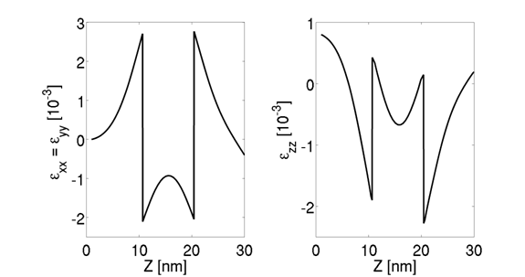

..  _ElasticityTheory:

..  THEORY PART

Elasticity
=================================================

Introduction
----------------------

Elasticity is a Finite Elements solver for mechanical equilibrium problems. 
It brings features typically developed for structural stability solvers into device modeling. 
The coupled treatment of the electro-mechanical problem within a unique framework results very useful to explore for multidisciplinary ideas. 

Details about the theory of continuous elasticity applied to device mechanical deformation 
can be found in [Povolotskiy]_ .

TiberCAD computes the mechanical deformation of a body subjected to external forces by means of the equilibrium mechanical equation, i.e.

.. math::
   :nowrap:
   :label:

    \[
    \frac{\partial \sigma_{ij}}{\partial x_j} = f_i
    \]

wheres :math:`\sigma` is the stress second-rank tensor and f is the external body force applied to the system. 
As we will see below, any strain and stress source can be appropriately mapped into an equivalent body force. 

The stress tensor :math:`\sigma` is related to the mechanical strain by means of the constitutive relationships :math:`\sigma_{ij}=C_{ijlk}\epsilon_{lk}` 
where **C** is the stiffness fourth-rank tensor. 
The strain is related to the displacement u by the expression

.. math::
   :nowrap:
   :label:

    \[
    \epsilon_{kl}=\frac{1}{2}\left(\frac{\partial u_l}{x_k}-\frac{\partial u_k}{\partial u_l} \right )
    \]

Relying on the symmetry of the strain and stiffness tensor the final equation reads as

.. math::
   :nowrap:
   :label:

    \[
    \frac{\partial}{\partial x_j}C_{ijlk}\frac{\partial u_l}{\partial x_k} = f_i
    \]

The non-linear strain is computed by applying the mechanical equilibrium equation on the deformed mesh.  
The number of the shape iteration is set by the keyword **shape_iteration** (default = 0, i.e. no deformation is performed) 
whereas the maximum tolerated error can be indicated with shape_error ( default = :math:`1e^{-3}` ).

Stiffness constant
-------------------

By default the stiffness constant is anisotropic. For the zincoblend crystal structure the independent coefficients are 
(with the Voigt notation) C11, C12, C44. 

..  math::
    :nowrap:
    :label:
    
    \begin{equation}
    C = \left(
    \begin{array}{cccccc}
    C_{11} & C_{12} & C_{12} & 0 & 0 & 0\\
    C_{12} & C_{11} & C_{12} & 0 & 0 & 0\\
    C_{12} & C_{12} & C_{11} & 0 & 0 & 0\\
    0 & 0 & 0 & C_{44} & 0 & 0\\
    0 & 0 & 0& 0 & C_{44} & 0\\
    0 &  0  &  0 & 0 & 0 & c_{44} 
    \end{array}
    \right)
    \end{equation}
    
|

For the wurtzite structure we have C11, C12, C13 and C44.

..  math::
    :nowrap:
    :label:
    
    \begin{equation}
    C = \left(
    \begin{array}{cccccc}
    C_{11} & C_{12} & C_{13} & 0 & 0 & 0\\
    C_{12} & C_{11} & C_{12} & 0 & 0 & 0\\
    C_{13} & C_{12} & C_{11} & 0 & 0 & 0\\
    0 & 0 & 0 & C_{44} & 0 & 0\\
    0 & 0 & 0& 0 & C_{44} & 0\\
    0 &  0  &  0 & 0 & 0 & \frac{C_{11} - C_{22}}{2}   
    \end{array}
    \right)
    \end{equation}

|

An isotropic stiffness can be included with the keyword ``Stiffness isotropic`` . 
In this case, the only independent parameters are the Young modulus 
(Young in GPa) and the Poisson's ratio (Poisson). 

..  math::
    :nowrap:
    :label:
    
    \begin{equation}
    C =
    \frac{E}{(1+\nu)(1-2\nu)} \left(
    \begin{array}{cccccc}
    1-\nu & \nu & \nu & 0 & 0 & 0\\
    \nu & 1-\nu & \nu & 0 & 0 & 0\\
    \nu & \nu & 1-\nu & 0 & 0 & 0\\
    0 & 0 & 0 & \frac{1-2\nu}{2} & 0 & 0\\
    0 & 0 & 0& 0 & \frac{1-2\nu}{2} & 0\\
    0 &  0  &  0 & 0 & 0 & \frac{1-2\nu}{2}   
    \end{array}
    \right)
    \end{equation}

|

While the anisotropic model is included by default, the ``isotropic`` one must be explicitly
indicated

Example::

  Stiffness isotropic
    {
     Young = 129
     Poisson = 0.349
    }

**Boundary conditions**

Surfaces forces :math:`f^0` are applied by imposing :math:`\sigma_{ij} n_{j} = f_i^0` along the surface with normal n. 
This boundary condition can be used with the keyword ``surface_force`` . The force can be specified in GPa with force. 
An example is shown below ::

  Contact base
    {
     type = surface_force
     force = (0,0,0.5) 
    }

On the other hand, one may want to fix some surface of the device. The keyword ``clamp`` freezes all nodes of a given surface. 

Example::

  Contact substrate 
    {
     type = clamp
    }

**Body forces**

A constant value body force can be included by means of the keyword ``Bodyforceconstant`` .

Example::

  BodyForceconstant 
    {
     force = (0,1,0)
    }

When two crystals with different crystal structure are put in contact the lattice mismatch between them may induce a strain  :math:`\epsilon^LM`  and, therefore, a stress :math:`\sigma =C\epsilon^{LM}` . 

This stress contribution acts as a body force 

.. math::
   :nowrap:
   :label:

    \[
    f_i = -\frac{\partial }{\partial x_j} C_{ijlk}\epsilon_{lk}^{LM}
    \]

The strain source can be computed only once the reference lattice is identified. 
The reference material and its growth axis can be included following the same syntax of the device section.

Example::

  BodyForcelattice_mismatch
    {
     reference_material = AlGaN
     structure = wz
     x = 0.2
     x-growth-direction = (1,0,0,0)
     y-growth-direction = (0,1,-1,0)
     z-growth-direction = (0,0,0,1)
    }

In presence of an electric field there might develop an additional stress source due to the so-called converse piezoelectric effect, given by :

.. math::
   :nowrap:
   :label:

    \[
    \sigma_{il}^{SC}=-e_{ijk}E_k
    \]

The converse piezoelectric effect can be included with the keyword ``BodyForce_piezo`` and an electrostatic simulation must be indicated. 

The effective body force reads as :

.. math::
   :nowrap:
   :label:

    \[
    f_i = -\frac{\partial}{\partial x_j} \sigma_{ij}^{CP}
    \]

Example::

  BodyForceconverse_piezo
    {
     poisson_simulation = dd
    }
    
Considering all the above mentioned force sources, the plotted total stress and strain are :

.. math::
   :nowrap:
   :label:

    \[
    \sigma_{ij} = C_{ijlk}\left( \frac{\partial u_l}{\partial x_k} + \epsilon_{lk}^{LM} \right) -e_{ijk}E_k 
    \]

.. math::
   :nowrap:
   :label:

    \[
    \epsilon_{kl}=\frac{1}{2}\left(\frac{\partial u_l}{x_k}-\frac{\partial u_k}{\partial u_l} \right ) + \epsilon_{lk}^{LM}
    \]

..  EOF THEORY PART

..   <marker>

.. _ElasticityGetting:

..  GETTING STARTED PART

Example
----------------------

Assuming a small displacement, Elasticity  elasticity computed the strain by solving the equation

.. math::
   :nowrap:
   :label:
   
   \[
   \frac{\partial}{\partial x_j}C_{ijlk}\frac{\partial u_l}{\partial x_k} = f_i
   \]

where C is the stiffness constant  and f is the total external body force. 
The latter may include several contribution such as the converse piezoelectric effect the thermal expansion and a lattice mismatch induced strain. 
The latter, described in the example below, occurs when an interface is created between two materials with different lattice constants. 
Let :math:`\epsilon^{LM}` be the lattice mismatch strain, then the effective body force reads as :  

.. math::
   :nowrap:
   :label:

    \[
    f_i = -\frac{\partial }{\partial x_j} C_{ijlk}\epsilon_{lk}^{LM}
    \]

In the following we will compute the strain induced by the lattice mismatch in a system comprising a layer of GaN between two contacts of :math:`Al_{x}Ga_{1-x}N` . 
Once the mesh is created with gmsh (distributed along TiberCAD ) we may start to build the input file. 
First, we have to insert the region section ::

  Device
    {
     dimension = 3 
     meshfile = mesh.msh
     mesh_units = 1e-9
     material = AlGaN
     x = 0.2
     x-growth-direction = (-1,0,1,0) 
     y-growth-direction = (-1,2,-1,0) 
     z-growth-direction = (0,0,0,1)
     Region Well  {material = GaN}
    }

All the options included in this section, such ad the material, axis growth and alloy concentration, apply for the whole structure.  
If we want to specify a region with different properties, we may use the keyword Region and refer to a region name, as specified in the mesh file. 

The second part of the input file is devoted to the module declaration ::

  Module elasticity 
    {
     Physics 
       {
        BodyForcelattice_mismatch 
          {
           x-growth-direction = (-1,0,1,0) 
           y-growth-direction = (-1,2,-1,0) 
           z-growth-direction = (0,0,0,1)
           reference_material = AlGaN
           x = 0.2 
          }
        Contact Base {type = clamp}
       }
    }

In physics we declare the physical models to be applied to our device. 
In our case, with BodyForce lattice mismatch we are adding a body force into the system, 
induced by the lattice mismatch with the reference lattice which in this case is :math:`Al_{0.2}Ga_{0.8}N` . 
In order to avoid a free standing device we may want to freeze a surface. With Boundary Clamp we fix, in this case, the region Base.

The third part is simply Simulation ``{solve = elasticity}`` where the default name *elasticity* is used. 
By default, files for 3D system are written in vtu which can be read from Paraview. 
Output data about strain are shown below.

.. _fig.elasticity01: 

.. figure:: ../data/elasticity01.png
   :align: center
   :scale: 80%
   
   The 3D output

   
   
.. _fig.elasticity02: 

   
   Strain effect on directions

..   EOF GETTING STARTED PART

..   </marker>

.. rubric:: Footnotes

